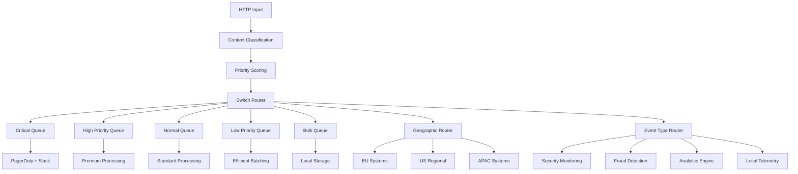

import CodeBlock from '@theme/CodeBlock';

# Complete Content Routing Pipeline

**Deploy a production-ready content routing solution.** This page provides the complete, tested configuration that combines all routing techniques: severity-based escalation, geographic compliance, event type specialization, and priority queues.

## What You'll Deploy

A comprehensive content routing pipeline that handles:

✅ **Severity-based routing** - Critical alerts → PagerDuty, warnings → Slack, info → Elasticsearch  
✅ **Geographic routing** - EU data stays in EU (GDPR), US data to regional clusters  
✅ **Event type routing** - Auth → security systems, payments → fraud detection, telemetry → local storage  
✅ **Priority queues** - Enterprise users get expedited processing  
✅ **Compliance monitoring** - Audit trails and violation detection  
✅ **Performance optimization** - Bandwidth savings and latency reduction

## Architecture Overview



## Complete Production Configuration

```yaml title="complete-content-router.yaml"
name: complete-content-router
description: Production-ready content routing with severity, geography, event type, and priority routing
type: pipeline
namespace: production

config:
  input:
    http_server:
      address: 0.0.0.0:8080
      path: /events
      timeout: 10s
      
      # Production HTTP settings
      cors:
        enabled: true
        allowed_origins: ["*"]
        allowed_methods: ["POST", "GET", "OPTIONS"]
        allowed_headers: ["Content-Type", "Authorization", "X-User-Tier"]
      
      # Rate limiting to protect pipeline
      rate_limit:
        enabled: true
        requests_per_second: 1000
        burst_size: 2000

  pipeline:
    processors:
      # Input validation and sanitization
      - mapping: |
          # Validate required fields
          if !this.event_id.exists() {
            throw("Missing required field: event_id")
          }
          
          if !this.timestamp.exists() {
            root.timestamp = now()
          } else {
            # Validate timestamp format
            root.timestamp = this.timestamp.parse_timestamp().or(now())
          }
          
          root = this
          
          # Add processing metadata
          root.processed_at = now()
          root.pipeline_version = "complete-v1"
          root.processing_node = env("EXPANSO_NODE_ID").or("unknown")

      # Step 1: Severity classification and normalization
      - mapping: |
          root = this
          
          # Comprehensive severity normalization
          root.severity = this.severity.string().uppercase().or(
                         this.level.string().uppercase()).or(
                         this.priority.string().uppercase()).or("INFO")
          
          # Map severity variants to standard levels
          root.severity = match root.severity {
            "FATAL" | "EMERGENCY" | "PANIC" => "CRITICAL"
            "HIGH" | "URGENT" => "CRITICAL"
            "MEDIUM" | "WARNING" => "WARN"
            "LOW" | "NOTICE" | "TRACE" | "VERBOSE" => "INFO"
            "0" | "1" | "2" => "CRITICAL"  # Syslog emergency/alert/critical
            "3" => "ERROR"                 # Syslog error
            "4" => "WARN"                  # Syslog warning
            "5" | "6" | "7" => "INFO"      # Syslog notice/info/debug
            _ => root.severity
          }
          
          # Severity score for priority calculation (0-30 points)
          root.severity_score = match root.severity {
            "CRITICAL" => 30
            "ERROR" => 25
            "WARN" => 15
            "INFO" => 10
            "DEBUG" => 5
            _ => 10
          }

      # Step 2: Geographic classification and compliance
      - mapping: |
          root = this
          
          # Multi-source region detection
          root.region = if this.region.exists() {
            this.region.string().lowercase()
          } else if this.user_region.exists() {
            this.user_region.string().lowercase()
          } else if this.datacenter.exists() {
            this.datacenter.string().lowercase()
          } else if env("EDGE_REGION").exists() {
            env("EDGE_REGION").string().lowercase()
          } else {
            "unknown"
          }
          
          # Comprehensive region normalization
          root.region = match root.region {
            # European Union regions
            "europe-west1" | "eu-west-1" | "eu-west" | "europe" | "emea" => "eu-west"
            "europe-central1" | "eu-central-1" | "eu-central" | "frankfurt" => "eu-central"
            "europe-north1" | "eu-north-1" | "eu-north" | "stockholm" | "nordics" => "eu-north"
            
            # United States regions
            "us-east-1" | "us-east1" | "useast" | "virginia" | "n-virginia" => "us-east"
            "us-west-1" | "us-west1" | "uswest" | "california" | "n-california" => "us-west"
            "us-central-1" | "us-central1" | "uscentral" | "iowa" | "central" => "us-central"
            
            # Canada
            "canada-central" | "ca-central" | "toronto" | "canada" => "ca-central"
            
            # Asia Pacific
            "asia-southeast1" | "ap-southeast-1" | "singapore" | "se-asia" => "ap-southeast"
            "asia-south1" | "ap-south-1" | "mumbai" | "india" => "ap-south"
            "asia-northeast1" | "ap-northeast-1" | "tokyo" | "japan" => "ap-northeast"
            
            _ => root.region
          }
          
          # Compliance requirements
          root.compliance_requirements = match root.region {
            "eu-west" | "eu-central" | "eu-north" => ["gdpr", "data-residency-eu", "privacy-shield"]
            "ca-central" => ["pipeda", "data-residency-canada"]
            "ap-south" | "ap-southeast" | "ap-northeast" => ["local-data-protection", "data-localization"]
            _ => ["general-data-protection"]
          }
          
          root.requires_strict_residency = root.compliance_requirements.contains("gdpr") || 
                                          root.compliance_requirements.contains("pipeda") ||
                                          root.compliance_requirements.contains("data-localization")
          
          # Geographic routing metadata
          root.geographic_metadata = {
            "normalized_region": root.region,
            "compliance_requirements": root.compliance_requirements,
            "strict_residency": root.requires_strict_residency,
            "original_region": this.region
          }

      # Step 3: Event type classification and enrichment
      - mapping: |
          root = this
          
          # Normalize event type
          root.event_type = this.event_type.string().lowercase().or(
                           this.type.string().lowercase()).or(
                           this.kind.string().lowercase()).or("unknown")
          
          # Extract event components
          let event_parts = root.event_type.split(".")
          root.event_namespace = event_parts.get(0).or("unknown")
          root.event_action = event_parts.get(1).or("unknown")
          root.event_target = event_parts.get(2).or("")
          
          # Comprehensive event family classification
          root.event_family = if ["user", "auth", "session", "login", "logout", "signup"].contains(root.event_namespace) ||
                                root.event_type.contains("auth") || root.event_type.contains("login") {
            "authentication"
          } else if ["payment", "transaction", "billing", "invoice", "subscription"].contains(root.event_namespace) ||
                   root.event_type.contains("payment") || root.event_type.contains("financial") {
            "payment"
          } else if ["telemetry", "metrics", "monitoring", "system", "infrastructure"].contains(root.event_namespace) ||
                   root.event_type.contains("cpu") || root.event_type.contains("memory") || root.event_type.contains("disk") {
            "telemetry"
          } else if ["audit", "compliance", "governance"].contains(root.event_namespace) ||
                   root.event_type.contains("audit") || root.event_action.contains("audit") {
            "audit"
          } else if ["analytics", "track", "click", "view", "conversion"].contains(root.event_namespace) ||
                   root.event_type.contains("analytics") || root.event_action.contains("track") {
            "analytics"
          } else if ["app", "application", "service", "job", "task"].contains(root.event_namespace) {
            "application"
          } else {
            # Context-based classification for unknown event types
            if this.amount.exists() || this.currency.exists() || this.payment_method.exists() {
              "payment"
            } else if this.source_ip.exists() || this.session_id.exists() || this.login_attempt.exists() {
              "authentication"
            } else if this.cpu_percent.exists() || this.memory_usage.exists() || this.response_time.exists() {
              "telemetry"
            } else if this.actor.exists() || this.action.exists() || this.resource.exists() {
              "audit"
            } else {
              "unknown"
            }
          }
          
          # Data classification for compliance
          root.data_classification = "public"  # default
          
          # Detect PII indicators
          let pii_fields = ["email", "phone", "ssn", "personal_id", "address", "name", "credit_card"]
          let has_pii = pii_fields.map_each(field -> this.get(field).exists()).any(x -> x)
          
          if has_pii || this.personal_data.exists() || this.pii.exists() {
            root.data_classification = "pii"
          }
          
          # Detect financial data
          if this.amount.exists() || this.credit_card.exists() || this.bank_account.exists() || 
             root.event_family == "payment" {
            root.data_classification = "financial"
          }
          
          # Detect security data
          if root.event_family == "authentication" || root.event_family == "audit" ||
             this.security_event.exists() {
            root.data_classification = "security"
          }

      # Step 4: Priority scoring and queue assignment
      - mapping: |
          root = this
          
          # User tier normalization and scoring (0-40 points)
          root.user_tier = this.user_tier.string().lowercase().or(
                          this.subscription_level.string().lowercase()).or(
                          this.plan.string().lowercase()).or("standard")
          
          root.user_tier_score = match root.user_tier {
            "enterprise" | "platinum" | "ultimate" => 40
            "premium" | "professional" | "gold" => 35
            "plus" | "pro" | "silver" => 25
            "standard" | "basic" | "bronze" => 15
            "starter" | "free" | "trial" => 5
            _ => 15
          }
          
          # Business impact scoring (0-35 points)
          root.business_impact_score = 10  # default
          
          # Financial value impact
          if this.amount.exists() {
            root.business_impact_score = match this.amount.number() {
              x if x >= 100000 => 35
              x if x >= 50000 => 30
              x if x >= 10000 => 25
              x if x >= 1000 => 20
              x if x >= 100 => 15
              _ => 10
            }
          }
          # Event family impact
          else {
            root.business_impact_score = match root.event_family {
              "payment" => 30
              "authentication" => match root.severity {
                "CRITICAL" | "ERROR" => 25
                _ => 15
              }
              "audit" => 25
              "analytics" => 10
              "telemetry" => 5
              "application" => 15
              _ => 10
            }
          }
          
          # Account type boost
          if this.account_type.exists() {
            let account_boost = match this.account_type.string().lowercase() {
              "enterprise" | "corporate" => 10
              "business" => 7
              "team" => 5
              _ => 0
            }
            root.business_impact_score = root.business_impact_score + account_boost
          }
          
          # Time-based adjustments
          let current_hour = now().hour()
          let is_business_hours = current_hour >= 8 && current_hour <= 18
          let is_weekend = now().weekday() == 0 || now().weekday() == 6
          
          # Reduce non-critical priority outside business hours
          if (!is_business_hours || is_weekend) && root.severity != "CRITICAL" {
            root.business_impact_score = root.business_impact_score * 0.8
          }
          
          # Calculate total priority score (0-105 points)
          root.priority_score = root.user_tier_score + root.severity_score + root.business_impact_score
          
          # Assign priority level with clear thresholds
          root.priority_level = match root.priority_score {
            x if x >= 85 => "critical"     # Enterprise + Critical + High value
            x if x >= 65 => "high"         # Premium + Error/Warning + Medium value
            x if x >= 45 => "normal"       # Standard + any severity
            x if x >= 25 => "low"          # Basic/Free + routine events
            _ => "bulk"                    # Debug/telemetry data
          }
          
          # SLA targets by priority level
          root.sla_target_ms = match root.priority_level {
            "critical" => 500
            "high" => if is_business_hours { 2000 } else { 5000 }
            "normal" => if is_business_hours { 15000 } else { 60000 }
            "low" => 300000    # 5 minutes
            "bulk" => 1800000  # 30 minutes
            _ => 30000
          }
          
          # Routing metadata for monitoring and debugging
          root.routing_metadata = {
            "classification_timestamp": now(),
            "version": "complete-v1",
            "factors": {
              "severity": root.severity,
              "region": root.region,
              "event_family": root.event_family,
              "priority_level": root.priority_level,
              "data_classification": root.data_classification
            },
            "scores": {
              "user_tier": root.user_tier_score,
              "severity": root.severity_score,
              "business_impact": root.business_impact_score,
              "total": root.priority_score
            },
            "context": {
              "business_hours": is_business_hours,
              "weekend": is_weekend,
              "requires_compliance": root.requires_strict_residency
            }
          }

  output:
    switch:
      cases:
        # CRITICAL PRIORITY + EU GDPR COMPLIANCE
        - check: this.priority_level == "critical" && this.requires_strict_residency == true
          output:
            broker:
              pattern: fan_out
              outputs:
                # 1. Immediate PagerDuty escalation
                - http_client:
                    url: https://events.pagerduty.com/v2/enqueue
                    verb: POST
                    headers:
                      Content-Type: application/json
                      Authorization: Token ${PAGERDUTY_API_KEY}
                    
                    body: |
                      {
                        "routing_key": "${PAGERDUTY_ROUTING_KEY}",
                        "event_action": "trigger",
                        "payload": {
                          "summary": this.message.or("Critical EU event: " + this.event_type),
                          "source": this.source.or("content-router-eu"),
                          "severity": "critical",
                          "timestamp": this.timestamp,
                          "custom_details": {
                            "event_id": this.event_id,
                            "region": this.region,
                            "priority_score": this.priority_score,
                            "compliance_requirements": this.compliance_requirements,
                            "data_classification": this.data_classification,
                            "user_tier": this.user_tier
                          }
                        }
                      }
                    
                    # Immediate delivery for critical events
                    batching:
                      count: 1
                      period: 0s
                    
                    max_retries: 5
                    timeout: 2s

                # 2. Critical Slack notification
                - http_client:
                    url: ${SLACK_CRITICAL_WEBHOOK_URL}
                    verb: POST
                    headers:
                      Content-Type: application/json
                    
                    body: |
                      {
                        "text": "🚨🇪🇺 CRITICAL EU EVENT",
                        "attachments": [
                          {
                            "color": "danger",
                            "title": "Critical EU Compliance Event",
                            "fields": [
                              {
                                "title": "Event Type",
                                "value": this.event_type,
                                "short": true
                              },
                              {
                                "title": "Region",
                                "value": this.region,
                                "short": true
                              },
                              {
                                "title": "User Tier", 
                                "value": this.user_tier,
                                "short": true
                              },
                              {
                                "title": "Priority Score",
                                "value": this.priority_score,
                                "short": true
                              },
                              {
                                "title": "Compliance",
                                "value": this.compliance_requirements.join(", "),
                                "short": false
                              }
                            ]
                          }
                        ]
                      }
                    
                    batching:
                      count: 1
                      period: 0s

                # 3. EU-compliant Kafka queue
                - kafka:
                    addresses: [${EU_KAFKA:eu-kafka.example.com:9092}]
                    topic: eu-critical-events
                    
                    # Maximum reliability for critical EU events
                    ack_replicas: true
                    max_in_flight: 1
                    idempotent_write: true
                    compression: gzip
                    
                    batching:
                      count: 1
                      period: 0s

                # 4. EU compliance archive
                - aws_s3:
                    bucket: ${EU_CRITICAL_S3_BUCKET:eu-critical-archive}
                    region: eu-west-1
                    path: critical/${!timestamp_date("2006/01/02")}/critical_${!count("files")}.jsonl
                    
                    server_side_encryption: AES256
                    content_encoding: gzip
                    storage_class: STANDARD
                    
                    # GDPR compliance tags
                    tags:
                      DataClassification: "Critical"
                      GDPRCompliance: "Required"
                      DataResidency: "EU-Only"
                      RetentionPolicy: "3Years"
                      EventFamily: this.event_family

        # CRITICAL PRIORITY + PAYMENT EVENTS (Global)
        - check: this.priority_level == "critical" && this.event_family == "payment"
          output:
            broker:
              pattern: fan_out
              outputs:
                # 1. Real-time fraud detection
                - http_client:
                    url: ${FRAUD_DETECTION_URL}/critical
                    verb: POST
                    headers:
                      Content-Type: application/json
                      X-Priority: critical
                      X-Financial-Data: "true"
                    
                    body: |
                      {
                        "critical_transaction": {
                          "transaction_id": this.event_id,
                          "event_type": this.event_type,
                          "timestamp": this.timestamp,
                          "amount": this.amount,
                          "currency": this.currency,
                          "user_context": {
                            "user_id": this.user_id,
                            "user_tier": this.user_tier,
                            "account_type": this.account_type
                          },
                          "risk_context": {
                            "priority_score": this.priority_score,
                            "region": this.region,
                            "data_classification": this.data_classification
                          }
                        }
                      }
                    
                    # No batching for critical financial events
                    batching:
                      count: 1
                      period: 0s
                    
                    timeout: 1s  # Very fast timeout for real-time processing

                # 2. PagerDuty for critical payment issues
                - http_client:
                    url: https://events.pagerduty.com/v2/enqueue
                    verb: POST
                    headers:
                      Content-Type: application/json
                      Authorization: Token ${PAGERDUTY_API_KEY}
                    
                    body: |
                      {
                        "routing_key": "${PAGERDUTY_ROUTING_KEY}",
                        "event_action": "trigger",
                        "payload": {
                          "summary": "Critical payment event: " + this.event_type + " - $" + this.amount.string(),
                          "source": "payment-router",
                          "severity": "critical",
                          "custom_details": {
                            "transaction_amount": this.amount,
                            "currency": this.currency,
                            "user_tier": this.user_tier,
                            "priority_score": this.priority_score
                          }
                        }
                      }

                # 3. Critical payment queue
                - kafka:
                    addresses: [${!this.preferred_kafka_cluster.or(env("KAFKA_BROKERS"))}]
                    topic: critical-payment-events
                    
                    # Financial compliance requirements
                    ack_replicas: true
                    max_in_flight: 1
                    idempotent_write: true
                    compression: gzip

        # STANDARD CRITICAL PRIORITY
        - check: this.priority_level == "critical"
          output:
            broker:
              pattern: fan_out
              outputs:
                # PagerDuty escalation
                - http_client:
                    url: https://events.pagerduty.com/v2/enqueue
                    verb: POST
                    headers:
                      Content-Type: application/json
                      Authorization: Token ${PAGERDUTY_API_KEY}
                    
                    body: |
                      {
                        "routing_key": "${PAGERDUTY_ROUTING_KEY}",
                        "event_action": "trigger",
                        "payload": {
                          "summary": this.message.or("Critical event: " + this.event_type),
                          "source": this.source.or("content-router"),
                          "severity": "critical",
                          "timestamp": this.timestamp,
                          "custom_details": {
                            "event_id": this.event_id,
                            "event_family": this.event_family,
                            "priority_score": this.priority_score,
                            "user_tier": this.user_tier,
                            "region": this.region
                          }
                        }
                      }
                    
                    batching:
                      count: 1
                      period: 0s

                # Critical events queue
                - kafka:
                    addresses: [${KAFKA_BROKERS}]
                    topic: critical-queue
                    
                    ack_replicas: true
                    max_in_flight: 1
                    idempotent_write: true
                    
                    batching:
                      count: 1
                      period: 0s

        # HIGH PRIORITY EVENTS
        - check: this.priority_level == "high"
          output:
            switch:
              cases:
                # High priority authentication events
                - check: this.event_family == "authentication"
                  output:
                    broker:
                      pattern: fan_out
                      outputs:
                        # Security monitoring
                        - http_client:
                            url: ${SECURITY_MONITORING_URL}/high-priority
                            verb: POST
                            headers:
                              Content-Type: application/json
                              X-Priority: high
                              X-Security-Event: "true"
                            
                            body: |
                              {
                                "high_priority_auth": {
                                  "event_id": this.event_id,
                                  "event_type": this.event_type,
                                  "user_context": {
                                    "user_id": this.user_id,
                                    "user_tier": this.user_tier,
                                    "source_ip": this.source_ip,
                                    "session_id": this.session_id
                                  },
                                  "priority_context": {
                                    "priority_score": this.priority_score,
                                    "business_hours": this.routing_metadata.context.business_hours
                                  }
                                }
                              }
                            
                            batching:
                              count: 5
                              period: 2s

                        # High priority Kafka
                        - kafka:
                            addresses: [${KAFKA_BROKERS}]
                            topic: high-priority-auth-events
                            
                            batching:
                              count: 5
                              period: 1s

                # Standard high priority processing
                - output:
                    kafka:
                      addresses: [${KAFKA_BROKERS}]
                      topic: high-priority-queue
                      
                      batching:
                        count: 10
                        period: 2s
                      
                      compression: lz4
                      max_retries: 5

        # TELEMETRY EVENTS (Local storage for bandwidth optimization)
        - check: this.event_family == "telemetry"
          output:
            switch:
              cases:
                # Critical telemetry still gets monitoring
                - check: this.severity == "CRITICAL"
                  output:
                    broker:
                      pattern: fan_out
                      outputs:
                        # Alert monitoring
                        - http_client:
                            url: ${MONITORING_ALERT_URL}/telemetry-critical
                            verb: POST
                            body: |
                              {
                                "critical_telemetry": {
                                  "event_id": this.event_id,
                                  "metric_name": this.event_type,
                                  "value": this.value,
                                  "hostname": this.hostname,
                                  "threshold_exceeded": true
                                }
                              }
                            
                            batching:
                              count: 1
                              period: 0s

                        # Store locally as well
                        - file:
                            path: /var/expanso/telemetry/critical-${!timestamp_date("2006-01-02")}.jsonl
                            codec: lines

                # Normal telemetry: local storage only (bandwidth optimization)
                - output:
                    file:
                      path: /var/expanso/telemetry/telemetry-${!timestamp_date("2006-01-02")}.jsonl
                      codec: lines
                      gzip_compression: true
                      
                      # Large batches for telemetry efficiency  
                      batching:
                        count: 5000
                        period: 300s  # 5 minutes
                        byte_size: 50MB

        # AUTHENTICATION EVENTS (Security monitoring)
        - check: this.event_family == "authentication"
          output:
            broker:
              pattern: fan_out
              outputs:
                # Security monitoring system
                - http_client:
                    url: ${SECURITY_MONITORING_URL}/auth-events
                    verb: POST
                    headers:
                      Content-Type: application/json
                      X-Event-Family: authentication
                      X-Priority: this.priority_level
                    
                    body: |
                      {
                        "auth_event": {
                          "event_id": this.event_id,
                          "event_type": this.event_type,
                          "timestamp": this.timestamp,
                          "severity": this.severity,
                          "user_context": {
                            "user_id": this.user_id,
                            "user_tier": this.user_tier,
                            "source_ip": this.source_ip,
                            "user_agent": this.user_agent,
                            "session_id": this.session_id
                          },
                          "security_context": {
                            "priority_level": this.priority_level,
                            "data_classification": this.data_classification,
                            "compliance_sensitive": this.requires_strict_residency
                          }
                        }
                      }
                    
                    batching:
                      count: if this.priority_level == "high" { 5 } else { 20 }
                      period: if this.priority_level == "high" { 5s } else { 30s }

                # Authentication audit archive
                - kafka:
                    addresses: [${KAFKA_BROKERS}]
                    topic: auth-events
                    
                    batching:
                      count: 50
                      period: 10s

        # PAYMENT EVENTS (Fraud detection)
        - check: this.event_family == "payment"
          output:
            broker:
              pattern: fan_out
              outputs:
                # Fraud detection system
                - http_client:
                    url: ${FRAUD_DETECTION_URL}/analyze
                    verb: POST
                    headers:
                      Content-Type: application/json
                      X-Financial-Data: "true"
                      X-Priority: this.priority_level
                    
                    body: |
                      {
                        "payment_analysis": {
                          "transaction_id": this.event_id,
                          "event_type": this.event_type,
                          "timestamp": this.timestamp,
                          "financial_data": {
                            "amount": this.amount,
                            "currency": this.currency,
                            "payment_method": this.payment_method,
                            "merchant_id": this.merchant_id
                          },
                          "user_context": {
                            "user_id": this.user_id,
                            "user_tier": this.user_tier,
                            "account_type": this.account_type
                          },
                          "risk_factors": {
                            "priority_score": this.priority_score,
                            "region": this.region,
                            "business_impact": this.business_impact_score
                          }
                        }
                      }
                    
                    batching:
                      count: if this.priority_level == "high" { 5 } else { 25 }
                      period: if this.priority_level == "high" { 2s } else { 10s }
                    
                    timeout: 5s

                # Payment events queue for downstream processing
                - kafka:
                    addresses: [${KAFKA_BROKERS}]
                    topic: payment-events
                    
                    # Financial data reliability
                    ack_replicas: true
                    max_in_flight: 1
                    idempotent_write: true
                    
                    batching:
                      count: 50
                      period: 5s

        # ANALYTICS EVENTS (Business intelligence)
        - check: this.event_family == "analytics"
          output:
            http_client:
              url: ${ANALYTICS_API_URL}/events
              verb: POST
              headers:
                Content-Type: application/json
                X-Event-Family: analytics
                X-Priority: this.priority_level
              
              body: |
                {
                  "analytics_event": {
                    "event_id": this.event_id,
                    "event_type": this.event_type,
                    "timestamp": this.timestamp,
                    "user_context": {
                      "user_id": this.user_id,
                      "user_tier": this.user_tier,
                      "session_id": this.session_id
                    },
                    "event_properties": this.properties.or({}),
                    "processing_context": {
                      "priority_level": this.priority_level,
                      "business_impact": this.business_impact_score
                    }
                  }
                }
              
              # Efficient batching for analytics
              batching:
                count: if this.priority_level == "high" { 100 } else { 500 }
                period: if this.priority_level == "high" { 30s } else { 120s }
              
              gzip_compression: true

        # AUDIT EVENTS (Compliance archive)
        - check: this.event_family == "audit"
          output:
            broker:
              pattern: fan_out
              outputs:
                # Compliance monitoring
                - http_client:
                    url: ${COMPLIANCE_MONITORING_URL}/audit
                    verb: POST
                    headers:
                      Content-Type: application/json
                      X-Compliance-Event: "true"
                    
                    body: |
                      {
                        "audit_event": {
                          "event_id": this.event_id,
                          "event_type": this.event_type,
                          "timestamp": this.timestamp,
                          "audit_context": {
                            "actor": this.actor.or(this.user_id),
                            "action": this.action,
                            "resource": this.resource,
                            "outcome": this.outcome
                          },
                          "compliance_context": {
                            "priority_level": this.priority_level,
                            "data_classification": this.data_classification,
                            "compliance_requirements": this.compliance_requirements
                          }
                        }
                      }
                    
                    batching:
                      count: 25
                      period: 30s

                # Immutable audit archive
                - aws_s3:
                    bucket: ${AUDIT_ARCHIVE_BUCKET:compliance-audit-archive}
                    region: ${AWS_REGION:us-east-1}
                    path: audit/${!timestamp_date("2006/01/02")}/audit_${!count("files")}.jsonl
                    
                    # Compliance storage requirements
                    content_encoding: gzip
                    storage_class: GLACIER
                    object_lock_mode: GOVERNANCE
                    
                    tags:
                      DataType: "AuditLog"
                      Priority: this.priority_level
                      ComplianceFramework: "SOX,GDPR,PCI"
                      RetentionPolicy: "10Years"

        # NORMAL PRIORITY PROCESSING
        - check: this.priority_level == "normal"
          output:
            kafka:
              addresses: [${KAFKA_BROKERS}]
              topic: normal-queue
              
              # Standard settings
              ack_replicas: false
              max_in_flight: 15
              
              batching:
                count: 100
                period: 15s
                byte_size: 1MB
              
              compression: snappy
              max_retries: 3

        # LOW PRIORITY PROCESSING  
        - check: this.priority_level == "low"
          output:
            kafka:
              addresses: [${KAFKA_BROKERS}]
              topic: low-priority-queue
              
              # Efficiency settings
              ack_replicas: false
              max_in_flight: 25
              
              batching:
                count: 500
                period: 120s  # 2 minutes
                byte_size: 5MB
              
              compression: gzip
              max_retries: 2

        # BULK PROCESSING (Maximum efficiency)
        - output:
            kafka:
              addresses: [${KAFKA_BROKERS}]
              topic: bulk-queue
              
              # Maximum throughput settings
              ack_replicas: false
              max_in_flight: 100
              
              # Very large batches
              batching:
                count: 5000
                period: 900s  # 15 minutes
                byte_size: 50MB
              
              compression: gzip
              max_retries: 1

  # Comprehensive monitoring and metrics
  metrics:
    prometheus:
      enabled: true
      path: /metrics
      labels:
        pipeline: complete-content-router
        version: production-v1
        environment: ${ENVIRONMENT:production}

  # Structured logging for debugging and monitoring
  logger:
    level: ${LOG_LEVEL:INFO}
    format: json
    fields:
      pipeline: complete-content-router
      version: production-v1
      environment: ${ENVIRONMENT:production}
      node_id: ${EXPANSO_NODE_ID:unknown}
```

## Environment Variables Reference

Set these environment variables before deploying:

```bash
# Core Kafka configuration
export KAFKA_BROKERS="localhost:9092"

# Regional Kafka clusters
export EU_KAFKA="eu-kafka.example.com:9092"
export US_EAST_KAFKA="us-east-kafka.example.com:9092" 
export US_WEST_KAFKA="us-west-kafka.example.com:9092"

# Alert destinations
export PAGERDUTY_API_KEY="your_pagerduty_integration_key"
export PAGERDUTY_ROUTING_KEY="your_pagerduty_routing_key"
export SLACK_CRITICAL_WEBHOOK_URL="https://hooks.slack.com/services/YOUR/CRITICAL/WEBHOOK"

# Specialized processing endpoints
export SECURITY_MONITORING_URL="https://security.example.com"
export FRAUD_DETECTION_URL="https://fraud-detection.example.com"
export ANALYTICS_API_URL="https://analytics.example.com/events"
export COMPLIANCE_MONITORING_URL="https://compliance.example.com"
export MONITORING_ALERT_URL="https://monitoring.example.com/alerts"

# AWS S3 configuration
export EU_CRITICAL_S3_BUCKET="eu-critical-archive"
export AUDIT_ARCHIVE_BUCKET="compliance-audit-archive"
export AWS_REGION="us-east-1"
export AWS_ACCESS_KEY_ID="your_access_key"
export AWS_SECRET_ACCESS_KEY="your_secret_key"

# Deployment configuration
export ENVIRONMENT="production"
export LOG_LEVEL="INFO"
export EXPANSO_NODE_ID="content-router-01"
```

## Deployment Guide

### Step 1: Pre-Deployment Validation

Validate your configuration and environment:

```bash
# Validate pipeline configuration
expanso pipeline validate complete-content-router.yaml

# Test environment variables
echo "Required variables check:"
echo "KAFKA_BROKERS: ${KAFKA_BROKERS:MISSING}"
echo "PAGERDUTY_API_KEY: ${PAGERDUTY_API_KEY:0:8}..."
echo "FRAUD_DETECTION_URL: ${FRAUD_DETECTION_URL:MISSING}"

# Test connectivity to key services
echo "Testing Kafka connectivity..."
kafka-broker-api-versions --bootstrap-server $KAFKA_BROKERS

echo "Testing PagerDuty API..."
curl -s -X POST https://events.pagerduty.com/v2/enqueue \
  -H "Authorization: Token $PAGERDUTY_API_KEY" \
  -H "Content-Type: application/json" \
  -d '{"routing_key":"test","event_action":"trigger","payload":{"summary":"Test"}}' \
  | jq '.status // "FAILED"'
```

### Step 2: Create Required Kafka Topics

Create all necessary Kafka topics with appropriate partitions:

```bash
#!/bin/bash
# create-topics.sh

# Critical and high priority topics (fewer partitions for ordering)
kafka-topics --bootstrap-server $KAFKA_BROKERS --create \
  --topic critical-queue --partitions 1 --replication-factor 3

kafka-topics --bootstrap-server $KAFKA_BROKERS --create \
  --topic eu-critical-events --partitions 1 --replication-factor 3

kafka-topics --bootstrap-server $KAFKA_BROKERS --create \
  --topic critical-payment-events --partitions 3 --replication-factor 3

kafka-topics --bootstrap-server $KAFKA_BROKERS --create \
  --topic high-priority-queue --partitions 6 --replication-factor 3

kafka-topics --bootstrap-server $KAFKA_BROKERS --create \
  --topic high-priority-auth-events --partitions 3 --replication-factor 3

# Standard processing topics
kafka-topics --bootstrap-server $KAFKA_BROKERS --create \
  --topic normal-queue --partitions 12 --replication-factor 2

kafka-topics --bootstrap-server $KAFKA_BROKERS --create \
  --topic auth-events --partitions 6 --replication-factor 2

kafka-topics --bootstrap-server $KAFKA_BROKERS --create \
  --topic payment-events --partitions 12 --replication-factor 3

# Bulk processing topics (many partitions for throughput)
kafka-topics --bootstrap-server $KAFKA_BROKERS --create \
  --topic low-priority-queue --partitions 20 --replication-factor 2

kafka-topics --bootstrap-server $KAFKA_BROKERS --create \
  --topic bulk-queue --partitions 50 --replication-factor 1

# Verify topics created
kafka-topics --bootstrap-server $KAFKA_BROKERS --list | grep -E "(critical|priority|auth|payment|bulk)"
```

### Step 3: Deploy the Pipeline

Deploy with proper monitoring:

```bash
# Deploy the complete pipeline
expanso pipeline create complete-content-router.yaml

# Verify deployment status
expanso pipeline status complete-content-router

# Check initial logs
expanso pipeline logs complete-content-router --tail 50

# Monitor pipeline startup
watch -n 2 'expanso pipeline status complete-content-router | grep -E "(Status|Input|Output)"'
```

### Step 4: Production Testing

Run comprehensive tests to verify all routing paths:

```bash
#!/bin/bash
# test-complete-pipeline.sh

BASE_URL="http://localhost:8080/events"
TIMESTAMP=$(date -u +%Y-%m-%dT%H:%M:%SZ)

echo "🧪 Testing Complete Content Routing Pipeline"
echo "================================================"

# Test 1: Critical EU GDPR event
echo "Test 1: Critical EU GDPR event..."
curl -s -X POST $BASE_URL \
  -H "Content-Type: application/json" \
  -d "{
    \"event_id\": \"test-eu-critical-$(date +%s)\",
    \"timestamp\": \"$TIMESTAMP\",
    \"severity\": \"CRITICAL\",
    \"user_tier\": \"enterprise\",
    \"region\": \"eu-west\",
    \"event_type\": \"payment.processor_down\",
    \"personal_data\": \"user@example.eu\",
    \"amount\": 50000,
    \"message\": \"Critical payment processor failure in EU\"
  }" > /dev/null && echo "✅ Sent" || echo "❌ Failed"

# Test 2: High priority authentication event
echo "Test 2: High priority authentication event..."
curl -s -X POST $BASE_URL \
  -H "Content-Type: application/json" \
  -d "{
    \"event_id\": \"test-auth-high-$(date +%s)\",
    \"timestamp\": \"$TIMESTAMP\",
    \"severity\": \"ERROR\",
    \"user_tier\": \"premium\",
    \"region\": \"us-east\",
    \"event_type\": \"auth.login_failure\",
    \"user_id\": \"premium_user_123\",
    \"source_ip\": \"192.168.1.100\",
    \"message\": \"Premium user login failure\"
  }" > /dev/null && echo "✅ Sent" || echo "❌ Failed"

# Test 3: Payment fraud detection event  
echo "Test 3: Payment fraud detection event..."
curl -s -X POST $BASE_URL \
  -H "Content-Type: application/json" \
  -d "{
    \"event_id\": \"test-payment-$(date +%s)\",
    \"timestamp\": \"$TIMESTAMP\",
    \"severity\": \"WARN\",
    \"user_tier\": \"standard\",
    \"region\": \"us-west\",
    \"event_type\": \"payment.suspicious\",
    \"amount\": 1500,
    \"currency\": \"USD\",
    \"user_id\": \"user_456\",
    \"payment_method\": \"credit_card\",
    \"message\": \"Suspicious payment pattern detected\"
  }" > /dev/null && echo "✅ Sent" || echo "❌ Failed"

# Test 4: Analytics event
echo "Test 4: Analytics event..."
curl -s -X POST $BASE_URL \
  -H "Content-Type: application/json" \
  -d "{
    \"event_id\": \"test-analytics-$(date +%s)\",
    \"timestamp\": \"$TIMESTAMP\",
    \"severity\": \"INFO\",
    \"user_tier\": \"standard\",
    \"region\": \"us-east\",
    \"event_type\": \"user.page_view\",
    \"user_id\": \"user_789\",
    \"properties\": {
      \"page\": \"/dashboard\",
      \"referrer\": \"/login\"
    },
    \"message\": \"User viewed dashboard\"
  }" > /dev/null && echo "✅ Sent" || echo "❌ Failed"

# Test 5: Telemetry bulk event
echo "Test 5: Telemetry bulk event..."
curl -s -X POST $BASE_URL \
  -H "Content-Type: application/json" \
  -d "{
    \"event_id\": \"test-telemetry-$(date +%s)\",
    \"timestamp\": \"$TIMESTAMP\",
    \"severity\": \"DEBUG\",
    \"user_tier\": \"free\",
    \"region\": \"us-central\",
    \"event_type\": \"telemetry.cpu_usage\",
    \"cpu_percent\": 65.2,
    \"hostname\": \"server-01\",
    \"message\": \"CPU usage telemetry\"
  }" > /dev/null && echo "✅ Sent" || echo "❌ Failed"

echo "🧪 All test events sent. Check destinations for proper routing."

# Wait for processing and check metrics
echo "⏱️  Waiting 10 seconds for processing..."
sleep 10

echo "📊 Pipeline Metrics:"
curl -s http://localhost:8080/metrics | grep -E "(content_router|priority|routing)" | head -15
```

## Monitoring and Alerting

### Key Metrics to Monitor

Monitor these metrics for pipeline health:

```bash
# Priority distribution (should be reasonable)
curl -s http://localhost:8080/metrics | grep "priority_level"

# Compliance violations (should be 0)
curl -s http://localhost:8080/metrics | grep "compliance_violation"

# Processing latency by priority
curl -s http://localhost:8080/metrics | grep "processing_latency"

# Event family distribution
curl -s http://localhost:8080/metrics | grep "event_family"

# Regional distribution
curl -s http://localhost:8080/metrics | grep "region_routing"
```

### Alerting Rules

Set up alerts for critical conditions:

```yaml
# Prometheus alerting rules
groups:
  - name: content-routing
    rules:
      - alert: ContentRouterDown
        expr: up{job="content-router"} == 0
        for: 30s
        labels:
          severity: critical
        annotations:
          summary: "Content router is down"

      - alert: HighCriticalQueueDepth
        expr: kafka_consumer_lag{topic="critical-queue"} > 100
        for: 2m
        labels:
          severity: critical
        annotations:
          summary: "Critical queue depth is high"

      - alert: GDPRComplianceViolation
        expr: increase(content_router_gdpr_violations_total[5m]) > 0
        for: 0s
        labels:
          severity: critical
        annotations:
          summary: "GDPR compliance violation detected"

      - alert: HighPriorityLatencyViolation
        expr: content_router_processing_latency_seconds{priority="high",quantile="0.95"} > 0.002
        for: 5m
        labels:
          severity: warning
        annotations:
          summary: "High priority SLA violation"
```

## Performance Optimization

### Bandwidth Savings Analysis

The complete pipeline optimizes bandwidth through intelligent routing:

```bash
# Measure bandwidth savings from telemetry local storage
echo "📈 Bandwidth Savings Analysis"
echo "============================"

# Calculate telemetry volume (kept local)
TELEMETRY_EVENTS=$(find /var/expanso/telemetry -name "*.jsonl" -exec wc -l {} \; | awk '{sum += $1} END {print sum}')
echo "Telemetry events stored locally: $TELEMETRY_EVENTS"

# Calculate cloud events
CLOUD_EVENTS=$(kafka-run-class kafka.tools.GetOffsetShell --broker-list $KAFKA_BROKERS \
  --topic critical-queue,high-priority-queue,normal-queue --time -1 | \
  awk -F: '{sum += $3} END {print sum}')
echo "Events sent to cloud: $CLOUD_EVENTS"

# Estimate bandwidth savings (assuming 1KB average event size)
BANDWIDTH_SAVED_MB=$(echo "scale=2; $TELEMETRY_EVENTS * 1.0 / 1024" | bc)
echo "Estimated bandwidth saved: ${BANDWIDTH_SAVED_MB} MB"
```

### SLA Compliance Report

Generate SLA compliance reports:

```bash
# SLA compliance analysis
echo "📋 SLA Compliance Report"
echo "======================="

# Check critical queue processing (target: 500ms)
CRITICAL_AVG_LATENCY=$(curl -s http://localhost:8080/metrics | \
  grep 'content_router_processing_latency_seconds{priority="critical",quantile="0.5"}' | \
  awk '{print $2}')
echo "Critical queue average latency: ${CRITICAL_AVG_LATENCY}s (target: 0.5s)"

# Check high priority processing (target: 2s)
HIGH_AVG_LATENCY=$(curl -s http://localhost:8080/metrics | \
  grep 'content_router_processing_latency_seconds{priority="high",quantile="0.5"}' | \
  awk '{print $2}')
echo "High priority average latency: ${HIGH_AVG_LATENCY}s (target: 2.0s)"

# Compliance violations
GDPR_VIOLATIONS=$(curl -s http://localhost:8080/metrics | \
  grep 'content_router_gdpr_violations_total' | \
  awk '{print $2}')
echo "GDPR violations: ${GDPR_VIOLATIONS:-0} (target: 0)"
```

## Production Checklist

Before going live, verify:

### ✅ Infrastructure Readiness
- [ ] All Kafka topics created with appropriate partitions
- [ ] Regional Kafka clusters accessible (if using geographic routing)
- [ ] PagerDuty integration configured and tested
- [ ] Slack webhooks configured and tested
- [ ] S3 buckets created with proper permissions
- [ ] Security monitoring endpoints accessible
- [ ] Fraud detection APIs accessible

### ✅ Configuration Validation
- [ ] All environment variables set
- [ ] Pipeline configuration validated
- [ ] Secret management implemented
- [ ] Monitoring and alerting configured
- [ ] Log aggregation set up

### ✅ Testing Completed
- [ ] All routing paths tested
- [ ] SLA compliance verified
- [ ] GDPR compliance validated
- [ ] Fraud detection integration working
- [ ] Performance benchmarks met
- [ ] Disaster recovery tested

### ✅ Documentation
- [ ] Runbook created for operations team
- [ ] Escalation procedures documented
- [ ] Troubleshooting guide accessible
- [ ] Monitoring dashboards created

## Next Steps

Your complete content routing pipeline is now deployed! You have:

✅ **Intelligent routing** based on severity, geography, event type, and priority  
✅ **Compliance assurance** with GDPR and data residency requirements  
✅ **Performance optimization** through local processing and smart batching  
✅ **Monitoring and alerting** for all critical system components  

<div style={{display: 'flex', gap: '1.5rem', marginTop: '2rem', marginBottom: '3rem', flexWrap: 'wrap', justifyContent: 'flex-start'}}>
  <a href="./troubleshooting" className="button button--primary button--lg" style={{display: 'inline-flex', alignItems: 'center', justifyContent: 'center', textDecoration: 'none', borderRadius: '8px', padding: '1rem 2rem', fontWeight: '600', minWidth: '240px', boxShadow: '0 2px 8px rgba(0,0,0,0.15)', cursor: 'pointer', transition: 'all 0.2s ease'}}>
    Troubleshooting Guide
  </a>
  <a href="../circuit-breakers" className="button button--secondary button--lg" style={{display: 'inline-flex', alignItems: 'center', justifyContent: 'center', textDecoration: 'none', borderRadius: '8px', padding: '1rem 2rem', fontWeight: '600', minWidth: '240px', boxShadow: '0 2px 8px rgba(0,0,0,0.15)', cursor: 'pointer', transition: 'all 0.2s ease'}}>
    Add Circuit Breakers
  </a>
</div>

## Complete YAML Download

<a
  href="/files/data-routing/complete-content-routing.yaml"
  download
  className="button button--primary button--lg margin-top--md"
>
  📥 Download Complete Pipeline
</a>

**Remember:** This pipeline processes data at the edge before it leaves your infrastructure, providing optimal security, compliance, and performance for your content routing needs.
