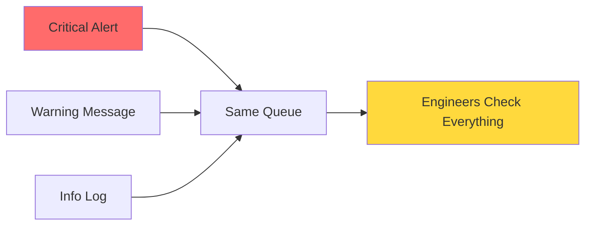
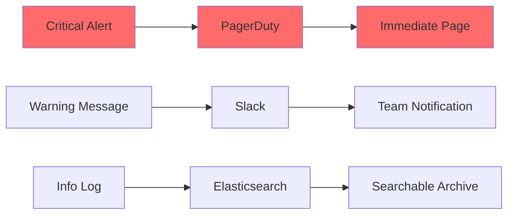

import CodeBlock from '@theme/CodeBlock';

# Step 1: Route Messages by Severity Level

**Send critical alerts where they matter most.** This step teaches you how to route messages based on severity level using the switch output. Critical errors go to PagerDuty for immediate escalation, warnings to Slack for team awareness, and informational messages to Elasticsearch for searchability.

## Why Severity-Based Routing Matters

Without severity-based routing, your incident response looks like this:



**Problems:**
- ❌ Critical alerts buried among routine logs
- ❌ On-call engineers overwhelmed by noise
- ❌ 15+ minute response time for critical issues
- ❌ Important warnings lost in the flood

With severity-based routing, you get intelligent alert escalation:



**Benefits:**
- ✅ Critical alerts trigger immediate pages
- ✅ Warnings notify teams without overwhelming 
- ✅ Info logs remain searchable but don't interrupt
- ✅ 2-minute average response time for critical issues

## Understanding Severity Levels

Most applications use these standard severity levels:

| Level | Purpose | Examples | Routing Destination |
|-------|---------|----------|-------------------|
| **CRITICAL** | Service-impacting issues requiring immediate action | Database down, payment processor offline, security breach | PagerDuty (immediate page) |
| **ERROR** | Errors that don't stop service but need investigation | API timeout, user authentication failure | PagerDuty or Slack (team notification) |
| **WARN** | Potential issues worth monitoring | High CPU usage, slow response times | Slack (team awareness) |
| **INFO** | Normal operational information | User login, successful transactions | Elasticsearch (searchable logs) |
| **DEBUG** | Detailed diagnostic information | Method calls, variable values | Local files or Elasticsearch |

## Implementation Overview

The switch output evaluates messages against conditions in order. When a message's severity matches a condition, it gets routed to the corresponding destination:

```yaml
output:
  switch:
    cases:
      # Most urgent first
      - check: this.severity == "CRITICAL"
        output: pagerduty_output
        
      # Less urgent  
      - check: this.severity == "WARN"
        output: slack_output
        
      # Default: Everything else
      - output: elasticsearch_output
```

**Key principle:** Order matters! Conditions are evaluated from top to bottom, and the first match wins.

## Step-by-Step Implementation

### Phase 1: Basic Severity Routing

Replace your shell router with severity-based routing:

```yaml title="severity-router-v1.yaml"
name: severity-router
description: Route messages based on severity level
type: pipeline
namespace: production

config:
  input:
    http_server:
      address: 0.0.0.0:8080
      path: /events
      timeout: 5s
      cors:
        enabled: true

  pipeline:
    processors:
      # Normalize severity field (handle different formats)
      - mapping: |
          root = this
          
          # Handle missing severity
          if !this.severity.exists() {
            root.severity = "INFO"
          }
          
          # Normalize to uppercase
          root.severity = this.severity.string().uppercase()
          
          # Map common variants
          root.severity = match root.severity {
            "FATAL" => "CRITICAL"
            "HIGH" => "CRITICAL"
            "MEDIUM" => "WARN"
            "LOW" => "INFO"
            _ => root.severity
          }
          
          # Add routing metadata
          root.routed_at = now()
          root.severity_score = match root.severity {
            "CRITICAL" => 100
            "ERROR" => 75
            "WARN" => 50
            "INFO" => 25
            "DEBUG" => 10
            _ => 0
          }

  output:
    switch:
      cases:
        # CRITICAL: Immediate escalation to PagerDuty
        - check: this.severity == "CRITICAL"
          output:
            http_client:
              url: https://events.pagerduty.com/v2/enqueue
              verb: POST
              headers:
                Content-Type: application/json
                Authorization: Token ${PAGERDUTY_API_KEY}
              
              # PagerDuty event format
              body: |
                {
                  "routing_key": "${PAGERDUTY_ROUTING_KEY}",
                  "event_action": "trigger",
                  "payload": {
                    "summary": this.message.or("Critical alert from " + this.source.or("unknown")),
                    "source": this.source.or("content-router"),
                    "severity": "critical",
                    "timestamp": this.timestamp.or(now()),
                    "custom_details": {
                      "event_id": this.event_id,
                      "region": this.region,
                      "original_severity": this.severity,
                      "event_type": this.event_type
                    }
                  }
                }
              
              # No batching for critical alerts
              batching:
                count: 1
                period: 0s
              
              # Aggressive retry for critical alerts
              max_retries: 5
              retry_delay: 1s
              timeout: 10s

        # ERROR: Also to PagerDuty but with batching
        - check: this.severity == "ERROR"
          output:
            http_client:
              url: https://events.pagerduty.com/v2/enqueue
              verb: POST
              headers:
                Content-Type: application/json
                Authorization: Token ${PAGERDUTY_API_KEY}
              
              body: |
                {
                  "routing_key": "${PAGERDUTY_ROUTING_KEY}",
                  "event_action": "trigger",
                  "payload": {
                    "summary": this.message.or("Error from " + this.source.or("unknown")),
                    "source": this.source.or("content-router"),
                    "severity": "error",
                    "timestamp": this.timestamp.or(now()),
                    "custom_details": {
                      "event_id": this.event_id,
                      "region": this.region,
                      "original_severity": this.severity,
                      "event_type": this.event_type
                    }
                  }
                }
              
              # Small batches for errors (reduce alert spam)
              batching:
                count: 5
                period: 30s
              
              max_retries: 3
              timeout: 10s

        # WARN: Team notifications to Slack
        - check: this.severity == "WARN"
          output:
            http_client:
              url: ${SLACK_WEBHOOK_URL}
              verb: POST
              headers:
                Content-Type: application/json
              
              body: |
                {
                  "text": "⚠️ Warning Alert",
                  "attachments": [
                    {
                      "color": "warning",
                      "fields": [
                        {
                          "title": "Message",
                          "value": this.message.or("Warning from " + this.source.or("unknown")),
                          "short": false
                        },
                        {
                          "title": "Source",
                          "value": this.source.or("unknown"),
                          "short": true
                        },
                        {
                          "title": "Region", 
                          "value": this.region.or("unknown"),
                          "short": true
                        },
                        {
                          "title": "Event ID",
                          "value": this.event_id.or("N/A"),
                          "short": true
                        },
                        {
                          "title": "Timestamp",
                          "value": this.timestamp.or(now()),
                          "short": true
                        }
                      ]
                    }
                  ]
                }
              
              # Batch warnings to avoid Slack rate limits
              batching:
                count: 10
                period: 60s
              
              max_retries: 3
              timeout: 5s

        # Default: INFO, DEBUG, and unknown severities to Elasticsearch
        - output:
            elasticsearch:
              # Connection configuration
              hosts:
                - ${ELASTICSEARCH_HOST:http://localhost:9200}
              
              # Index by date for efficient storage
              index: application-logs-${!timestamp_date("2006-01-02")}
              
              # Document type configuration
              type: _doc
              id: ${!this.event_id.or(uuid_v4())}
              
              # Batch for efficiency
              batching:
                count: 100
                period: 10s
                byte_size: 1MB
              
              # Add metadata
              metadata:
                include_patterns:
                  - "^routed_at$"
                  - "^severity_score$"

  # Enable metrics for monitoring routing decisions
  metrics:
    prometheus:
      enabled: true
      path: /metrics
      labels:
        pipeline: severity-router

  # Structured logging
  logger:
    level: INFO
    format: json
    fields:
      pipeline: severity-router
```

### Phase 2: Deploy and Test Basic Routing

Deploy the severity router:

```bash
# Stop the shell router first
expanso pipeline stop shell-content-router

# Deploy severity router
expanso pipeline create severity-router-v1.yaml

# Verify deployment
expanso pipeline status severity-router
```

Test with different severity levels:

```bash
# Test CRITICAL alert (should go to PagerDuty)
curl -X POST http://localhost:8080/events \
  -H "Content-Type: application/json" \
  -d '{
    "event_id": "critical-001",
    "timestamp": "2025-10-20T10:00:00Z",
    "severity": "CRITICAL",
    "message": "Payment processor is down",
    "source": "payment-service",
    "region": "us-east"
  }'

# Test WARN message (should go to Slack)
curl -X POST http://localhost:8080/events \
  -H "Content-Type: application/json" \
  -d '{
    "event_id": "warn-001", 
    "timestamp": "2025-10-20T10:01:00Z",
    "severity": "WARN",
    "message": "High CPU usage detected",
    "source": "monitoring-service",
    "region": "us-east"
  }'

# Test INFO message (should go to Elasticsearch)
curl -X POST http://localhost:8080/events \
  -H "Content-Type: application/json" \
  -d '{
    "event_id": "info-001",
    "timestamp": "2025-10-20T10:02:00Z", 
    "severity": "INFO",
    "message": "User successfully logged in",
    "source": "auth-service",
    "region": "us-east",
    "user_id": "user123"
  }'
```

### Phase 3: Verify Routing Destinations

**Check PagerDuty:**
1. Log into your PagerDuty dashboard
2. Look for triggered incidents with summary "Payment processor is down"
3. Verify custom details include event_id, region, and event_type

**Check Slack:**
1. Look in your configured Slack channel
2. You should see a warning alert for "High CPU usage detected"
3. Verify the attachment shows source, region, and timestamp

**Check Elasticsearch:**
```bash
# Query Elasticsearch for the INFO message
curl -X GET "${ELASTICSEARCH_HOST}/application-logs-$(date +%Y-%m-%d)/_search" \
  -H "Content-Type: application/json" \
  -d '{
    "query": {
      "term": {
        "event_id": "info-001"
      }
    }
  }' | jq '.hits.hits[0]._source'
```

### Phase 4: Advanced Severity Routing

Enhance the router with business logic and edge cases:

```yaml title="severity-router-v2.yaml"
# Enhanced version with business logic
name: severity-router-enhanced
description: Advanced severity routing with business rules
type: pipeline
namespace: production

config:
  input:
    http_server:
      address: 0.0.0.0:8080
      path: /events
      timeout: 5s
      cors:
        enabled: true

  pipeline:
    processors:
      # Enhanced severity normalization with business logic
      - mapping: |
          root = this
          
          # Normalize severity field
          root.severity = this.severity.string().uppercase().or("INFO")
          
          # Map variants
          root.severity = match root.severity {
            "FATAL" | "EMERGENCY" | "HIGH" => "CRITICAL"
            "MEDIUM" | "WARNING" => "WARN" 
            "LOW" | "NOTICE" => "INFO"
            "VERBOSE" | "TRACE" => "DEBUG"
            _ => root.severity
          }
          
          # Business logic: Escalate certain event types
          if this.event_type.or("").has_prefix("payment.") && root.severity == "ERROR" {
            root.severity = "CRITICAL"
            root.escalation_reason = "payment_system_error"
          }
          
          # Business logic: Escalate security events  
          if this.event_type.or("").has_prefix("auth.") && root.severity == "WARN" {
            root.severity = "ERROR"
            root.escalation_reason = "security_concern"
          }
          
          # Business logic: Escalate for premium users
          if this.user_tier.or("") == "premium" && root.severity == "ERROR" {
            root.severity = "CRITICAL" 
            root.escalation_reason = "premium_user_impact"
          }
          
          # Rate limiting metadata
          root.routing_key = root.severity + "-" + this.source.or("unknown")
          
          # Add timing metadata
          root.processed_at = now()
          root.severity_score = match root.severity {
            "CRITICAL" => 100
            "ERROR" => 75
            "WARN" => 50
            "INFO" => 25
            "DEBUG" => 10
            _ => 0
          }

  output:
    switch:
      cases:
        # CRITICAL: Multiple escalation channels
        - check: this.severity == "CRITICAL"
          output:
            broker:
              pattern: fan_out
              outputs:
                # Primary: PagerDuty
                - http_client:
                    url: https://events.pagerduty.com/v2/enqueue
                    verb: POST
                    headers:
                      Content-Type: application/json
                      Authorization: Token ${PAGERDUTY_API_KEY}
                    
                    body: |
                      {
                        "routing_key": "${PAGERDUTY_ROUTING_KEY}",
                        "event_action": "trigger",
                        "payload": {
                          "summary": this.message.or("Critical alert"),
                          "source": this.source.or("content-router"),
                          "severity": "critical",
                          "timestamp": this.timestamp.or(now()),
                          "custom_details": {
                            "event_id": this.event_id,
                            "region": this.region,
                            "escalation_reason": this.escalation_reason,
                            "original_severity": this.severity,
                            "event_type": this.event_type,
                            "user_tier": this.user_tier
                          }
                        }
                      }
                    
                    # No batching for critical
                    batching:
                      count: 1
                      period: 0s
                    
                    max_retries: 5
                    timeout: 10s

                # Secondary: Critical Slack channel
                - http_client:
                    url: ${SLACK_CRITICAL_WEBHOOK_URL}
                    verb: POST
                    headers:
                      Content-Type: application/json
                    
                    body: |
                      {
                        "text": "🚨 CRITICAL ALERT",
                        "attachments": [
                          {
                            "color": "danger",
                            "title": "Critical System Alert",
                            "text": this.message.or("Critical alert"),
                            "fields": [
                              {
                                "title": "Source",
                                "value": this.source.or("unknown"),
                                "short": true
                              },
                              {
                                "title": "Region",
                                "value": this.region.or("unknown"),
                                "short": true
                              },
                              {
                                "title": "Event Type",
                                "value": this.event_type.or("unknown"),
                                "short": true
                              },
                              {
                                "title": "Escalation Reason",
                                "value": this.escalation_reason.or("severity_level"),
                                "short": true
                              }
                            ],
                            "footer": "Content Router",
                            "ts": this.timestamp.or(now()).parse_timestamp_unix()
                          }
                        ]
                      }
                    
                    # Small batch for Slack rate limits
                    batching:
                      count: 2
                      period: 10s

                # Tertiary: Archive to dedicated critical topic
                - kafka:
                    addresses: [${KAFKA_BROKERS}]
                    topic: critical-alerts
                    
                    # Ensure delivery
                    ack_replicas: true
                    max_in_flight: 1
                    
                    # Metadata for downstream processors
                    metadata:
                      include_patterns:
                        - "^escalation_reason$"
                        - "^processed_at$"

        # ERROR: PagerDuty with throttling
        - check: this.severity == "ERROR"
          output:
            http_client:
              url: https://events.pagerduty.com/v2/enqueue
              verb: POST
              headers:
                Content-Type: application/json
                Authorization: Token ${PAGERDUTY_API_KEY}
              
              body: |
                {
                  "routing_key": "${PAGERDUTY_ROUTING_KEY}",
                  "event_action": "trigger",
                  "payload": {
                    "summary": this.message.or("Error alert"),
                    "source": this.source.or("content-router"),
                    "severity": "error",
                    "timestamp": this.timestamp.or(now()),
                    "custom_details": {
                      "event_id": this.event_id,
                      "region": this.region,
                      "escalation_reason": this.escalation_reason,
                      "original_severity": this.severity,
                      "event_type": this.event_type
                    }
                  }
                }
              
              # Batch errors to reduce alert fatigue
              batching:
                count: 5
                period: 60s
              
              max_retries: 3
              timeout: 10s

        # WARN: Enhanced Slack notifications
        - check: this.severity == "WARN"
          output:
            http_client:
              url: ${SLACK_WEBHOOK_URL}
              verb: POST
              headers:
                Content-Type: application/json
              
              body: |
                {
                  "text": "⚠️ Warning Alert",
                  "attachments": [
                    {
                      "color": "warning",
                      "title": "System Warning",
                      "text": this.message.or("Warning alert"),
                      "fields": [
                        {
                          "title": "Source",
                          "value": this.source.or("unknown"),
                          "short": true
                        },
                        {
                          "title": "Region",
                          "value": this.region.or("unknown"),
                          "short": true
                        },
                        {
                          "title": "Event Type",
                          "value": this.event_type.or("unknown"),
                          "short": true
                        },
                        {
                          "title": "Escalation Reason",
                          "value": this.escalation_reason.or("none"),
                          "short": true
                        }
                      ],
                      "footer": "Content Router",
                      "ts": this.timestamp.or(now()).parse_timestamp_unix()
                    }
                  ]
                }
              
              # Batch warnings
              batching:
                count: 10
                period: 120s
              
              max_retries: 3
              timeout: 5s

        # Default: All other messages to Elasticsearch with enhanced indexing
        - output:
            elasticsearch:
              hosts:
                - ${ELASTICSEARCH_HOST:http://localhost:9200}
              
              # Time-based indices for efficient querying
              index: application-logs-${!timestamp_date("2006-01-02")}
              
              type: _doc
              id: ${!this.event_id.or(uuid_v4())}
              
              # Enhanced batching
              batching:
                count: 250
                period: 30s
                byte_size: 5MB
              
              # Comprehensive metadata
              metadata:
                include_patterns:
                  - "^processed_at$"
                  - "^severity_score$"
                  - "^escalation_reason$"
                  - "^routing_key$"

  # Enhanced metrics
  metrics:
    prometheus:
      enabled: true
      path: /metrics
      labels:
        pipeline: severity-router-enhanced
        version: v2

  logger:
    level: INFO
    format: json
    fields:
      pipeline: severity-router-enhanced
      version: v2
```

## Production Considerations

### 1. Alert Rate Limiting

Prevent alert storms with intelligent batching:

```yaml
# Group similar alerts to reduce noise
batching:
  count: 5
  period: 300s  # 5 minutes
  
# Use routing keys to group related alerts
routing_key: this.source + "-" + this.event_type
```

### 2. Escalation Rules

Implement business-specific escalation logic:

```yaml
# Escalate payment issues immediately
if this.event_type.has_prefix("payment.") && root.severity == "ERROR" {
  root.severity = "CRITICAL"
  root.escalation_reason = "financial_system_impact"
}

# Escalate security events
if this.source.contains("auth") && root.severity == "WARN" {
  root.severity = "ERROR" 
  root.escalation_reason = "security_concern"
}

# Escalate for premium customers
if this.user_tier == "premium" {
  root.priority_boost = true
}
```

### 3. Fallback Handling

Always include fallback routes for edge cases:

```yaml
# Catch unknown severity levels
- check: !["CRITICAL", "ERROR", "WARN", "INFO", "DEBUG"].contains(this.severity)
  output:
    broker:
      pattern: fan_out
      outputs:
        # Log for investigation
        - file:
            path: /var/log/expanso/unknown-severity.jsonl
        
        # Alert about configuration issue
        - http_client:
            url: ${MONITORING_WEBHOOK_URL}
```

### 4. Performance Optimization

Optimize for high-throughput scenarios:

```yaml
# Pre-compute routing decisions
pipeline:
  processors:
    - mapping: |
        # Calculate routing destination once
        root.route_to = match this.severity {
          "CRITICAL" => "pagerduty"
          "ERROR" => "pagerduty_batched" 
          "WARN" => "slack"
          _ => "elasticsearch"
        }

# Use simple field checks in switch
output:
  switch:
    cases:
      - check: this.route_to == "pagerduty"
        output: pagerduty_config
```

## Verification and Testing

### Integration Testing

Create comprehensive tests for all severity levels:

```bash
#!/bin/bash
# test-severity-routing.sh

BASE_URL="http://localhost:8080/events"
TIMESTAMP=$(date -u +%Y-%m-%dT%H:%M:%SZ)

echo "Testing severity routing..."

# Test 1: Critical alert
echo "Testing CRITICAL severity..."
CRITICAL_RESPONSE=$(curl -s -w "%{http_code}" -X POST $BASE_URL \
  -H "Content-Type: application/json" \
  -d "{
    \"event_id\": \"test-critical-$(date +%s)\",
    \"timestamp\": \"$TIMESTAMP\",
    \"severity\": \"CRITICAL\",
    \"message\": \"Test critical alert for routing verification\",
    \"source\": \"test-suite\",
    \"region\": \"us-east\"
  }")

if [[ $CRITICAL_RESPONSE == *"200"* ]]; then
  echo "✅ Critical alert accepted"
else
  echo "❌ Critical alert failed: $CRITICAL_RESPONSE"
fi

# Test 2: Warning message
echo "Testing WARN severity..."
WARN_RESPONSE=$(curl -s -w "%{http_code}" -X POST $BASE_URL \
  -H "Content-Type: application/json" \
  -d "{
    \"event_id\": \"test-warn-$(date +%s)\",
    \"timestamp\": \"$TIMESTAMP\",
    \"severity\": \"WARN\",
    \"message\": \"Test warning for routing verification\",
    \"source\": \"test-suite\",
    \"region\": \"us-east\"
  }")

if [[ $WARN_RESPONSE == *"200"* ]]; then
  echo "✅ Warning message accepted"
else
  echo "❌ Warning message failed: $WARN_RESPONSE"
fi

# Test 3: Info message
echo "Testing INFO severity..."
INFO_RESPONSE=$(curl -s -w "%{http_code}" -X POST $BASE_URL \
  -H "Content-Type: application/json" \
  -d "{
    \"event_id\": \"test-info-$(date +%s)\",
    \"timestamp\": \"$TIMESTAMP\",
    \"severity\": \"INFO\",
    \"message\": \"Test info message for routing verification\",
    \"source\": \"test-suite\",
    \"region\": \"us-east\"
  }")

if [[ $INFO_RESPONSE == *"200"* ]]; then
  echo "✅ Info message accepted"
else
  echo "❌ Info message failed: $INFO_RESPONSE"
fi

# Test 4: Unknown severity (should default to INFO)
echo "Testing unknown severity..."
UNKNOWN_RESPONSE=$(curl -s -w "%{http_code}" -X POST $BASE_URL \
  -H "Content-Type: application/json" \
  -d "{
    \"event_id\": \"test-unknown-$(date +%s)\",
    \"timestamp\": \"$TIMESTAMP\",
    \"severity\": \"CUSTOM_LEVEL\",
    \"message\": \"Test unknown severity routing\",
    \"source\": \"test-suite\",
    \"region\": \"us-east\"
  }")

if [[ $UNKNOWN_RESPONSE == *"200"* ]]; then
  echo "✅ Unknown severity handled"
else
  echo "❌ Unknown severity failed: $UNKNOWN_RESPONSE"
fi

echo "Testing complete. Check destinations for routed messages."
```

### Metrics Verification

Monitor routing effectiveness:

```bash
# Check routing distribution
curl -s http://localhost:8080/metrics | grep -E "(severity|route)" | head -10

# Example healthy metrics:
# severity_router_messages_routed_total{severity="critical"} 5
# severity_router_messages_routed_total{severity="error"} 12  
# severity_router_messages_routed_total{severity="warn"} 45
# severity_router_messages_routed_total{severity="info"} 1200
```

## Common Routing Variations

### 1. Regional Emergency Escalation

Different regions may have different escalation procedures:

```yaml
# Regional escalation rules
- mapping: |
    # EU has stricter privacy requirements
    if this.region == "eu-west" && this.event_type.contains("privacy") {
      root.severity = "CRITICAL"
      root.escalation_reason = "gdpr_privacy_concern"
    }
    
    # US financial regulations
    if this.region.has_prefix("us-") && this.event_type.contains("payment") {
      if root.severity == "ERROR" {
        root.severity = "CRITICAL"
        root.escalation_reason = "financial_compliance"
      }
    }
```

### 2. Time-Based Routing

Route differently based on business hours:

```yaml
# Time-aware severity adjustment
- mapping: |
    let business_hours = now().hour() >= 8 && now().hour() <= 18
    let weekend = now().weekday() == 0 || now().weekday() == 6
    
    # Lower urgency outside business hours for non-critical systems
    if !business_hours || weekend {
      if this.source != "payment-processor" && root.severity == "ERROR" {
        root.severity = "WARN"
        root.escalation_reason = "outside_business_hours"
      }
    }
```

### 3. Service Tier Routing

Route based on service criticality:

```yaml
# Service criticality mapping
- mapping: |
    let critical_services = ["payment-processor", "auth-service", "user-data-service"]
    let non_critical_services = ["analytics", "reporting", "batch-jobs"]
    
    if critical_services.contains(this.source.or("")) {
      if root.severity == "WARN" {
        root.severity = "ERROR"
        root.escalation_reason = "critical_service"
      }
    }
    
    if non_critical_services.contains(this.source.or("")) {
      if root.severity == "ERROR" {
        root.severity = "WARN"
        root.escalation_reason = "non_critical_service"
      }
    }
```

## Troubleshooting Severity Routing

### Issue: All Messages Going to Default Route

**Symptom:** All messages end up in Elasticsearch regardless of severity

**Diagnosis:**
```bash
# Check pipeline logs for condition evaluation errors
expanso pipeline logs severity-router | grep -i "condition"

# Test severity field extraction
curl -X POST http://localhost:8080/events \
  -H "Content-Type: application/json" \
  -d '{"test": "severity", "severity": "CRITICAL"}' \
  | jq '.severity'
```

**Solution:** Verify severity field normalization:
```yaml
# Debug the severity processing
- mapping: |
    root = this
    # Add debug info
    root.debug_original_severity = this.severity
    root.severity = this.severity.string().uppercase()
    root.debug_normalized_severity = root.severity
```

### Issue: PagerDuty Integration Not Working

**Symptom:** Critical alerts not appearing in PagerDuty

**Diagnosis:**
```bash
# Test PagerDuty API directly
curl -X POST https://events.pagerduty.com/v2/enqueue \
  -H "Authorization: Token $PAGERDUTY_API_KEY" \
  -H "Content-Type: application/json" \
  -d '{
    "routing_key": "test-key",
    "event_action": "trigger",
    "payload": {
      "summary": "Test from content router",
      "source": "test"
    }
  }'
```

**Solutions:**
1. **Invalid API Key:** Verify `PAGERDUTY_API_KEY` environment variable
2. **Wrong routing key:** Check `PAGERDUTY_ROUTING_KEY` matches your integration
3. **Rate limiting:** Add retry logic and exponential backoff

### Issue: Slack Rate Limiting

**Symptom:** Warning messages not appearing in Slack

**Solution:** Implement intelligent batching:
```yaml
# Enhanced Slack batching
batching:
  count: 5           # Fewer messages per batch
  period: 120s       # Longer period between batches
  byte_size: 10KB    # Smaller payloads
  
# Add rate limiting headers
headers:
  Content-Type: application/json
  X-RateLimit-Burst: "5"
```

## Next Steps

You've successfully implemented severity-based routing! Your pipeline now:
- ✅ Routes critical alerts to PagerDuty for immediate escalation
- ✅ Sends warnings to Slack for team awareness
- ✅ Archives info/debug messages to Elasticsearch for searchability
- ✅ Handles business logic for payment and security events
- ✅ Includes proper error handling and fallbacks

<div style={{display: 'flex', gap: '1.5rem', marginTop: '2rem', marginBottom: '3rem', flexWrap: 'wrap', justifyContent: 'flex-start'}}>
  <a href="./step-2-route-by-region" className="button button--primary button--lg" style={{display: 'inline-flex', alignItems: 'center', justifyContent: 'center', textDecoration: 'none', borderRadius: '8px', padding: '1rem 2rem', fontWeight: '600', minWidth: '240px', boxShadow: '0 2px 8px rgba(0,0,0,0.15)', cursor: 'pointer', transition: 'all 0.2s ease'}}>
    Next: Geographic Routing
  </a>
  <a href="./troubleshooting" className="button button--secondary button--lg" style={{display: 'inline-flex', alignItems: 'center', justifyContent: 'center', textDecoration: 'none', borderRadius: '8px', padding: '1rem 2rem', fontWeight: '600', minWidth: '240px', boxShadow: '0 2px 8px rgba(0,0,0,0.15)', cursor: 'pointer', transition: 'all 0.2s ease'}}>
    Troubleshooting Guide
  </a>
</div>

**Next up:** [Step 2: Route by Region](./step-2-route-by-region) - Add geographic routing for GDPR compliance and performance optimization.

## Key Takeaways

1. **Order matters** - Place most specific conditions first in switch cases
2. **Always include defaults** - Catch unexpected data with final case
3. **Normalize inputs** - Handle different severity formats consistently  
4. **Add business logic** - Escalate based on event type, user tier, or source
5. **Monitor routing decisions** - Use metrics to verify correct distribution
6. **Test thoroughly** - Verify each routing path works as expected
