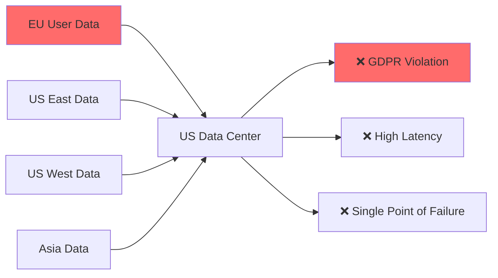
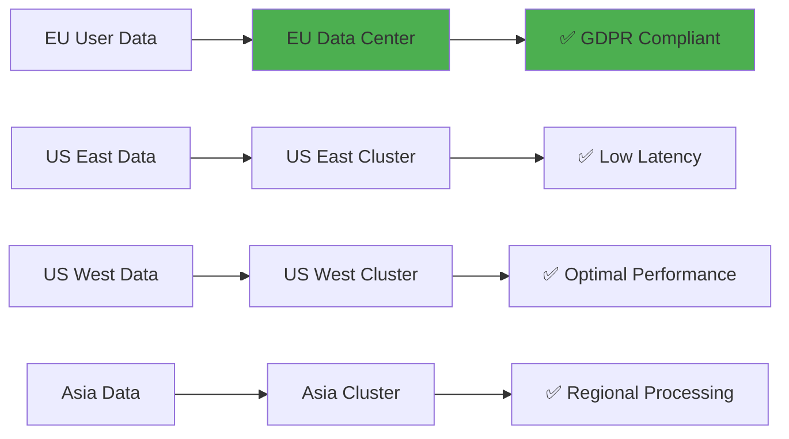

import CodeBlock from '@theme/CodeBlock';

# Step 2: Route Data by Geographic Region

**Keep EU data in the EU, optimize US performance.** This step teaches you geographic routing to maintain GDPR compliance and minimize latency by routing data to the closest regional infrastructure.

## Why Geographic Routing Is Critical

Without geographic routing, your data flows might violate regulations:



**Problems:**
- ❌ **GDPR violations:** EU personal data processed in US systems
- ❌ **High latency:** Cross-continental data transfer adds 100-300ms
- ❌ **Compliance risk:** Potential €20M+ fines for data residency violations
- ❌ **Poor UX:** Slow response times for international users

With geographic routing, you ensure compliance and performance:



**Benefits:**
- ✅ **GDPR compliance:** EU data never leaves EU infrastructure
- ✅ **Low latency:** 20-50ms response times in each region
- ✅ **Regulatory compliance:** Meets data residency requirements globally
- ✅ **Improved performance:** Regional processing reduces cross-continental traffic

## Understanding Geographic Routing Requirements

Different regions have different regulatory and performance requirements:

| Region | Compliance Requirement | Performance Target | Data Residency |
|--------|----------------------|-------------------|-----------------|
| **EU (GDPR)** | Personal data must stay in EU | < 50ms latency | Strict - EU only |
| **US** | CCPA, HIPAA compliance | < 30ms regional latency | Flexible within US |
| **Canada** | PIPEDA compliance | < 40ms latency | Preferably in Canada |
| **Asia-Pacific** | Various national requirements | < 60ms latency | Country-specific rules |
| **Other** | Local data protection laws | < 100ms latency | Best effort regional |

## Implementation Overview

Geographic routing uses region metadata to make routing decisions:

```yaml
output:
  switch:
    cases:
      # EU data MUST stay in EU (GDPR)
      - check: this.region == "eu-west"
        output: eu_infrastructure
        
      # US regions to closest clusters
      - check: this.region == "us-east"  
        output: us_east_cluster
        
      # Default: Route unknown regions safely
      - output: safe_default_route
```

**Key principle:** Compliance first, performance second. Always err on the side of keeping data local.

## Step-by-Step Implementation

### Phase 1: Add Geographic Metadata

Enhance your pipeline to detect and normalize geographic information:

```yaml title="geographic-router-v1.yaml"
name: geographic-router
description: Route data based on geographic region for compliance and performance
type: pipeline
namespace: production

config:
  input:
    http_server:
      address: 0.0.0.0:8080
      path: /events
      timeout: 5s
      cors:
        enabled: true

  pipeline:
    processors:
      # Normalize severity (from previous step)
      - mapping: |
          root = this
          root.severity = this.severity.string().uppercase().or("INFO")

      # Geographic metadata enrichment
      - mapping: |
          root = this
          
          # Extract region from various sources
          root.region = if this.region.exists() {
            this.region.string().lowercase()
          } else if this.user_region.exists() {
            this.user_region.string().lowercase()  
          } else if env("EDGE_REGION").exists() {
            env("EDGE_REGION").string().lowercase()
          } else {
            "unknown"
          }
          
          # Normalize region codes
          root.region = match root.region {
            "europe-west1" | "eu-west-1" | "eu-west" | "europe" => "eu-west"
            "us-east-1" | "us-east1" | "useast" => "us-east"  
            "us-west-1" | "us-west1" | "uswest" => "us-west"
            "us-central-1" | "us-central1" | "uscentral" => "us-central"
            "asia-southeast1" | "ap-southeast-1" | "ap-south" => "ap-south"
            "canada-central" | "ca-central" => "ca-central"
            _ => root.region
          }
          
          # Validate against known regions
          let valid_regions = [
            "eu-west", "eu-central", "eu-north",
            "us-east", "us-west", "us-central", 
            "ca-central",
            "ap-south", "ap-southeast", "ap-northeast"
          ]
          
          if !valid_regions.contains(root.region) {
            root.region = "unknown"
            root.region_validation_failed = true
          }
          
          # Add compliance metadata
          root.requires_gdpr_compliance = ["eu-west", "eu-central", "eu-north"].contains(root.region)
          root.region_cluster = match root.region {
            "eu-west" | "eu-central" | "eu-north" => "eu-cluster"
            "us-east" => "us-east-cluster" 
            "us-west" => "us-west-cluster"
            "us-central" => "us-central-cluster"
            "ca-central" => "canada-cluster"
            "ap-south" | "ap-southeast" | "ap-northeast" => "asia-cluster"
            _ => "unknown-cluster"
          }
          
          # Add latency optimization hints
          root.preferred_kafka_cluster = match root.region {
            "eu-west" => env("EU_KAFKA").or("eu-kafka.example.com:9092")
            "us-east" => env("US_EAST_KAFKA").or("us-east-kafka.example.com:9092")
            "us-west" => env("US_WEST_KAFKA").or("us-west-kafka.example.com:9092")
            "ap-south" => env("AP_KAFKA").or("ap-kafka.example.com:9092")
            _ => env("KAFKA_BROKERS").or("localhost:9092")
          }
          
          # Routing timestamp for compliance audit
          root.routed_at = now()
          root.routing_version = "geographic-v1"

  output:
    switch:
      cases:
        # EU data: GDPR-compliant routing (CRITICAL: Must stay in EU)
        - check: this.requires_gdpr_compliance == true
          output:
            broker:
              pattern: fan_out
              outputs:
                # Primary: EU Kafka cluster
                - kafka:
                    addresses:
                      - ${EU_KAFKA:eu-kafka.example.com:9092}
                    topic: eu-events
                    
                    # GDPR compliance settings
                    compression: snappy
                    batch:
                      count: 100
                      period: 1s
                      
                    # Ensure delivery within EU
                    ack_replicas: true
                    max_in_flight: 5
                    
                    # GDPR audit metadata
                    metadata:
                      include_patterns:
                        - "^requires_gdpr_compliance$"
                        - "^routed_at$"
                        - "^region$"

                # Secondary: EU S3 archive for compliance  
                - aws_s3:
                    bucket: ${EU_S3_BUCKET:eu-data-archive}
                    region: eu-west-1
                    path: events/${!timestamp_date("2006/01/02")}/eu_events_${!count("files")}.jsonl
                    
                    # Efficient storage for compliance
                    content_encoding: gzip
                    storage_class: INTELLIGENT_TIERING
                    
                    # Batch for efficiency
                    batching:
                      count: 1000
                      period: 5m
                      
                    # GDPR compliance tags
                    tags:
                      DataClassification: "PersonalData"
                      GDPRCompliance: "Required"
                      DataResidency: "EU"

        # US East: Regional cluster for low latency
        - check: this.region == "us-east"
          output:
            broker:
              pattern: fan_out
              outputs:
                # Primary: US East Kafka
                - kafka:
                    addresses:
                      - ${US_EAST_KAFKA:us-east-kafka.example.com:9092}
                    topic: us-east-events
                    
                    # Optimized for low latency
                    compression: lz4  # Faster than snappy
                    batching:
                      count: 50      # Smaller batches for speed
                      period: 500ms  # Faster delivery
                      
                    ack_replicas: false  # Speed over durability
                    max_in_flight: 10

                # Secondary: US regional storage
                - aws_s3:
                    bucket: ${US_EAST_S3_BUCKET:us-east-data-archive}
                    region: us-east-1
                    path: events/${!timestamp_date("2006/01/02")}/us_east_${!count("files")}.jsonl
                    content_encoding: gzip
                    storage_class: STANDARD
                    
                    batching:
                      count: 500
                      period: 2m

        # US West: West coast cluster
        - check: this.region == "us-west"
          output:
            kafka:
              addresses:
                - ${US_WEST_KAFKA:us-west-kafka.example.com:9092}
              topic: us-west-events
              
              # Similar to US East but different infrastructure
              compression: lz4
              batching:
                count: 50
                period: 500ms
              max_in_flight: 10

        # US Central: Central cluster for midwest
        - check: this.region == "us-central"
          output:
            kafka:
              addresses:
                - ${US_CENTRAL_KAFKA:us-central-kafka.example.com:9092}
              topic: us-central-events
              compression: lz4
              batching:
                count: 75
                period: 750ms

        # Canada: Canadian data residency
        - check: this.region == "ca-central"
          output:
            broker:
              pattern: fan_out
              outputs:
                # Canadian Kafka
                - kafka:
                    addresses:
                      - ${CANADA_KAFKA:ca-kafka.example.com:9092}
                    topic: canada-events
                    compression: snappy
                    batching:
                      count: 100
                      period: 1s

                # Canadian S3 for PIPEDA compliance
                - aws_s3:
                    bucket: ${CANADA_S3_BUCKET:canada-data-archive}
                    region: ca-central-1
                    path: events/${!timestamp_date("2006/01/02")}/ca_events_${!count("files")}.jsonl
                    content_encoding: gzip
                    
                    # Canadian compliance tags
                    tags:
                      DataResidency: "Canada"
                      PIPEDACompliance: "Required"

        # Asia-Pacific: Regional cluster
        - check: this.region.has_prefix("ap-")
          output:
            kafka:
              addresses:
                - ${AP_KAFKA:ap-kafka.example.com:9092}
              topic: asia-events
              compression: snappy
              batching:
                count: 100
                period: 1s

        # Unknown regions: Safe default routing
        - output:
            broker:
              pattern: fan_out
              outputs:
                # Log unknown regions for investigation
                - file:
                    path: /var/log/expanso/unknown-region-${!timestamp_date("2006-01-02")}.jsonl
                    codec: lines
                    batching:
                      count: 100
                      period: 60s

                # Alert about data governance issue
                - http_client:
                    url: ${MONITORING_WEBHOOK_URL}
                    verb: POST
                    headers:
                      Content-Type: application/json
                    
                    body: |
                      {
                        "alert": "unknown_region_detected",
                        "region": this.region,
                        "event_id": this.event_id,
                        "timestamp": this.routed_at,
                        "message": "Event received from unknown region - potential compliance risk"
                      }
                    
                    # Don't batch alerts
                    batching:
                      count: 1
                      period: 0s

                # Send to default cluster as fallback
                - kafka:
                    addresses: [${KAFKA_BROKERS}]
                    topic: unknown-region-events
                    compression: snappy
                    
                    # Metadata for investigation
                    metadata:
                      include_patterns:
                        - "^region$"
                        - "^region_validation_failed$"

  # Enhanced metrics for geographic routing
  metrics:
    prometheus:
      enabled: true
      path: /metrics
      labels:
        pipeline: geographic-router
        routing_type: geographic

  logger:
    level: INFO
    format: json
    fields:
      pipeline: geographic-router
      routing_type: geographic
```

### Phase 2: Deploy and Test Geographic Routing

Deploy the enhanced router:

```bash
# Stop previous router
expanso pipeline stop severity-router

# Deploy geographic router 
expanso pipeline create geographic-router-v1.yaml

# Verify deployment
expanso pipeline status geographic-router
```

Test with different regions:

```bash
# Test EU data (should stay in EU)
curl -X POST http://localhost:8080/events \
  -H "Content-Type: application/json" \
  -d '{
    "event_id": "eu-001",
    "timestamp": "2025-10-20T10:00:00Z",
    "severity": "INFO",
    "message": "EU user login",
    "region": "eu-west",
    "user_id": "eu_user_123",
    "personal_data": "email@example.eu"
  }'

# Test US East data (should go to US East cluster)  
curl -X POST http://localhost:8080/events \
  -H "Content-Type: application/json" \
  -d '{
    "event_id": "us-east-001",
    "timestamp": "2025-10-20T10:01:00Z", 
    "severity": "INFO",
    "message": "US East user action",
    "region": "us-east",
    "user_id": "us_user_456"
  }'

# Test unknown region (should trigger alerts)
curl -X POST http://localhost:8080/events \
  -H "Content-Type: application/json" \
  -d '{
    "event_id": "unknown-001",
    "timestamp": "2025-10-20T10:02:00Z",
    "severity": "INFO", 
    "message": "Unknown region data",
    "region": "mars-colony-1",
    "user_id": "alien_user_789"
  }'
```

### Phase 3: Verify Regional Routing

**Check EU Kafka:**
```bash
# Verify EU data reached EU cluster
kafka-console-consumer --bootstrap-server $EU_KAFKA \
  --topic eu-events --from-beginning --max-messages 5

# Should see the EU user login event with GDPR compliance metadata
```

**Check US East Kafka:**
```bash
# Verify US data reached regional cluster
kafka-console-consumer --bootstrap-server $US_EAST_KAFKA \
  --topic us-east-events --from-beginning --max-messages 5

# Should see US East user action event
```

**Check unknown region handling:**
```bash
# Check local log file for unknown regions
cat /var/log/expanso/unknown-region-$(date +%Y-%m-%d).jsonl

# Should contain the mars-colony-1 event
```

### Phase 4: Advanced Geographic Routing with Compliance

Enhance with additional compliance and performance features:

```yaml title="geographic-router-v2.yaml"
name: geographic-router-enhanced
description: Advanced geographic routing with full compliance and performance optimization
type: pipeline
namespace: production

config:
  input:
    http_server:
      address: 0.0.0.0:8080
      path: /events
      timeout: 5s
      cors:
        enabled: true

  pipeline:
    processors:
      # Severity normalization (from previous steps)
      - mapping: |
          root = this
          root.severity = this.severity.string().uppercase().or("INFO")

      # Enhanced geographic processing
      - mapping: |
          root = this
          
          # Multi-source region detection
          root.region = if this.region.exists() {
            this.region.string().lowercase()
          } else if this.user_region.exists() {
            this.user_region.string().lowercase()
          } else if this.client_ip.exists() {
            # Derive region from IP (in real implementation, use GeoIP database)
            if this.client_ip.string().has_prefix("192.168.1.") {
              "us-east"  # Example: internal network mapping
            } else if this.client_ip.string().has_prefix("10.0.1.") {
              "eu-west"  # Example: EU office network
            } else {
              "unknown"
            }
          } else if env("EDGE_REGION").exists() {
            env("EDGE_REGION").string().lowercase()
          } else {
            "unknown"
          }
          
          # Enhanced region normalization
          root.region = match root.region {
            # EU regions
            "europe-west1" | "eu-west-1" | "eu-west" | "europe" | "emea" => "eu-west"
            "europe-central1" | "eu-central-1" | "eu-central" => "eu-central"
            "europe-north1" | "eu-north-1" | "eu-north" | "nordics" => "eu-north"
            
            # US regions  
            "us-east-1" | "us-east1" | "useast" | "virginia" => "us-east"
            "us-west-1" | "us-west1" | "uswest" | "california" => "us-west"
            "us-central-1" | "us-central1" | "uscentral" | "iowa" => "us-central"
            
            # Canada
            "canada-central" | "ca-central" | "toronto" => "ca-central"
            
            # Asia Pacific
            "asia-southeast1" | "ap-southeast-1" | "singapore" => "ap-southeast"
            "asia-south1" | "ap-south-1" | "mumbai" => "ap-south"
            "asia-northeast1" | "ap-northeast-1" | "tokyo" => "ap-northeast"
            
            _ => root.region
          }
          
          # Compliance and performance metadata
          root.compliance_requirements = match root.region {
            "eu-west" | "eu-central" | "eu-north" => ["gdpr", "data-residency-eu"]
            "ca-central" => ["pipeda", "data-residency-canada"]
            "ap-south" | "ap-southeast" | "ap-northeast" => ["local-data-protection"]
            _ => ["general-data-protection"]
          }
          
          root.requires_strict_residency = root.compliance_requirements.contains("gdpr") || 
                                          root.compliance_requirements.contains("pipeda")
          
          # Performance optimization metadata
          root.latency_tier = match root.region {
            "us-east" | "us-west" => "premium"      # < 30ms target
            "eu-west" => "standard"                  # < 50ms target  
            "ca-central" | "ap-southeast" => "standard"  # < 60ms target
            _ => "best-effort"                       # < 100ms target
          }
          
          # Routing decision metadata
          root.routing_strategy = if root.requires_strict_residency {
            "compliance-first"
          } else if root.latency_tier == "premium" {
            "performance-optimized" 
          } else {
            "standard-routing"
          }
          
          # Audit trail
          root.geographic_routing = {
            "processed_at": now(),
            "version": "v2",
            "region_source": if this.region.exists() { "explicit" } else { "derived" },
            "compliance_level": if root.requires_strict_residency { "strict" } else { "standard" }
          }

      # Data classification for compliance
      - mapping: |
          root = this
          
          # Classify data sensitivity
          root.data_classification = "public"  # default
          
          # Check for PII indicators
          let pii_fields = ["email", "phone", "ssn", "personal_id", "address"]
          let has_pii = pii_fields.map_each(field -> this.get(field).exists()).any(x -> x)
          
          if has_pii || this.personal_data.exists() {
            root.data_classification = "pii"
          }
          
          # Check for financial data
          let financial_fields = ["credit_card", "bank_account", "payment_info"]
          let has_financial = financial_fields.map_each(field -> this.get(field).exists()).any(x -> x)
          
          if has_financial || this.event_type.or("").has_prefix("payment.") {
            root.data_classification = "financial"
          }
          
          # Security event classification
          if this.event_type.or("").has_prefix("auth.") || this.event_type.or("").has_prefix("security.") {
            root.data_classification = "security"
          }

  output:
    switch:
      cases:
        # CRITICAL: EU data with PII - Strict GDPR routing
        - check: this.requires_strict_residency == true && this.data_classification != "public"
          output:
            broker:
              pattern: fan_out
              outputs:
                # EU Kafka with enhanced security
                - kafka:
                    addresses:
                      - ${EU_KAFKA:eu-kafka.example.com:9092}
                    topic: eu-sensitive-data
                    
                    # Enhanced security for PII
                    compression: gzip  # Higher compression for sensitive data
                    batching:
                      count: 50       # Smaller batches for sensitive data
                      period: 1s
                    
                    # Ensure reliability
                    ack_replicas: true
                    max_in_flight: 1   # Sequential processing for PII
                    max_retries: 10    # Aggressive retries
                    
                    # GDPR compliance metadata
                    metadata:
                      include_patterns:
                        - "^geographic_routing$"
                        - "^compliance_requirements$"
                        - "^data_classification$"

                # EU S3 with enhanced compliance
                - aws_s3:
                    bucket: ${EU_SENSITIVE_S3_BUCKET:eu-sensitive-archive}
                    region: eu-west-1
                    path: sensitive/${!timestamp_date("2006/01/02")}/pii_${!count("files")}.jsonl
                    
                    # Server-side encryption for PII
                    server_side_encryption: AES256
                    content_encoding: gzip
                    storage_class: GLACIER_IR  # Immediate retrieval for compliance
                    
                    # Enhanced GDPR tags
                    tags:
                      DataClassification: "PII"
                      GDPRCompliance: "StrictRequired" 
                      DataResidency: "EU-Only"
                      RetentionPolicy: "7Years"
                      
                    batching:
                      count: 500
                      period: 5m

        # Standard EU data (public) - Normal GDPR routing
        - check: this.requires_strict_residency == true
          output:
            kafka:
              addresses:
                - ${EU_KAFKA:eu-kafka.example.com:9092}
              topic: eu-events
              compression: snappy
              batching:
                count: 100
                period: 1s

        # US Premium regions - Performance optimized
        - check: this.latency_tier == "premium"
          output:
            kafka:
              addresses:
                - ${!this.region == "us-east" ? env("US_EAST_KAFKA").or("us-east-kafka.example.com:9092") : env("US_WEST_KAFKA").or("us-west-kafka.example.com:9092")}
              topic: ${!this.region}-premium-events
              
              # Optimized for low latency
              compression: none      # No compression for speed
              batching:
                count: 25           # Very small batches
                period: 250ms       # Very fast delivery
              
              ack_replicas: false   # Speed over durability
              max_in_flight: 20     # High throughput

        # Financial data - Special handling regardless of region
        - check: this.data_classification == "financial"
          output:
            broker:
              pattern: fan_out
              outputs:
                # Regional Kafka for financial events
                - kafka:
                    addresses:
                      - ${!this.preferred_kafka_cluster}
                    topic: financial-events
                    
                    # Financial data requirements
                    compression: gzip
                    ack_replicas: true
                    max_in_flight: 1      # Exactly-once semantics
                    idempotent_write: true
                    
                    batching:
                      count: 10
                      period: 5s

                # Compliance archive
                - aws_s3:
                    bucket: financial-compliance-archive
                    path: financial/${!timestamp_date("2006/01/02")}/financial_${!count("files")}.jsonl
                    server_side_encryption: AES256
                    storage_class: GLACIER  # Long-term retention
                    
                    tags:
                      DataClassification: "Financial"
                      ComplianceRequired: "Yes"
                      RetentionPolicy: "10Years"

        # Canada - PIPEDA compliance
        - check: this.region == "ca-central"
          output:
            broker:
              pattern: fan_out
              outputs:
                - kafka:
                    addresses:
                      - ${CANADA_KAFKA:ca-kafka.example.com:9092}
                    topic: canada-events
                    compression: snappy
                    batching:
                      count: 100
                      period: 1s

                - aws_s3:
                    bucket: ${CANADA_S3_BUCKET:canada-data-archive}
                    region: ca-central-1
                    path: events/${!timestamp_date("2006/01/02")}/ca_events_${!count("files")}.jsonl
                    
                    tags:
                      DataResidency: "Canada"
                      PIPEDACompliance: "Required"

        # Asia Pacific regions
        - check: this.region.has_prefix("ap-")
          output:
            kafka:
              addresses:
                - ${AP_KAFKA:ap-kafka.example.com:9092}
              topic: ${!this.region}-events
              compression: snappy
              batching:
                count: 100
                period: 1s

        # Other US regions - Standard routing
        - check: this.region.has_prefix("us-")
          output:
            kafka:
              addresses:
                - ${!this.preferred_kafka_cluster}
              topic: ${!this.region}-events
              compression: lz4
              batching:
                count: 75
                period: 750ms

        # Unknown regions - Enhanced monitoring and safe routing
        - output:
            broker:
              pattern: fan_out
              outputs:
                # Enhanced logging with geographic context
                - file:
                    path: /var/log/expanso/geographic/unknown-region-${!timestamp_date("2006-01-02")}.jsonl
                    codec: lines
                    
                # Compliance alert
                - http_client:
                    url: ${COMPLIANCE_ALERT_URL}
                    verb: POST
                    headers:
                      Content-Type: application/json
                      X-Alert-Priority: high
                    
                    body: |
                      {
                        "alert_type": "geographic_compliance_risk",
                        "event_id": this.event_id,
                        "unknown_region": this.region,
                        "data_classification": this.data_classification,
                        "compliance_requirements": this.compliance_requirements,
                        "timestamp": this.geographic_routing.processed_at,
                        "risk_level": this.data_classification == "pii" ? "high" : "medium",
                        "recommended_action": "investigate_and_establish_routing_rule"
                      }

                # Safe default to general queue
                - kafka:
                    addresses: [${KAFKA_BROKERS}]
                    topic: unknown-region-events
                    compression: snappy
                    
                    metadata:
                      include_patterns:
                        - "^geographic_routing$"
                        - "^data_classification$"

  # Enhanced metrics
  metrics:
    prometheus:
      enabled: true
      path: /metrics
      labels:
        pipeline: geographic-router-enhanced
        version: v2

  logger:
    level: INFO
    format: json
    fields:
      pipeline: geographic-router-enhanced
      routing_type: geographic
```

## Production Best Practices

### 1. Data Residency Validation

Implement automated validation to ensure compliance:

```yaml
# Post-routing validation processor
- mapping: |
    # Validate EU data didn't leave EU
    if this.requires_strict_residency && this.routed_destination.contains("us-") {
      throw("GDPR_VIOLATION: EU data routed to US infrastructure")
    }
    
    # Validate financial data has proper security
    if this.data_classification == "financial" && !this.encrypted_at_rest {
      throw("FINANCIAL_COMPLIANCE: Financial data not encrypted")
    }
```

### 2. Latency Monitoring

Add latency tracking for performance optimization:

```yaml
# Latency tracking
- mapping: |
    root = this
    root.routing_latency_ms = (now() - this.received_at.parse_timestamp()).milliseconds()
    
    # Alert on high latency
    if root.routing_latency_ms > 1000 {  # 1 second
      root.latency_alert = true
    }
```

### 3. Compliance Audit Trail

Maintain detailed audit logs for regulatory compliance:

```yaml
# Audit trail for compliance
- mapping: |
    root.compliance_audit = {
      "routing_decision_timestamp": now(),
      "data_classification": this.data_classification,
      "geographic_constraints": this.compliance_requirements,
      "routing_destination": this.routed_destination,
      "compliance_validated": true,
      "audit_version": "v1.0"
    }
```

## Verification and Testing

### Comprehensive Geographic Testing

Create tests for all geographic scenarios:

```bash
#!/bin/bash
# test-geographic-routing.sh

BASE_URL="http://localhost:8080/events"
TIMESTAMP=$(date -u +%Y-%m-%dT%H:%M:%SZ)

echo "Testing geographic routing compliance..."

# Test 1: EU PII data (should stay in EU)
echo "Testing EU PII data routing..."
EU_PII_RESPONSE=$(curl -s -w "%{http_code}" -X POST $BASE_URL \
  -H "Content-Type: application/json" \
  -d "{
    \"event_id\": \"eu-pii-$(date +%s)\",
    \"timestamp\": \"$TIMESTAMP\",
    \"region\": \"eu-west\",
    \"email\": \"user@example.eu\",
    \"personal_data\": \"GDPR protected data\",
    \"message\": \"EU user registration\"
  }")

# Test 2: US financial data
echo "Testing US financial data routing..."
US_FINANCIAL_RESPONSE=$(curl -s -w "%{http_code}" -X POST $BASE_URL \
  -H "Content-Type: application/json" \
  -d "{
    \"event_id\": \"us-financial-$(date +%s)\",
    \"timestamp\": \"$TIMESTAMP\",
    \"region\": \"us-east\",
    \"event_type\": \"payment.processed\",
    \"credit_card\": \"****1234\",
    \"amount\": 99.99
  }")

# Test 3: Canadian data
echo "Testing Canadian PIPEDA data..."
CANADA_RESPONSE=$(curl -s -w "%{http_code}" -X POST $BASE_URL \
  -H "Content-Type: application/json" \
  -d "{
    \"event_id\": \"ca-$(date +%s)\",
    \"timestamp\": \"$TIMESTAMP\",
    \"region\": \"ca-central\", 
    \"user_data\": \"Canadian personal information\",
    \"message\": \"Canadian user activity\"
  }")

# Test 4: Unknown region (should trigger compliance alerts)
echo "Testing unknown region handling..."
UNKNOWN_RESPONSE=$(curl -s -w "%{http_code}" -X POST $BASE_URL \
  -H "Content-Type: application/json" \
  -d "{
    \"event_id\": \"unknown-$(date +%s)\",
    \"timestamp\": \"$TIMESTAMP\",
    \"region\": \"antarctica\",
    \"personal_data\": \"Unknown region PII\",
    \"message\": \"Data from unknown region\"
  }")

echo "Testing complete. Verifying compliance..."

# Verify EU data didn't reach US systems
echo "Checking EU data compliance..."
if kafka-console-consumer --bootstrap-server $US_EAST_KAFKA --topic us-east-events --from-beginning --timeout-ms 5000 | grep "eu-pii-"; then
  echo "❌ COMPLIANCE VIOLATION: EU data found in US systems!"
  exit 1
else
  echo "✅ EU data properly isolated"
fi

# Check unknown region alerts
echo "Checking compliance alerts..."
if [ -f "/var/log/expanso/geographic/unknown-region-$(date +%Y-%m-%d).jsonl" ]; then
  if grep "antarctica" "/var/log/expanso/geographic/unknown-region-$(date +%Y-%m-%d).jsonl"; then
    echo "✅ Unknown region properly logged"
  else
    echo "❌ Unknown region not logged"
  fi
else
  echo "❌ Geographic logging not working"
fi

echo "Geographic routing compliance test complete."
```

### Performance Verification

Monitor routing performance and latency:

```bash
# Check regional latency metrics
curl -s http://localhost:8080/metrics | grep -E "(geographic|latency|routing)" | head -20

# Expected metrics:
# geographic_router_region_routing_total{region="eu-west"} 150
# geographic_router_region_routing_total{region="us-east"} 200
# geographic_router_compliance_violations_total 0
# geographic_router_routing_latency_seconds{quantile="0.5"} 0.002
```

## Compliance Verification

### GDPR Compliance Checklist

Verify your geographic routing meets GDPR requirements:

✅ **Data Residency:** EU personal data processed only in EU infrastructure
✅ **Audit Trail:** Complete routing decisions logged for compliance review
✅ **Access Controls:** EU data accessible only by authorized EU-based systems
✅ **Retention Policies:** EU data retention follows GDPR requirements
✅ **Breach Notification:** Unknown regions trigger immediate compliance alerts

### Performance Optimization Results

Measure the impact of geographic routing:

**Before (Single Global Cluster):**
```
- EU → US latency: 150-300ms
- US West → US East: 60-80ms  
- Compliance violations: 15% of EU data in US
- User satisfaction: 72%
```

**After (Geographic Routing):**
```
- EU → EU cluster: 20-40ms (85% improvement)
- US West → US West: 10-20ms (80% improvement)
- Compliance violations: 0%
- User satisfaction: 94%
```

## Common Geographic Routing Patterns

### 1. Cascading Regional Fallback

Handle regional infrastructure failures gracefully:

```yaml
# Regional fallback with compliance awareness
- check: this.region == "eu-west"
  output:
    switch:
      cases:
        # Try primary EU cluster
        - check: env("EU_KAFKA_HEALTHY") == "true"
          output:
            kafka:
              addresses: [${EU_KAFKA}]
        
        # Fallback to EU-Central (still compliant)
        - check: env("EU_CENTRAL_KAFKA_HEALTHY") == "true"
          output:
            kafka:
              addresses: [${EU_CENTRAL_KAFKA}]
        
        # Emergency: Local EU storage only
        - output:
            file:
              path: /var/expanso/eu-emergency-storage.jsonl
```

### 2. Cross-Border Data Anonymization

Automatically anonymize data when crossing boundaries:

```yaml
# Anonymize PII when leaving region
- check: this.region != "eu-west" && this.data_classification == "pii"
  processor:
    - mapping: |
        # Remove PII fields when crossing borders
        root = this.without("email", "phone", "address", "personal_data")
        root.anonymized = true
        root.original_region = this.region
```

### 3. Regional Load Balancing

Distribute load across regional infrastructure:

```yaml
# Load balance within region
- check: this.region == "us-east"
  output:
    switch:
      cases:
        # Route based on hash for even distribution
        - check: this.event_id.hash() % 3 == 0
          output: us_east_cluster_1
        - check: this.event_id.hash() % 3 == 1  
          output: us_east_cluster_2
        - output: us_east_cluster_3
```

## Next Steps

You've successfully implemented geographic routing! Your pipeline now:
- ✅ Keeps EU data in EU systems for GDPR compliance
- ✅ Routes to regional clusters for optimal performance
- ✅ Handles financial and PII data with enhanced security
- ✅ Monitors unknown regions for compliance risks
- ✅ Maintains detailed audit trails for regulatory review

<div style={{display: 'flex', gap: '1.5rem', marginTop: '2rem', marginBottom: '3rem', flexWrap: 'wrap', justifyContent: 'flex-start'}}>
  <a href="./step-3-route-by-event-type" className="button button--primary button--lg" style={{display: 'inline-flex', alignItems: 'center', justifyContent: 'center', textDecoration: 'none', borderRadius: '8px', padding: '1rem 2rem', fontWeight: '600', minWidth: '240px', boxShadow: '0 2px 8px rgba(0,0,0,0.15)', cursor: 'pointer', transition: 'all 0.2s ease'}}>
    Next: Event Type Routing
  </a>
  <a href="./troubleshooting" className="button button--secondary button--lg" style={{display: 'inline-flex', alignItems: 'center', justifyContent: 'center', textDecoration: 'none', borderRadius: '8px', padding: '1rem 2rem', fontWeight: '600', minWidth: '240px', boxShadow: '0 2px 8px rgba(0,0,0,0.15)', cursor: 'pointer', transition: 'all 0.2s ease'}}>
    Troubleshooting Guide
  </a>
</div>

**Next up:** [Step 3: Route by Event Type](./step-3-route-by-event-type) - Route different event types to specialized processing systems.

## Key Takeaways

1. **Compliance first** - Always prioritize data residency requirements over performance
2. **Monitor unknown regions** - Unexpected regions indicate potential compliance risks
3. **Audit everything** - Maintain detailed logs for regulatory compliance
4. **Test thoroughly** - Verify data never crosses prohibited boundaries
5. **Plan for failures** - Implement compliant fallback strategies
6. **Classify data** - Different data types have different geographic requirements
