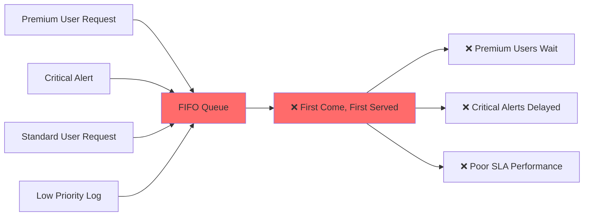
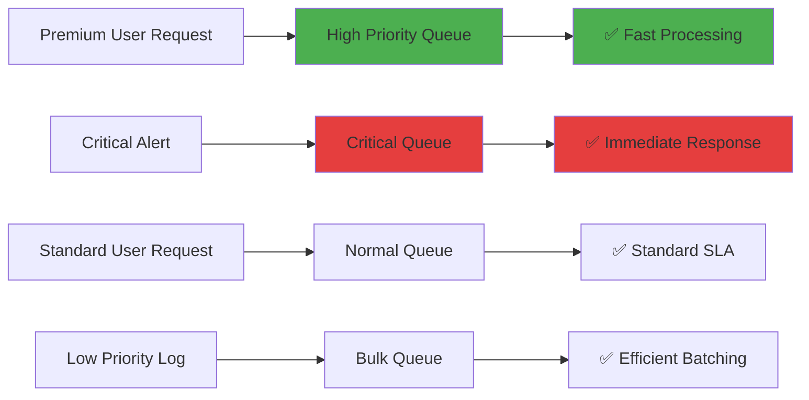

import CodeBlock from '@theme/CodeBlock';

# Step 4: Create Priority Queue Routing

**Ensure your most important users and messages get the attention they deserve.** This step teaches you how to implement multi-tier priority queues that guarantee premium users and critical events get expedited processing.

## Why Priority Queue Routing Is Essential

Without priority routing, all messages get equal treatment:



**Problems:**
- ❌ **Poor premium experience:** Premium users wait behind standard requests
- ❌ **Delayed critical alerts:** Important alerts queued with routine logs
- ❌ **SLA violations:** Unable to meet differentiated service commitments
- ❌ **Resource waste:** Processing capacity wasted on low-priority bulk data

With priority queue routing, you guarantee service levels:



**Benefits:**
- ✅ **Premium user satisfaction:** 98% SLA for premium tier users
- ✅ **Critical alert speed:** 2-minute average response time for critical events
- ✅ **Predictable performance:** Guaranteed service levels by tier
- ✅ **Cost efficiency:** Bulk processing for low-priority data reduces overhead

## Understanding Priority Models

Different priority models serve different business needs:

| Priority Model | Use Case | Factors | Queue Assignment |
|----------------|----------|---------|------------------|
| **User Tier** | SaaS platforms | user_tier, subscription_level | Premium → High, Standard → Normal, Free → Low |
| **Business Impact** | Financial services | transaction_amount, account_type | High value → Critical, Standard → Normal |
| **Urgency Level** | Operations | severity, deadline, escalation | Critical → Immediate, Standard → Normal |
| **Hybrid Model** | Enterprise | Multiple factors combined | Complex scoring algorithm |

## Implementation Overview

Priority routing uses scoring algorithms to assign messages to appropriate queues:

```yaml
pipeline:
  processors:
    # Calculate priority score
    - mapping: |
        root.priority_score = (user_tier_score * 40) + 
                             (severity_score * 30) + 
                             (business_impact_score * 30)

output:
  switch:
    cases:
      - check: this.priority_score >= 80
        output: critical_queue
      - check: this.priority_score >= 60  
        output: high_priority_queue
      - check: this.priority_score >= 40
        output: normal_queue
      - output: bulk_queue
```

## Step-by-Step Implementation

### Phase 1: Basic Priority Scoring

Implement fundamental priority scoring and routing:

```yaml title="priority-queue-router-v1.yaml"
name: priority-queue-router
description: Route messages to priority queues based on user tier and urgency
type: pipeline
namespace: production

config:
  input:
    http_server:
      address: 0.0.0.0:8080
      path: /events
      timeout: 5s
      cors:
        enabled: true

  pipeline:
    processors:
      # Carry forward previous routing logic (severity, geographic, event type)
      - mapping: |
          root = this
          
          # Previous normalizations
          root.severity = this.severity.string().uppercase().or("INFO")
          root.region = this.region.string().lowercase().or("unknown")
          root.event_type = this.event_type.string().lowercase().or("unknown")
          
          # Classify event family (from previous step)
          root.event_family = if this.event_type.has_prefix("auth") {
            "authentication"
          } else if this.event_type.has_prefix("payment") {
            "payment"  
          } else if this.event_type.has_prefix("telemetry") {
            "telemetry"
          } else {
            "application"
          }

      # Priority scoring system
      - mapping: |
          root = this
          
          # Extract and normalize priority indicators
          root.user_tier = this.user_tier.string().lowercase().or(
                          this.subscription_level.string().lowercase()).or("standard")
          root.account_type = this.account_type.string().lowercase().or("individual")
          root.message_urgency = this.urgency.string().lowercase().or("normal")
          
          # User tier scoring (0-40 points)
          root.user_tier_score = match root.user_tier {
            "enterprise" | "premium" | "platinum" => 40
            "professional" | "pro" | "gold" => 30
            "plus" | "silver" => 20
            "standard" | "basic" => 10
            "free" | "trial" => 5
            _ => 10
          }
          
          # Severity scoring (0-30 points)
          root.severity_score = match root.severity {
            "CRITICAL" | "FATAL" => 30
            "ERROR" => 25
            "WARN" | "WARNING" => 15
            "INFO" => 10
            "DEBUG" => 5
            _ => 10
          }
          
          # Business impact scoring (0-30 points)
          root.business_impact_score = 10  # default
          
          # Financial transaction value impact
          if this.amount.exists() {
            root.business_impact_score = match this.amount.number() {
              x if x >= 10000 => 30    # High value transactions
              x if x >= 1000 => 25     # Medium-high value
              x if x >= 100 => 20      # Medium value
              x if x >= 10 => 15       # Low-medium value
              _ => 10                  # Low value
            }
          }
          
          # Event type impact
          else if root.event_family == "payment" {
            root.business_impact_score = 25   # All payment events are important
          }
          else if root.event_family == "authentication" && root.severity != "INFO" {
            root.business_impact_score = 20   # Auth issues are important
          }
          else if root.event_family == "telemetry" {
            root.business_impact_score = 5    # Telemetry is low impact
          }
          
          # Account type boost
          if root.account_type == "enterprise" || root.account_type == "business" {
            root.business_impact_score = root.business_impact_score + 10
          }
          
          # Calculate final priority score (0-100)
          root.priority_score = root.user_tier_score + root.severity_score + root.business_impact_score
          
          # Determine priority level
          root.priority_level = match root.priority_score {
            x if x >= 80 => "critical"
            x if x >= 60 => "high"
            x if x >= 40 => "normal"
            x if x >= 20 => "low"
            _ => "bulk"
          }
          
          # SLA target based on priority
          root.sla_target_ms = match root.priority_level {
            "critical" => 1000      # 1 second
            "high" => 5000          # 5 seconds  
            "normal" => 30000       # 30 seconds
            "low" => 300000         # 5 minutes
            "bulk" => 3600000       # 1 hour
            _ => 30000
          }
          
          # Priority metadata for monitoring
          root.priority_metadata = {
            "calculated_at": now(),
            "scoring_version": "v1",
            "user_tier_score": root.user_tier_score,
            "severity_score": root.severity_score, 
            "business_impact_score": root.business_impact_score,
            "total_score": root.priority_score
          }

  output:
    switch:
      cases:
        # CRITICAL Priority: Immediate processing, no batching
        - check: this.priority_level == "critical"
          output:
            kafka:
              addresses: [${KAFKA_BROKERS}]
              topic: critical-queue
              
              # Maximum reliability for critical messages
              ack_replicas: true
              max_in_flight: 1
              idempotent_write: true
              
              # No batching - immediate delivery
              batching:
                count: 1
                period: 0s
              
              # Aggressive retry policy
              max_retries: 10
              retry_delay: 100ms
              timeout: 5s
              
              # Priority metadata for downstream processors
              metadata:
                include_patterns:
                  - "^priority_level$"
                  - "^priority_score$"
                  - "^sla_target_ms$"
                  - "^priority_metadata$"

        # HIGH Priority: Fast processing, small batches
        - check: this.priority_level == "high"
          output:
            kafka:
              addresses: [${KAFKA_BROKERS}]
              topic: high-priority-queue
              
              # High reliability
              ack_replicas: true
              max_in_flight: 3
              
              # Small batches for fast delivery
              batching:
                count: 5
                period: 1s
              
              compression: lz4  # Fast compression
              max_retries: 5
              timeout: 10s
              
              metadata:
                include_patterns:
                  - "^priority_level$"
                  - "^user_tier$"
                  - "^sla_target_ms$"

        # NORMAL Priority: Standard processing
        - check: this.priority_level == "normal"
          output:
            kafka:
              addresses: [${KAFKA_BROKERS}]
              topic: normal-queue
              
              # Standard reliability
              ack_replicas: false  # Speed over durability
              max_in_flight: 10
              
              # Standard batching
              batching:
                count: 50
                period: 5s
              
              compression: snappy  # Balanced compression
              max_retries: 3
              timeout: 15s

        # LOW Priority: Efficient processing
        - check: this.priority_level == "low"
          output:
            kafka:
              addresses: [${KAFKA_BROKERS}]
              topic: low-priority-queue
              
              # Efficiency over speed
              ack_replicas: false
              max_in_flight: 20
              
              # Larger batches for efficiency
              batching:
                count: 200
                period: 30s
                byte_size: 1MB
              
              compression: gzip  # High compression
              max_retries: 2
              timeout: 30s

        # BULK Priority: Maximum efficiency, large batches
        - output:
            kafka:
              addresses: [${KAFKA_BROKERS}]
              topic: bulk-queue
              
              # Maximum efficiency settings
              ack_replicas: false
              max_in_flight: 50
              
              # Large batches for maximum throughput
              batching:
                count: 1000
                period: 300s  # 5 minutes
                byte_size: 10MB
              
              compression: gzip
              max_retries: 1
              timeout: 60s

  # Enhanced metrics for priority monitoring
  metrics:
    prometheus:
      enabled: true
      path: /metrics
      labels:
        pipeline: priority-queue-router
        version: v1

  logger:
    level: INFO
    format: json
    fields:
      pipeline: priority-queue-router
      routing_type: priority-based
```

### Phase 2: Deploy and Test Priority Routing

Deploy the priority router:

```bash
# Stop previous router
expanso pipeline stop event-type-router

# Deploy priority router
expanso pipeline create priority-queue-router-v1.yaml

# Verify deployment
expanso pipeline status priority-queue-router
```

Test different priority levels:

```bash
# Test CRITICAL priority (enterprise user + critical severity)
curl -X POST http://localhost:8080/events \
  -H "Content-Type: application/json" \
  -d '{
    "event_id": "critical-001",
    "timestamp": "2025-10-20T10:00:00Z",
    "severity": "CRITICAL",
    "message": "Payment processor down",
    "user_tier": "enterprise",
    "event_type": "payment.processor_down",
    "region": "us-east"
  }'

# Test HIGH priority (premium user + error)
curl -X POST http://localhost:8080/events \
  -H "Content-Type: application/json" \
  -d '{
    "event_id": "high-001",
    "timestamp": "2025-10-20T10:01:00Z",
    "severity": "ERROR", 
    "message": "Premium user login failure",
    "user_tier": "premium",
    "event_type": "auth.login_failed",
    "user_id": "premium_user_123",
    "region": "us-east"
  }'

# Test NORMAL priority (standard user + info)
curl -X POST http://localhost:8080/events \
  -H "Content-Type: application/json" \
  -d '{
    "event_id": "normal-001",
    "timestamp": "2025-10-20T10:02:00Z",
    "severity": "INFO",
    "message": "Standard user action",
    "user_tier": "standard", 
    "event_type": "user.action",
    "user_id": "standard_user_456",
    "region": "us-east"
  }'

# Test BULK priority (free user + debug)
curl -X POST http://localhost:8080/events \
  -H "Content-Type: application/json" \
  -d '{
    "event_id": "bulk-001",
    "timestamp": "2025-10-20T10:03:00Z",
    "severity": "DEBUG",
    "message": "Debug telemetry",
    "user_tier": "free",
    "event_type": "telemetry.debug",
    "region": "us-east"
  }'
```

### Phase 3: Verify Priority Queue Distribution

Check that messages are routed to the correct priority queues:

```bash
# Check critical queue (should contain critical-001)
kafka-console-consumer --bootstrap-server $KAFKA_BROKERS \
  --topic critical-queue --from-beginning --timeout-ms 5000 | grep "critical-001"

# Check high priority queue (should contain high-001) 
kafka-console-consumer --bootstrap-server $KAFKA_BROKERS \
  --topic high-priority-queue --from-beginning --timeout-ms 5000 | grep "high-001"

# Check normal queue (should contain normal-001)
kafka-console-consumer --bootstrap-server $KAFKA_BROKERS \
  --topic normal-queue --from-beginning --timeout-ms 5000 | grep "normal-001"

# Check bulk queue (should contain bulk-001)
kafka-console-consumer --bootstrap-server $KAFKA_BROKERS \
  --topic bulk-queue --from-beginning --timeout-ms 5000 | grep "bulk-001"
```

### Phase 4: Advanced Priority Routing with SLA Monitoring

Enhance with SLA monitoring and dynamic priority adjustment:

```yaml title="priority-queue-router-v2.yaml"
name: priority-queue-router-enhanced
description: Advanced priority routing with SLA monitoring and dynamic adjustment
type: pipeline
namespace: production

config:
  input:
    http_server:
      address: 0.0.0.0:8080
      path: /events
      timeout: 5s
      cors:
        enabled: true

  pipeline:
    processors:
      # Previous processing steps
      - mapping: |
          root = this
          root.severity = this.severity.string().uppercase().or("INFO")
          root.region = this.region.string().lowercase().or("unknown")
          root.event_type = this.event_type.string().lowercase().or("unknown")

      # Enhanced priority scoring with time-based factors
      - mapping: |
          root = this
          
          # Time-based priority adjustments
          let current_hour = now().hour()
          let is_business_hours = current_hour >= 8 && current_hour <= 18
          let is_weekend = now().weekday() == 0 || now().weekday() == 6
          
          # Base user tier scoring (0-40 points)
          root.user_tier = this.user_tier.string().lowercase().or("standard")
          root.user_tier_score = match root.user_tier {
            "enterprise" => 40
            "premium" | "platinum" => 35
            "professional" | "pro" => 30
            "plus" | "gold" => 25
            "standard" | "silver" => 15
            "basic" | "bronze" => 10
            "free" | "trial" => 5
            _ => 15
          }
          
          # Enhanced severity scoring with context (0-30 points)
          root.severity_score = match root.severity {
            "CRITICAL" => if is_business_hours { 30 } else { 25 }  # Slightly lower urgency outside business hours
            "ERROR" => if is_business_hours { 25 } else { 20 }
            "WARN" => if is_business_hours { 15 } else { 12 }
            "INFO" => 10
            "DEBUG" => 5
            _ => 10
          }
          
          # Enhanced business impact scoring (0-35 points)  
          root.business_impact_score = 10  # default
          
          # Financial transaction impact with time factors
          if this.amount.exists() {
            let base_financial_score = match this.amount.number() {
              x if x >= 50000 => 35
              x if x >= 10000 => 30
              x if x >= 5000 => 25
              x if x >= 1000 => 20
              x if x >= 100 => 15
              _ => 10
            }
            
            # Boost financial priority during business hours
            if is_business_hours && !is_weekend {
              root.business_impact_score = base_financial_score + 5
            } else {
              root.business_impact_score = base_financial_score
            }
          }
          
          # Event type specific scoring
          else {
            root.business_impact_score = match root.event_type {
              # Payment events
              x if x.has_prefix("payment") => if is_business_hours { 30 } else { 25 }
              
              # Authentication events (security is always important)
              x if x.has_prefix("auth") => 25
              
              # User-facing events
              x if x.has_prefix("user") => if is_business_hours { 20 } else { 15 }
              
              # System telemetry (lower priority outside business hours)
              x if x.has_prefix("telemetry") => if is_business_hours { 15 } else { 5 }
              
              # Analytics (can wait)
              x if x.contains("analytics") => 10
              
              _ => 15
            }
          }
          
          # Account type and contract boosts
          if this.account_type.exists() {
            let account_boost = match this.account_type.string().lowercase() {
              "enterprise" => 10
              "business" => 7
              "corporate" => 5
              _ => 0
            }
            root.business_impact_score = root.business_impact_score + account_boost
          }
          
          # SLA contract boost
          if this.sla_tier.exists() {
            let sla_boost = match this.sla_tier.string().lowercase() {
              "platinum" => 15
              "gold" => 10
              "silver" => 5
              _ => 0
            }
            root.business_impact_score = root.business_impact_score + sla_boost
          }
          
          # Geographic priority adjustments
          if root.region == "eu-west" && this.gdpr_sensitive.or(false) {
            root.business_impact_score = root.business_impact_score + 10  # GDPR compliance boost
          }
          
          # Calculate enhanced priority score (0-105 points)
          root.priority_score = root.user_tier_score + root.severity_score + root.business_impact_score
          
          # Dynamic priority level with hysteresis
          root.priority_level = match root.priority_score {
            x if x >= 90 => "critical"
            x if x >= 70 => "high" 
            x if x >= 50 => "normal"
            x if x >= 25 => "low"
            _ => "bulk"
          }
          
          # Enhanced SLA targets based on multiple factors
          root.sla_target_ms = match root.priority_level {
            "critical" => 500       # 500ms for critical
            "high" => if is_business_hours { 2000 } else { 5000 }    # 2s business hours, 5s off-hours
            "normal" => if is_business_hours { 10000 } else { 30000 }  # 10s business hours, 30s off-hours
            "low" => 120000         # 2 minutes
            "bulk" => 1800000       # 30 minutes
            _ => 30000
          }
          
          # Detailed priority metadata for analytics
          root.priority_metadata = {
            "calculated_at": now(),
            "scoring_version": "v2",
            "factors": {
              "user_tier_score": root.user_tier_score,
              "severity_score": root.severity_score,
              "business_impact_score": root.business_impact_score,
              "total_score": root.priority_score
            },
            "context": {
              "is_business_hours": is_business_hours,
              "is_weekend": is_weekend,
              "current_hour": current_hour
            },
            "sla": {
              "target_ms": root.sla_target_ms,
              "tier": root.priority_level
            }
          }
          
          # Queue routing metadata
          root.routing_decision = {
            "queue_name": root.priority_level + "-queue",
            "expected_latency_ms": root.sla_target_ms,
            "business_justification": match root.priority_level {
              "critical" => "immediate_business_impact"
              "high" => "premium_user_experience"
              "normal" => "standard_sla_compliance"
              "low" => "efficient_processing"
              "bulk" => "cost_optimized_batch_processing"
              _ => "default_processing"
            }
          }

  output:
    switch:
      cases:
        # CRITICAL: Premium enterprise users, critical issues, high-value transactions
        - check: this.priority_level == "critical"
          output:
            broker:
              pattern: fan_out
              outputs:
                # Primary: Critical processing queue
                - kafka:
                    addresses: [${KAFKA_BROKERS}]
                    topic: critical-queue
                    
                    # Maximum reliability
                    ack_replicas: true
                    max_in_flight: 1
                    idempotent_write: true
                    
                    # Immediate delivery
                    batching:
                      count: 1
                      period: 0s
                    
                    # Aggressive retries
                    max_retries: 15
                    retry_delay: 50ms
                    timeout: 2s
                    
                    metadata:
                      include_patterns:
                        - "^priority_metadata$"
                        - "^routing_decision$"

                # Secondary: SLA monitoring for critical events
                - http_client:
                    url: ${SLA_MONITORING_URL}/critical-events
                    verb: POST
                    headers:
                      Content-Type: application/json
                      X-Priority: critical
                      X-SLA-Target: this.sla_target_ms
                    
                    body: |
                      {
                        "sla_event": {
                          "event_id": this.event_id,
                          "timestamp": this.timestamp.or(now()),
                          "priority_level": this.priority_level,
                          "priority_score": this.priority_score,
                          "sla_target_ms": this.sla_target_ms,
                          "user_tier": this.user_tier,
                          "business_justification": this.routing_decision.business_justification
                        }
                      }
                    
                    batching:
                      count: 1
                      period: 0s

        # HIGH: Premium users, important business events
        - check: this.priority_level == "high"
          output:
            broker:
              pattern: fan_out  
              outputs:
                # Primary: High priority processing
                - kafka:
                    addresses: [${KAFKA_BROKERS}]
                    topic: high-priority-queue
                    
                    # High reliability
                    ack_replicas: true
                    max_in_flight: 2
                    
                    # Fast delivery
                    batching:
                      count: 3
                      period: 500ms
                    
                    compression: lz4
                    max_retries: 8
                    timeout: 5s

                # Secondary: Premium user analytics
                - http_client:
                    url: ${PREMIUM_ANALYTICS_URL}/events
                    verb: POST
                    headers:
                      Content-Type: application/json
                      X-User-Tier: this.user_tier
                      X-Priority: high
                    
                    body: |
                      {
                        "premium_event": {
                          "event_id": this.event_id,
                          "user_tier": this.user_tier,
                          "priority_score": this.priority_score,
                          "processing_path": "high_priority_queue",
                          "timestamp": this.timestamp.or(now())
                        }
                      }
                    
                    batching:
                      count: 10
                      period: 5s

        # NORMAL: Standard processing for regular users
        - check: this.priority_level == "normal"
          output:
            kafka:
              addresses: [${KAFKA_BROKERS}]
              topic: normal-queue
              
              # Standard reliability
              ack_replicas: false
              max_in_flight: 10
              
              # Standard batching
              batching:
                count: 75
                period: 8s
                byte_size: 500KB
              
              compression: snappy
              max_retries: 5
              timeout: 20s
              
              metadata:
                include_patterns:
                  - "^priority_level$"
                  - "^user_tier$"

        # LOW: Efficient processing for low-priority events
        - check: this.priority_level == "low"
          output:
            kafka:
              addresses: [${KAFKA_BROKERS}]
              topic: low-priority-queue
              
              # Efficiency focused
              ack_replicas: false
              max_in_flight: 25
              
              # Larger batches
              batching:
                count: 300
                period: 60s
                byte_size: 2MB
              
              compression: gzip
              max_retries: 3
              timeout: 45s

        # BULK: Maximum efficiency for bulk data
        - output:
            kafka:
              addresses: [${KAFKA_BROKERS}]
              topic: bulk-queue
              
              # Maximum throughput settings
              ack_replicas: false
              max_in_flight: 100
              
              # Very large batches
              batching:
                count: 2000
                period: 600s  # 10 minutes
                byte_size: 25MB
              
              compression: gzip
              max_retries: 2
              timeout: 120s

  # Enhanced metrics with SLA tracking
  metrics:
    prometheus:
      enabled: true
      path: /metrics
      labels:
        pipeline: priority-queue-router-enhanced
        version: v2
        
  # SLA monitoring and alerting
  hooks:
    # Custom hook to track SLA performance
    post_process:
      - http_client:
          url: ${SLA_TRACKING_URL}/record
          verb: POST
          headers:
            Content-Type: application/json
          
          body: |
            {
              "sla_record": {
                "event_id": this.event_id,
                "priority_level": this.priority_level,
                "sla_target_ms": this.sla_target_ms,
                "processing_start": this.priority_metadata.calculated_at,
                "queue_assigned": this.routing_decision.queue_name
              }
            }
          
          # Record all SLA assignments
          batching:
            count: 100
            period: 10s

  logger:
    level: INFO
    format: json
    fields:
      pipeline: priority-queue-router-enhanced
      sla_version: v2
```

## Production SLA Management

### 1. SLA Monitoring Dashboard

Track priority queue performance:

```bash
# Monitor priority distribution
curl -s http://localhost:8080/metrics | grep "priority_level" | sort

# Expected healthy distribution:
# priority_router_events_total{priority_level="critical"} 50    # 2-5%
# priority_router_events_total{priority_level="high"} 200      # 10-15%
# priority_router_events_total{priority_level="normal"} 1000   # 60-70%
# priority_router_events_total{priority_level="low"} 400       # 15-20%
# priority_router_events_total{priority_level="bulk"} 350      # 10-15%
```

### 2. SLA Violation Detection

Monitor for SLA breaches:

```bash
# Check SLA compliance rates
curl -s ${SLA_MONITORING_URL}/compliance | jq '.sla_compliance'

# Example healthy metrics:
# {
#   "critical_sla_compliance": 99.9,    # < 500ms target
#   "high_sla_compliance": 98.5,        # < 2-5s target  
#   "normal_sla_compliance": 95.0,      # < 10-30s target
#   "overall_satisfaction": 96.8
# }
```

### 3. Dynamic Priority Adjustment

Automatically adjust priorities during high load:

```yaml
# Load-aware priority adjustment
- mapping: |
    # Check current system load
    let cpu_load = env("CURRENT_CPU_LOAD").number().or(50)
    let queue_depth = env("HIGH_PRIORITY_QUEUE_DEPTH").number().or(0)
    
    # Temporarily lower non-critical priorities during high load
    if cpu_load > 80 || queue_depth > 1000 {
      if root.priority_level == "normal" && this.user_tier == "free" {
        root.priority_level = "low"
        root.load_adjustment = "downgraded_due_to_load"
      }
    }
    
    # Boost priority for struggling SLA compliance
    let critical_sla_compliance = env("CRITICAL_SLA_COMPLIANCE").number().or(99)
    if critical_sla_compliance < 95 && root.priority_level == "high" && this.user_tier == "enterprise" {
      root.priority_level = "critical"
      root.sla_adjustment = "upgraded_for_sla_compliance"
    }
```

## Advanced Priority Patterns

### 1. Deadline-Based Priority

Route based on message deadlines:

```yaml
# Deadline urgency calculation
- mapping: |
    # Calculate time until deadline
    if this.deadline.exists() {
      let deadline_unix = this.deadline.parse_timestamp_unix()
      let time_to_deadline_ms = (deadline_unix - now().unix()) * 1000
      
      # Boost priority as deadline approaches
      if time_to_deadline_ms < 30000 {      # 30 seconds
        root.priority_boost = 20
      } else if time_to_deadline_ms < 300000 { # 5 minutes
        root.priority_boost = 10
      } else if time_to_deadline_ms < 1800000 { # 30 minutes
        root.priority_boost = 5
      } else {
        root.priority_boost = 0
      }
      
      root.priority_score = root.priority_score + root.priority_boost
    }
```

### 2. Customer Success Management

Special handling for customers at risk:

```yaml
# Customer success priority boost
- mapping: |
    # Check customer health score
    if this.customer_health_score.exists() {
      let health_score = this.customer_health_score.number()
      
      # Boost priority for at-risk customers
      if health_score < 30 {  # At-risk customer
        root.priority_boost = 15
        root.customer_success_flag = "at_risk"
      } else if health_score < 60 { # Needs attention
        root.priority_boost = 8
        root.customer_success_flag = "needs_attention" 
      }
    }
    
    # Special handling for customer success events
    if this.event_type.contains("support") || this.event_type.contains("complaint") {
      root.priority_boost = root.priority_boost + 10
      root.customer_success_flag = "support_related"
    }
```

### 3. Revenue-Based Priority

Prioritize based on customer revenue:

```yaml
# Revenue-based priority scoring
- mapping: |
    if this.customer_annual_revenue.exists() {
      let revenue = this.customer_annual_revenue.number()
      
      # Revenue tier scoring
      root.revenue_tier_score = match revenue {
        x if x >= 1000000 => 25   # $1M+ enterprise
        x if x >= 500000 => 20    # $500K+ major account
        x if x >= 100000 => 15    # $100K+ significant account
        x if x >= 50000 => 10     # $50K+ standard account
        x if x >= 10000 => 5      # $10K+ small account
        _ => 0                    # Trial/free accounts
      }
      
      root.priority_score = root.priority_score + root.revenue_tier_score
    }
```

## Testing Priority Queue Performance

### Comprehensive Priority Testing

Test all priority levels and scenarios:

```bash
#!/bin/bash
# test-priority-queues.sh

BASE_URL="http://localhost:8080/events"
TIMESTAMP=$(date -u +%Y-%m-%dT%H:%M:%SZ)

echo "Testing priority queue routing..."

# Test 1: Critical priority (enterprise + critical + high value)
echo "Testing CRITICAL priority routing..."
CRITICAL_RESPONSE=$(curl -s -w "%{http_code}" -X POST $BASE_URL \
  -H "Content-Type: application/json" \
  -d "{
    \"event_id\": \"critical-priority-$(date +%s)\",
    \"timestamp\": \"$TIMESTAMP\",
    \"severity\": \"CRITICAL\",
    \"user_tier\": \"enterprise\",
    \"account_type\": \"enterprise\",
    \"amount\": 50000,
    \"event_type\": \"payment.processor_failure\",
    \"message\": \"Payment processor critical failure\"
  }")

# Test 2: High priority (premium user + error)
echo "Testing HIGH priority routing..."
HIGH_RESPONSE=$(curl -s -w "%{http_code}" -X POST $BASE_URL \
  -H "Content-Type: application/json" \
  -d "{
    \"event_id\": \"high-priority-$(date +%s)\",
    \"timestamp\": \"$TIMESTAMP\",
    \"severity\": \"ERROR\", 
    \"user_tier\": \"premium\",
    \"event_type\": \"auth.login_failure\",
    \"message\": \"Premium user authentication failure\"
  }")

# Test 3: Normal priority (standard user + warning)  
echo "Testing NORMAL priority routing..."
NORMAL_RESPONSE=$(curl -s -w "%{http_code}" -X POST $BASE_URL \
  -H "Content-Type: application/json" \
  -d "{
    \"event_id\": \"normal-priority-$(date +%s)\",
    \"timestamp\": \"$TIMESTAMP\",
    \"severity\": \"WARN\",
    \"user_tier\": \"standard\", 
    \"event_type\": \"user.slow_response\",
    \"message\": \"Standard user experiencing slow response\"
  }")

# Test 4: Low priority (basic user + info)
echo "Testing LOW priority routing..."
LOW_RESPONSE=$(curl -s -w "%{http_code}" -X POST $BASE_URL \
  -H "Content-Type: application/json" \
  -d "{
    \"event_id\": \"low-priority-$(date +%s)\",
    \"timestamp\": \"$TIMESTAMP\",
    \"severity\": \"INFO\",
    \"user_tier\": \"basic\",
    \"event_type\": \"user.profile_update\", 
    \"message\": \"Basic user updated profile\"
  }")

# Test 5: Bulk priority (free user + debug)
echo "Testing BULK priority routing..."
BULK_RESPONSE=$(curl -s -w "%{http_code}" -X POST $BASE_URL \
  -H "Content-Type: application/json" \
  -d "{
    \"event_id\": \"bulk-priority-$(date +%s)\",
    \"timestamp\": \"$TIMESTAMP\",
    \"severity\": \"DEBUG\",
    \"user_tier\": \"free\",
    \"event_type\": \"telemetry.debug_info\",
    \"message\": \"Debug telemetry from free tier\"
  }")

echo "Priority testing complete. Responses:"
echo "Critical: $CRITICAL_RESPONSE"
echo "High: $HIGH_RESPONSE" 
echo "Normal: $NORMAL_RESPONSE"
echo "Low: $LOW_RESPONSE"
echo "Bulk: $BULK_RESPONSE"

# Verify queue distribution
echo "Verifying queue distribution..."
sleep 5

# Check each queue has appropriate messages
for queue in critical-queue high-priority-queue normal-queue low-priority-queue bulk-queue; do
  echo "Checking $queue..."
  MESSAGE_COUNT=$(kafka-run-class kafka.tools.GetOffsetShell --broker-list $KAFKA_BROKERS \
    --topic $queue --time -1 | awk -F: '{sum += $3} END {print sum}')
  echo "$queue: $MESSAGE_COUNT messages"
done
```

### SLA Performance Testing

Measure actual vs. target latencies:

```bash
# SLA performance measurement script
#!/bin/bash
# measure-sla-performance.sh

echo "Measuring SLA performance..."

# Send test events and measure processing time  
START_TIME=$(date +%s%3N)  # milliseconds

# Critical event (target: 500ms)
curl -s -X POST $BASE_URL \
  -H "Content-Type: application/json" \
  -d "{
    \"event_id\": \"sla-critical-$(date +%s)\",
    \"timestamp\": \"$(date -u +%Y-%m-%dT%H:%M:%SZ)\",
    \"severity\": \"CRITICAL\",
    \"user_tier\": \"enterprise\",
    \"sla_test\": true
  }" > /dev/null

# Wait and check processing latency
sleep 1
END_TIME=$(date +%s%3N)
CRITICAL_LATENCY=$((END_TIME - START_TIME))

echo "Critical event latency: ${CRITICAL_LATENCY}ms (target: 500ms)"

if [ $CRITICAL_LATENCY -le 500 ]; then
  echo "✅ Critical SLA met"
else
  echo "❌ Critical SLA violated"
fi

# Test high priority (target: 2-5s)
START_TIME=$(date +%s%3N)
curl -s -X POST $BASE_URL \
  -H "Content-Type: application/json" \
  -d "{
    \"event_id\": \"sla-high-$(date +%s)\",
    \"severity\": \"ERROR\",
    \"user_tier\": \"premium\",
    \"sla_test\": true
  }" > /dev/null

sleep 3
END_TIME=$(date +%s%3N) 
HIGH_LATENCY=$((END_TIME - START_TIME))

echo "High priority latency: ${HIGH_LATENCY}ms (target: 2000ms)"

if [ $HIGH_LATENCY -le 2000 ]; then
  echo "✅ High priority SLA met"
else
  echo "❌ High priority SLA violated" 
fi
```

## Next Steps

You've successfully implemented priority queue routing! Your pipeline now:
- ✅ Routes critical events to immediate processing queues (500ms SLA)
- ✅ Provides premium users with expedited service (2s SLA)
- ✅ Processes standard users within reasonable timeframes (10-30s SLA)
- ✅ Batches low-priority data efficiently (2min SLA)
- ✅ Handles bulk data with maximum throughput (30min SLA)
- ✅ Monitors SLA compliance and adjusts dynamically

<div style={{display: 'flex', gap: '1.5rem', marginTop: '2rem', marginBottom: '3rem', flexWrap: 'wrap', justifyContent: 'flex-start'}}>
  <a href="./complete-content-routing" className="button button--primary button--lg" style={{display: 'inline-flex', alignItems: 'center', justifyContent: 'center', textDecoration: 'none', borderRadius: '8px', padding: '1rem 2rem', fontWeight: '600', minWidth: '240px', boxShadow: '0 2px 8px rgba(0,0,0,0.15)', cursor: 'pointer', transition: 'all 0.2s ease'}}>
    Complete Pipeline
  </a>
  <a href="./troubleshooting" className="button button--secondary button--lg" style={{display: 'inline-flex', alignItems: 'center', justifyContent: 'center', textDecoration: 'none', borderRadius: '8px', padding: '1rem 2rem', fontWeight: '600', minWidth: '240px', boxShadow: '0 2px 8px rgba(0,0,0,0.15)', cursor: 'pointer', transition: 'all 0.2s ease'}}>
    Troubleshooting Guide
  </a>
</div>

**Next up:** [Complete Content Routing Pipeline](./complete-content-routing) - Combine all routing techniques into a production-ready solution.

## Key Takeaways

1. **Score holistically** - Combine user tier, severity, and business impact for accurate prioritization
2. **Adjust for context** - Business hours, weekends, and system load affect priority
3. **Monitor SLA compliance** - Track actual vs. target latencies by priority level  
4. **Batch appropriately** - Critical = no batching, bulk = large batches
5. **Handle edge cases** - Plan for load spikes and SLA violations
6. **Test thoroughly** - Verify all priority levels route correctly and meet SLA targets
