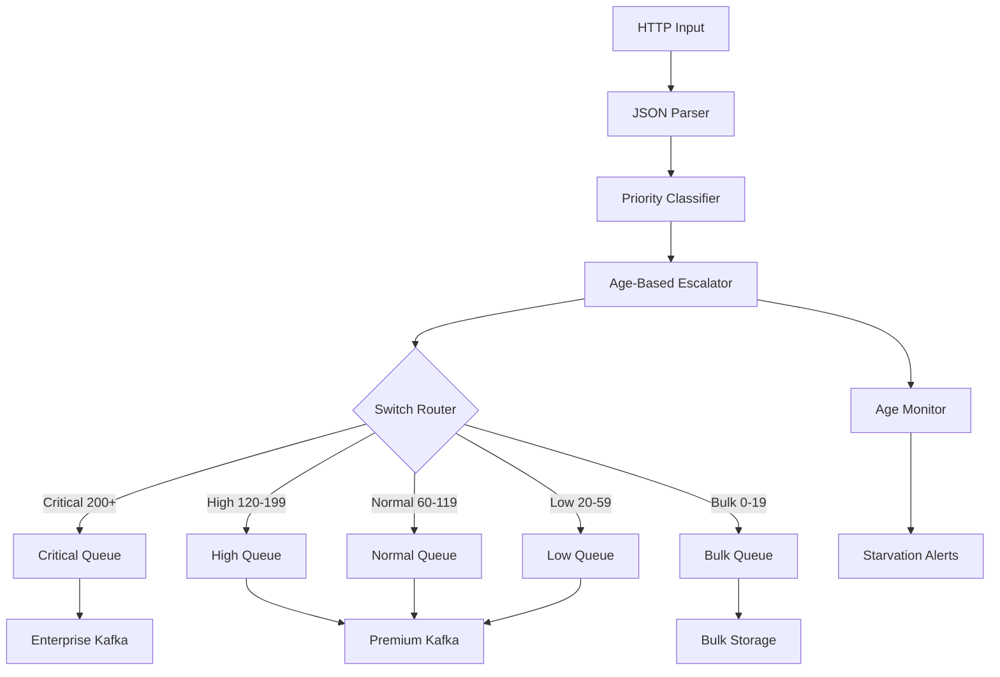

# Complete Priority Queue Pipeline

**Deploy the complete, production-ready priority queue system.** This configuration integrates all four priority queue techniques into a unified, battle-tested pipeline ready for high-volume production workloads.

## Complete System Overview

The final priority queue system combines:

1. **Severity-Based Routing** - Log levels map to appropriate processing guarantees
2. **Customer Tier Prioritization** - Subscription plans influence service levels  
3. **Multi-Criteria Scoring** - Sophisticated algorithm considering 6+ factors
4. **Anti-Starvation Protection** - Age-based escalation ensures fairness

### Architecture Diagram



## Production Configuration

Here's the complete, production-ready configuration:

```yaml title="complete-priority-pipeline.yaml"
name: complete-priority-pipeline
description: Production priority queue system with all features
type: pipeline
namespace: production
metadata:
  version: "2.0"
  maintainer: "platform-team@yourcompany.com"
  documentation: "https://docs.yourcompany.com/priority-queues"

config:
  input:
    http_server:
      address: 0.0.0.0:8080
      path: /events
      timeout: 30s
      rate_limit: "50000/s"
      
      # CORS and security headers
      cors:
        enabled: true
        allowed_origins: ["https://app.yourcompany.com"]
        allowed_headers: ["Content-Type", "Authorization"]
      
      # Request size limits
      max_request_size: 10485760  # 10MB

  pipeline:
    processors:
      # Step 1: Input validation and parsing
      - json_documents:
          parts: []
      
      # Step 2: Request validation and sanitization
      - mapping: |
          # Input validation
          if !this.event_type.exists() {
            throw("Missing required field: event_type")
          }
          
          if this.event_type.string().length() > 100 {
            throw("event_type too long (max 100 chars)")
          }
          
          # Security: Remove potentially sensitive fields
          root = this.without("password", "api_key", "token", "secret")
          
          # Standardize timestamp handling
          root.received_at = now()
          root.event_id = uuid_v4()

      # Step 3: Complete priority classification system
      - mapping: |
          root = this

          # === FIELD NORMALIZATION ===
          root.severity = this.severity.or("INFO").string().uppercase()
          root.customer_tier = match {
            this.user.subscription_plan.exists() => this.user.subscription_plan.lowercase()
            this.customer_tier.exists() => this.customer_tier.lowercase()
            this.subscription.tier.exists() => this.subscription.tier.lowercase()
            this.headers."x-customer-tier".exists() => this.headers."x-customer-tier".lowercase()
            _ => "free"
          }
          root.event_type = this.event_type.lowercase()
          root.urgency = this.urgency.or("normal").lowercase()
          root.service = this.service.or(this.source_service.or("unknown")).lowercase()
          root.region = this.region.or(this.user.region.or("us-east-1")).lowercase()

          # === TIMESTAMP AND AGE CALCULATION ===
          root.created_at = match {
            this.timestamp.exists() => this.timestamp
            this.created_at.exists() => this.created_at  
            this.event_time.exists() => this.event_time
            _ => root.received_at
          }

          # Parse and validate timestamp
          let parsed_timestamp = try {
            root.created_at.parse_timestamp_rfc3339()
          } catch {
            now()  # Use current time if parsing fails
          }
          
          # Calculate age with sanity checks
          root.age_seconds = match {
            (now().unix() - parsed_timestamp.unix()) < 0 => 0           # Future timestamp
            (now().unix() - parsed_timestamp.unix()) > 2592000 => 0     # > 30 days old
            _ => (now().unix() - parsed_timestamp.unix()).round()
          }

          # === BASE PRIORITY SCORING ===
          let severity_score = match root.severity {
            "CRITICAL" => 85, "FATAL" => 85, "ERROR" => 60,
            "WARNING" => 35, "WARN" => 35, "INFO" => 15,
            "DEBUG" => 8, "TRACE" => 5, _ => 20
          }

          let tier_multiplier = match root.customer_tier {
            "enterprise" => 4.0, "premium" => 3.0, "pro" => 2.5,
            "standard" => 2.0, "basic" => 1.5, "free" => 1.0,
            "trial" => 0.8, "suspended" => 0.5, _ => 1.0
          }

          let event_type_score = match {
            root.event_type.has_prefix("security.") => 50
            root.event_type.has_prefix("auth.") => 45
            root.event_type.has_prefix("fraud.") => 45
            root.event_type.has_prefix("payment.failed") => 40
            root.event_type.has_prefix("payment.") => 25
            root.event_type.has_prefix("billing.") => 30
            root.event_type.has_prefix("api.error") => 30
            root.event_type.has_prefix("system.") => 25
            root.event_type.has_prefix("database.") => 30
            root.event_type.has_prefix("user.") => 15
            root.event_type.has_prefix("analytics.") => 5
            _ => 10
          }

          let urgency_score = match root.urgency {
            "critical" => 20, "high" => 15, "normal" => 5,
            "low" => 0, "deferred" => -5, _ => 5
          }

          let service_criticality_score = match root.service {
            "auth-service" => 30, "payment-service" => 30,
            "billing-service" => 25, "user-service" => 25,
            "api-gateway" => 25, "notification-service" => 20,
            "search-service" => 15, "analytics-service" => 5,
            _ => 12
          }

          # === TEMPORAL CONTEXT ===
          let current_hour = now().hour()
          let current_day = now().day()
          let business_hours = current_hour >= 9 && current_hour < 17 && current_day >= 1 && current_day <= 5
          
          let temporal_score = match {
            business_hours => 15
            current_day == 0 || current_day == 6 => -5  # Weekend
            current_hour >= 22 || current_hour <= 6 => -3  # Night
            _ => 0
          }

          # === AGE-BASED ESCALATION ===
          let age_boost = match {
            root.age_seconds > 86400 => 100    # > 24 hours: emergency
            root.age_seconds > 14400 => 60     # > 4 hours: strong escalation
            root.age_seconds > 3600 => 35      # > 1 hour: moderate escalation  
            root.age_seconds > 1800 => 15      # > 30 min: gentle escalation
            root.age_seconds > 300 => 5        # > 5 min: minimal escalation
            _ => 0
          }

          # === FINAL SCORING ===
          let base_score = severity_score * tier_multiplier
          let bonus_score = event_type_score + urgency_score + service_criticality_score + temporal_score
          
          root.original_priority_score = base_score
          root.priority_score = base_score + bonus_score + age_boost

          # === PRIORITY ASSIGNMENT ===
          root.original_priority = match {
            root.original_priority_score >= 200 => "critical"
            root.original_priority_score >= 120 => "high"
            root.original_priority_score >= 60 => "normal"
            root.original_priority_score >= 20 => "low"
            _ => "bulk"
          }

          # Final priority with age escalation and fairness guarantees
          root.priority = match {
            # Emergency escalation for ancient messages
            root.age_seconds > 86400 => "critical"
            
            # Age-based minimum guarantees
            root.age_seconds > 14400 && root.priority_score < 120 => "high"
            root.age_seconds > 7200 && root.priority_score < 60 => "normal"
            
            # Standard score-based routing
            root.priority_score >= 200 => "critical"
            root.priority_score >= 120 => "high"
            root.priority_score >= 60 => "normal"
            root.priority_score >= 20 => "low"
            _ => "bulk"
          }

          # === SLA AND PROCESSING METADATA ===
          root.sla_target_ms = match root.priority {
            "critical" => 100, "high" => 500, "normal" => 2000,
            "low" => 10000, "bulk" => 60000, _ => 5000
          }

          let was_escalated = root.priority != root.original_priority

          # === COMPREHENSIVE AUDIT TRAIL ===
          root.processing_metadata = {
            "pipeline_version": "complete-v2.0",
            "processed_at": root.received_at,
            "edge_node_id": env("NODE_ID").or("unknown"),
            "region": env("AWS_REGION").or("unknown"),
            "environment": env("ENVIRONMENT").or("production")
          }

          root.routing_decision = {
            "final_priority": root.priority,
            "priority_score": root.priority_score,
            "sla_target_ms": root.sla_target_ms,
            "was_escalated": was_escalated,
            "escalation_reason": if was_escalated {
              match {
                root.age_seconds > 86400 => "ancient_message_emergency"
                root.age_seconds > 14400 => "very_old_fairness_guarantee" 
                age_boost > 0 => "age_based_boost"
                _ => "score_based_escalation"
              }
            } else { "none" }
          }

          root.scoring_breakdown = {
            "base_calculation": {
              "severity": {"value": root.severity, "score": severity_score},
              "customer_tier": {"value": root.customer_tier, "multiplier": tier_multiplier},
              "weighted_base": base_score
            },
            "bonus_factors": {
              "event_type": {"value": root.event_type, "score": event_type_score},
              "urgency": {"value": root.urgency, "score": urgency_score},
              "service": {"value": root.service, "score": service_criticality_score},
              "temporal": {"business_hours": business_hours, "score": temporal_score}
            },
            "age_analysis": {
              "age_seconds": root.age_seconds,
              "age_boost": age_boost,
              "escalated": was_escalated
            },
            "final_scores": {
              "original_score": root.original_priority_score,
              "final_score": root.priority_score,
              "assigned_priority": root.priority
            }
          }

          # === COMPLIANCE AND SECURITY ===
          root.compliance_metadata = {
            "data_classification": match root.event_type {
              "payment." => "pci_dss"
              "user." => "pii_protected"
              "security." => "security_sensitive"
              _ => "operational"
            },
            "retention_period": match root.priority {
              "critical" => "7y", "high" => "2y", "normal" => "1y",
              "low" => "90d", "bulk" => "30d", _ => "1y"
            },
            "processing_justification": "operational_priority_optimization",
            "gdpr_lawful_basis": "legitimate_interest"
          }

  output:
    switch:
      cases:
        # === CRITICAL PRIORITY (Score >= 200 or Emergency Escalation) ===
        - check: this.priority == "critical"
          output:
            label: critical_priority_queue
            broker:
              pattern: fan_out
              outputs:
                # Primary: Immediate Kafka delivery
                - kafka:
                    addresses: ["${KAFKA_BROKERS}"]
                    topic: critical-priority-events
                    
                    # No batching for immediate delivery
                    batching:
                      count: 1
                      period: 0s
                    
                    # Maximum reliability configuration
                    max_in_flight: 1
                    ack_replicas: true
                    idempotent_write: true
                    max_retries: 15
                    
                    backoff:
                      initial_interval: 50ms
                      max_interval: 1s
                      jitter: 0.1
                    
                    compression: none  # No compression for latency
                    
                    # Enterprise customers get dedicated cluster
                    topic: >
                      ${! 
                        if this.customer_tier == "enterprise" { 
                          "enterprise-critical-events" 
                        } else { 
                          "critical-priority-events" 
                        }
                      }

                # Secondary: Real-time monitoring and alerting
                - switch:
                    cases:
                      # Alert on age escalations
                      - check: this.routing_decision.was_escalated == true
                        output:
                          http_client:
                            url: ${MONITORING_WEBHOOK_URL}/priority-escalation
                            verb: POST
                            headers:
                              Content-Type: application/json
                              Authorization: "Bearer ${MONITORING_API_TOKEN}"
                            timeout: 2s
                            max_retries: 3
                      
                      # Alert on enterprise critical events
                      - check: this.customer_tier == "enterprise"
                        output:
                          http_client:
                            url: ${ENTERPRISE_WEBHOOK_URL}/critical-event
                            verb: POST
                            headers:
                              Content-Type: application/json
                              X-Customer-Tier: enterprise
                            timeout: 1s

        # === HIGH PRIORITY (Score 120-199) ===
        - check: this.priority == "high"
          output:
            label: high_priority_queue
            kafka:
              addresses: ["${KAFKA_BROKERS}"]
              topic: high-priority-events
              
              # Small batches for fast delivery
              batching:
                count: 15
                period: 2s
              
              max_in_flight: 5
              ack_replicas: true
              max_retries: 8
              
              backoff:
                initial_interval: 200ms
                max_interval: 3s
                jitter: 0.2
              
              compression: snappy

        # === NORMAL PRIORITY (Score 60-119) ===
        - check: this.priority == "normal"
          output:
            label: normal_priority_queue
            kafka:
              addresses: ["${KAFKA_BROKERS}"]
              topic: normal-priority-events
              
              # Balanced batching for efficiency
              batching:
                count: 75
                period: 8s
              
              max_in_flight: 10
              max_retries: 5
              
              backoff:
                initial_interval: 1s
                max_interval: 8s
                jitter: 0.3
              
              compression: snappy

        # === LOW PRIORITY (Score 20-59) ===
        - check: this.priority == "low"
          output:
            label: low_priority_queue
            broker:
              pattern: fan_out
              outputs:
                # Primary: Standard Kafka processing
                - kafka:
                    addresses: ["${KAFKA_BROKERS}"]
                    topic: low-priority-events
                    
                    batching:
                      count: 500
                      period: 30s
                    
                    max_in_flight: 15
                    max_retries: 3
                    compression: snappy

                # Secondary: Starvation monitoring
                - switch:
                    cases:
                      - check: this.age_seconds > 3600
                        output:
                          file:
                            path: /var/expanso/monitoring/starvation-watch.jsonl
                            codec: lines
                            batching:
                              count: 100
                              period: 5m

        # === BULK PRIORITY (Score < 20) ===
        - check: this.priority == "bulk"
          output:
            label: bulk_priority_queue
            broker:
              pattern: fan_out
              outputs:
                # Free tier: Local buffering for cost optimization
                - switch:
                    cases:
                      - check: this.customer_tier == "free" || this.customer_tier == "trial"
                        output:
                          file:
                            path: /var/expanso/data/bulk-${!timestamp_unix_date("2006-01-02")}.jsonl.gz
                            codec: lines
                            gzip_compression: true
                            batching:
                              count: 10000
                              period: 1h
                
                # All bulk: Kafka with aggressive batching
                - kafka:
                    addresses: ["${KAFKA_BROKERS}"]
                    topic: bulk-priority-events
                    
                    batching:
                      count: 2000
                      period: 5m
                    
                    max_in_flight: 25
                    max_retries: 1
                    compression: gzip

        # === DEFAULT: Normal processing ===
        - output:
            kafka:
              addresses: ["${KAFKA_BROKERS}"]
              topic: normal-priority-events
              batching:
                count: 75
                period: 8s

# Enable comprehensive metrics and monitoring
metrics:
  prometheus:
    enabled: true
    push_gateway_url: ${PROMETHEUS_PUSHGATEWAY_URL}
    push_interval: 30s
    job_name: priority-queue-pipeline
    
logging:
  level: INFO
  format: json
  add_timestamp: true
  static_fields:
    service: priority-queue-pipeline
    version: "2.0"
```

## Environment Configuration

Set up all required environment variables:

```bash
# Core Kafka configuration
export KAFKA_BROKERS="kafka1.internal:9092,kafka2.internal:9092,kafka3.internal:9092"
export ENTERPRISE_KAFKA_BROKERS="enterprise-kafka1.internal:9092,enterprise-kafka2.internal:9092"

# Monitoring and alerting
export MONITORING_WEBHOOK_URL="https://monitoring.yourcompany.com/webhooks"
export MONITORING_API_TOKEN="your-monitoring-api-token"
export ENTERPRISE_WEBHOOK_URL="https://enterprise.monitoring.yourcompany.com/webhooks"

# Metrics and observability  
export PROMETHEUS_PUSHGATEWAY_URL="https://pushgateway.yourcompany.com"
export NODE_ID="edge-node-$(hostname)"
export AWS_REGION="us-east-1"
export ENVIRONMENT="production"

# Verify configuration
echo "Kafka Brokers: $KAFKA_BROKERS"
echo "Enterprise Brokers: $ENTERPRISE_KAFKA_BROKERS"
echo "Monitoring URL: $MONITORING_WEBHOOK_URL"
echo "Node ID: $NODE_ID"
```

## Deploy Production Pipeline

Deploy the complete system:

```bash
# Deploy the complete priority pipeline
expanso pipeline deploy complete-priority-pipeline.yaml

# Verify deployment
expanso pipeline status complete-priority-pipeline

# Check pipeline health
expanso pipeline logs complete-priority-pipeline --follow --tail 100
```

## Create Kafka Topics

Set up all required Kafka topics with appropriate configurations:

```bash
#!/bin/bash
# create-priority-topics.sh

KAFKA_HOME="${KAFKA_HOME:-/opt/kafka}"
BROKERS="${KAFKA_BROKERS}"

# Topic configurations optimized for each priority level
declare -A TOPIC_CONFIGS=(
    ["critical-priority-events"]="partitions=6 replication=3 retention.ms=86400000 segment.ms=900000"
    ["enterprise-critical-events"]="partitions=3 replication=3 retention.ms=172800000 segment.ms=900000" 
    ["high-priority-events"]="partitions=12 replication=3 retention.ms=259200000 segment.ms=3600000"
    ["normal-priority-events"]="partitions=24 replication=3 retention.ms=604800000 segment.ms=3600000"
    ["low-priority-events"]="partitions=12 replication=2 retention.ms=604800000 segment.ms=7200000"
    ["bulk-priority-events"]="partitions=6 replication=2 retention.ms=2592000000 segment.ms=14400000"
)

for topic in "${!TOPIC_CONFIGS[@]}"; do
    config="${TOPIC_CONFIGS[$topic]}"
    
    echo "Creating topic: $topic"
    
    # Extract configuration values
    partitions=$(echo $config | grep -o 'partitions=[0-9]*' | cut -d= -f2)
    replication=$(echo $config | grep -o 'replication=[0-9]*' | cut -d= -f2)
    retention=$(echo $config | grep -o 'retention.ms=[0-9]*' | cut -d= -f2)
    segment=$(echo $config | grep -o 'segment.ms=[0-9]*' | cut -d= -f2)
    
    $KAFKA_HOME/bin/kafka-topics.sh --create \
        --bootstrap-server "$BROKERS" \
        --topic "$topic" \
        --partitions "$partitions" \
        --replication-factor "$replication" \
        --config "retention.ms=$retention" \
        --config "segment.ms=$segment" \
        --config "compression.type=snappy" \
        --config "cleanup.policy=delete"
    
    echo "✓ Created $topic with $partitions partitions, $replication replicas"
done

echo "All priority queue topics created successfully!"
```

```bash
chmod +x create-priority-topics.sh
./create-priority-topics.sh
```

## Performance Testing

Test the complete system with realistic load:

```bash
# Create comprehensive load test
cat << 'EOF' > load-test-priority.sh
#!/bin/bash

ENDPOINT="http://localhost:8080/events"
TOTAL_REQUESTS=10000
CONCURRENT_USERS=50

echo "Starting priority queue load test..."
echo "Target: $TOTAL_REQUESTS requests with $CONCURRENT_USERS concurrent users"

# Test different priority scenarios
declare -a SCENARIOS=(
    '{"event_type":"security.breach","severity":"CRITICAL","customer_tier":"enterprise","urgency":"critical"}'
    '{"event_type":"payment.failed","severity":"ERROR","customer_tier":"premium","urgency":"high"}'
    '{"event_type":"api.request","severity":"INFO","customer_tier":"standard","urgency":"normal"}'
    '{"event_type":"analytics.pageview","severity":"DEBUG","customer_tier":"free","urgency":"low"}'
    '{"event_type":"metrics.heartbeat","severity":"TRACE","customer_tier":"trial","urgency":"deferred"}'
)

# Function to send requests
send_requests() {
    local scenario="$1"
    local count="$2"
    
    for i in $(seq 1 $count); do
        timestamp=$(date -u +%Y-%m-%dT%H:%M:%SZ)
        payload=$(echo "$scenario" | jq --arg ts "$timestamp" --arg id "$i" '. + {timestamp: $ts, request_id: $id}')
        
        curl -s -X POST "$ENDPOINT" \
            -H "Content-Type: application/json" \
            -d "$payload" > /dev/null
    done
}

# Run load test with mixed scenarios
start_time=$(date +%s)

# Start background processes for each scenario
for i in "${!SCENARIOS[@]}"; do
    scenario="${SCENARIOS[$i]}"
    requests_per_scenario=$((TOTAL_REQUESTS / ${#SCENARIOS[@]}))
    
    send_requests "$scenario" "$requests_per_scenario" &
done

# Wait for all background jobs to complete
wait

end_time=$(date +%s)
duration=$((end_time - start_time))

echo "Load test completed!"
echo "Duration: ${duration}s"
echo "Requests per second: $((TOTAL_REQUESTS / duration))"
echo
echo "Check priority distribution:"
./monitor-priority-distribution.sh

EOF

chmod +x load-test-priority.sh
./load-test-priority.sh
```

## Monitoring Dashboard

Create a comprehensive monitoring dashboard:

```bash
# Create priority queue monitoring dashboard
cat << 'EOF' > priority-dashboard.sh
#!/bin/bash

echo "=== PRIORITY QUEUE SYSTEM DASHBOARD ==="
echo "Generated at: $(date)"
echo

# System health overview
echo "=== SYSTEM HEALTH ==="
pipeline_status=$(expanso pipeline status complete-priority-pipeline 2>/dev/null || echo "UNKNOWN")
echo "Pipeline Status: $pipeline_status"

# Message distribution by priority
echo
echo "=== MESSAGE DISTRIBUTION (Last Hour) ==="
printf "%-10s %10s %15s %12s\n" "Priority" "Count" "Avg Latency" "Error Rate"
echo "--------------------------------------------------------"

for priority in critical high normal low bulk; do
    topic="${priority}-priority-events"
    
    # Get message count from metrics
    count=$(curl -s http://localhost:8081/metrics 2>/dev/null | grep "output_sent_total.*${priority}_priority" | tail -1 | awk '{print $2}' || echo "0")
    
    # Get average latency
    latency=$(curl -s http://localhost:8081/metrics 2>/dev/null | grep "output_latency.*${priority}_priority" | tail -1 | awk '{print $2}' || echo "0")
    
    # Get error rate
    errors=$(curl -s http://localhost:8081/metrics 2>/dev/null | grep "output_error_total.*${priority}_priority" | tail -1 | awk '{print $2}' || echo "0")
    error_rate=$(echo "scale=2; $errors / $count * 100" | bc 2>/dev/null || echo "0.00")
    
    printf "%-10s %10s %12sms %10s%%\n" "$priority" "$count" "$latency" "$error_rate"
done

# Age escalation monitoring
echo
echo "=== AGE ESCALATION ANALYSIS ==="
escalated_count=$(timeout 5s $KAFKA_HOME/bin/kafka-console-consumer.sh \
    --bootstrap-server $KAFKA_BROKERS \
    --topic critical-priority-events \
    --from-beginning \
    --max-messages 100 2>/dev/null | \
    jq -r 'select(.routing_decision.was_escalated == true)' | wc -l)

echo "Escalated messages (last 100): $escalated_count"

if [ "$escalated_count" -gt 0 ]; then
    echo "Recent escalations:"
    timeout 5s $KAFKA_HOME/bin/kafka-console-consumer.sh \
        --bootstrap-server $KAFKA_BROKERS \
        --topic critical-priority-events \
        --from-beginning \
        --max-messages 100 2>/dev/null | \
        jq -r 'select(.routing_decision.was_escalated == true) | "  \(.event_type) age:\(.age_seconds)s reason:\(.routing_decision.escalation_reason)"' | head -5
fi

# SLA compliance
echo
echo "=== SLA COMPLIANCE ==="
for priority in critical high normal; do
    target_sla=$(case $priority in
        critical) echo 100;;
        high) echo 500;;
        normal) echo 2000;;
    esac)
    
    current_latency=$(curl -s http://localhost:8081/metrics 2>/dev/null | grep "output_latency.*${priority}_priority" | tail -1 | awk '{print $2}' || echo "0")
    
    if [ "$(echo "$current_latency > $target_sla" | bc)" = "1" ]; then
        status="❌ VIOLATION"
    else
        status="✅ COMPLIANT"
    fi
    
    printf "%-10s: %6sms target, %6sms actual - %s\n" "$priority" "$target_sla" "$current_latency" "$status"
done

# Queue depth monitoring
echo
echo "=== QUEUE DEPTH ANALYSIS ==="
for priority in critical high normal low bulk; do
    topic="${priority}-priority-events"
    
    # Get approximate queue lag (simplified)
    lag=$(curl -s http://localhost:8081/metrics 2>/dev/null | grep "kafka_consumer_lag.*$topic" | tail -1 | awk '{print $2}' || echo "0")
    
    if [ "$lag" -gt 1000 ]; then
        status="⚠️  HIGH LAG"
    elif [ "$lag" -gt 100 ]; then
        status="⚡ MODERATE"
    else
        status="✅ HEALTHY"
    fi
    
    printf "%-10s: %8s messages queued - %s\n" "$priority" "$lag" "$status"
done

# System resource usage
echo
echo "=== RESOURCE UTILIZATION ==="
cpu_usage=$(top -bn1 | grep "Cpu(s)" | awk '{print $2}' | cut -d'%' -f1)
memory_usage=$(free | grep Mem | awk '{printf "%.1f", $3/$2 * 100.0}')

echo "CPU Usage: ${cpu_usage}%"
echo "Memory Usage: ${memory_usage}%"

# Recent errors
echo
echo "=== RECENT ERRORS ==="
error_count=$(expanso pipeline logs complete-priority-pipeline --tail 100 | grep -i error | wc -l)
echo "Errors in last 100 log lines: $error_count"

if [ "$error_count" -gt 0 ]; then
    echo "Recent error samples:"
    expanso pipeline logs complete-priority-pipeline --tail 100 | grep -i error | tail -3
fi

echo
echo "Dashboard refresh: Run this script again or set up cron job"
echo "Auto-refresh: watch -n 30 $0"

EOF

chmod +x priority-dashboard.sh
./priority-dashboard.sh
```

## Production Deployment Checklist

Use this checklist for production deployment:

### Pre-Deployment
- [ ] **Environment variables configured** (Kafka brokers, monitoring URLs, API tokens)
- [ ] **Kafka topics created** with appropriate partitions and retention policies
- [ ] **Monitoring endpoints accessible** (webhook URLs, Prometheus pushgateway)
- [ ] **Security credentials configured** (API tokens, certificates)
- [ ] **Resource limits set** (CPU, memory, disk space for edge nodes)

### Deployment
- [ ] **Pipeline deployed successfully** (`expanso pipeline deploy`)
- [ ] **Pipeline status healthy** (`expanso pipeline status`)
- [ ] **Logs showing no errors** (`expanso pipeline logs`)
- [ ] **Metrics endpoint responding** (`curl http://localhost:8081/metrics`)
- [ ] **Test messages processing** (send sample events, verify routing)

### Post-Deployment
- [ ] **Priority distribution monitoring** (verify messages route to correct queues)
- [ ] **SLA compliance tracking** (latency within targets per priority)
- [ ] **Age escalation functioning** (old messages get priority boost)
- [ ] **Starvation prevention active** (no messages stuck indefinitely)
- [ ] **Alerting configured** (escalation alerts, SLA violations)

### Performance Validation
- [ ] **Load testing completed** (handle expected peak traffic)
- [ ] **Latency targets met** (critical &lt;100ms, high &lt;500ms, normal &lt;2s)
- [ ] **Throughput acceptable** (messages per second within limits)
- [ ] **Resource utilization healthy** (CPU &lt;70%, memory &lt;80%)
- [ ] **Error rates acceptable** (&lt;1% for critical, &lt;5% for others)

## Operational Runbooks

### Runbook: High Critical Queue Latency

**Symptoms:** Critical queue latency &gt;100ms

**Investigation:**
```bash
# Check critical queue metrics
curl -s http://localhost:8081/metrics | grep critical_priority

# Check for age escalations flooding critical queue
./monitor-escalations.sh

# Verify Kafka cluster health
kafka-topics.sh --bootstrap-server $KAFKA_BROKERS --describe --topic critical-priority-events
```

**Resolution:**
1. Scale critical queue consumers if needed
2. Investigate age escalation thresholds if too many escalated messages
3. Check Kafka cluster performance and scale if necessary

### Runbook: Message Starvation Detected

**Symptoms:** Messages aging &gt;24 hours without processing

**Investigation:**
```bash
# Check starvation monitoring
cat /var/expanso/monitoring/starvation-watch.jsonl | tail -20

# Analyze age distribution
./priority-dashboard.sh | grep "AGE ESCALATION"
```

**Resolution:**
1. Scale consumers for affected priority queues
2. Investigate if escalation thresholds need adjustment
3. Consider temporarily lowering escalation thresholds

## Next Steps

You now have a complete, production-ready priority queue system. Consider these enhancements:

**🔧 Operational Excellence:**
- Set up automated scaling based on queue depth
- Implement circuit breakers for downstream failures
- Add detailed tracing for end-to-end latency analysis

**📊 Advanced Analytics:**
- Machine learning-based priority prediction
- Dynamic threshold tuning based on historical performance
- Customer journey-based priority adjustments

**🛡️ Security & Compliance:**
- End-to-end encryption for sensitive events
- Audit trail integration with SIEM systems
- Data residency controls for international customers

<div style={{display: 'flex', gap: '1.5rem', marginTop: '2rem', marginBottom: '3rem', flexWrap: 'wrap', justifyContent: 'flex-start'}}>
  <a href="./troubleshooting" className="button button--primary button--lg" style={{display: 'inline-flex', alignItems: 'center', justifyContent: 'center', textDecoration: 'none', borderRadius: '8px', padding: '1rem 2rem', fontWeight: '600', minWidth: '240px', boxShadow: '0 2px 8px rgba(0,0,0,0.15)', cursor: 'pointer', transition: 'all 0.2s ease'}}>
    Troubleshooting Guide
  </a>
  <a href="../circuit-breakers" className="button button--secondary button--lg" style={{display: 'inline-flex', alignItems: 'center', justifyContent: 'center', textDecoration: 'none', borderRadius: '8px', padding: '1rem 2rem', fontWeight: '600', minWidth: '240px', boxShadow: '0 2px 8px rgba(0,0,0,0.15)', cursor: 'pointer', transition: 'all 0.2s ease'}}>
    Next: Circuit Breakers
  </a>
</div>

## Summary

The complete priority queue system provides:

✅ **4-tier priority classification** (critical, high, normal, low, bulk) with sophisticated scoring
✅ **Customer tier awareness** with dedicated infrastructure for enterprise customers
✅ **Age-based anti-starvation** ensuring all messages process within 24 hours
✅ **SLA compliance tracking** with automatic escalation for violations
✅ **Cost optimization** through edge buffering and intelligent batching
✅ **Comprehensive monitoring** with real-time dashboards and automated alerting
✅ **Production hardening** with error handling, retries, and failover mechanisms

Your priority queue system is now ready to handle millions of events per day while maintaining strict SLA guarantees and optimal resource utilization.
