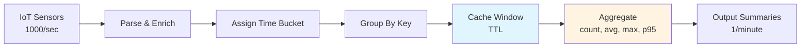

import CodeBlock from '@theme/CodeBlock';
import pipelineYaml from '!!raw-loader!../../examples/data-transformation/aggregate-time-windows.yaml';


# Aggregate Time Windows

Time-windowed aggregation groups events into time buckets (1 minute, 5 minutes, hourly) and calculates statistics like counts, averages, maximums, and percentiles. This reduces data volume, enables trend analysis, and powers real-time dashboards.

## Complete Examples

For full working configurations with all variations, see:
- [Aggregate Time Windows Examples](https://github.com/expanso-io/docs.expanso.io/tree/main/examples/data-transformation/aggregate-time-windows)

Includes: Tumbling windows (1-minute), sliding windows (5-minute with 1-minute slide), hourly aggregation with percentiles, and production buffering scripts.

## When to Use

**Use time-windowed aggregation when:**
- You need to reduce data volume by 98-99% before sending to cloud
- Dashboards require summarized metrics, not raw events
- You want to calculate moving averages or trends
- High-frequency sensor data overwhelms cloud ingestion

**Example:** 1000 sensors × 60 events/minute = 60,000 events/minute → aggregate to 1000 summaries/minute (98.3% reduction)

## Window Types

### Tumbling Windows

Fixed-size, non-overlapping time buckets. Each event belongs to exactly one window.

```
Events:    A  B  C  D  E  F  G  H  I  J
Time:      |----1m----|----1m----|----1m----|
Windows:   [A,B,C,D]  [E,F,G]    [H,I,J]
```

**Use cases:**
- Count events per minute
- Hourly traffic analysis
- Daily summaries

**Characteristics:**
- Simple to implement
- Memory efficient (one active window per key)
- Clear boundaries

### Sliding Windows

Fixed-size windows that overlap by a configurable slide interval.

```
Events:    A  B  C  D  E  F  G  H  I  J
Time:      |----5m----|
           |----5m----|
              |----5m----|
Windows:   [A,B,C,D]
           [B,C,D,E]
           [C,D,E,F]
```

**Use cases:**
- Moving averages
- Trending metrics
- Smoothed analytics

**Characteristics:**
- Events appear in multiple windows
- Smoother trends (less "jumpy")
- Higher memory usage (5× for 5-minute window with 1-minute slide)

### Session Windows

Dynamic windows that group events by activity bursts, separated by inactivity gaps.

```
Events:    A B C....D E F....G H I J K
Time:      |--gap--|  |--gap--|
Sessions:  [A,B,C]    [D,E,F]  [G,H,I,J,K]
```

**Use cases:**
- User sessions
- Transaction grouping
- Event clustering

**Characteristics:**
- Window size varies based on timing
- Gaps define session boundaries (e.g., 5 minutes of inactivity)

## Implementation Pattern

Time-windowed aggregation uses cache resources and the `group_by` processor:



**Flow:**
1. Parse events and extract timestamp
2. Round timestamp to window boundary (e.g., 14:23:45 → 14:23:00)
3. Create grouping key: `sensor_id + time_bucket`
4. Cache events in memory with TTL matching window duration
5. When window expires (TTL), calculate aggregations
6. Output summary record

## Basic Configuration

### 1-Minute Tumbling Window

<CodeBlock language="yaml" title="aggregate-time-windows.yaml" showLineNumbers>
  {pipelineYaml}
</CodeBlock>

<a
  href="/files/data-transformation/aggregate-time-windows.yaml"
  download
  className="button button--primary button--lg margin-top--md"
>
  📥 Download Pipeline
</a>

---


**Input:** 60 events/minute per sensor
```json
{
  "sensor_id": "temp_sensor_42",
  "temperature": 72.3,
  "timestamp": "2025-10-20T14:23:45.123Z"
}
```

**Output:** 1 summary/minute per sensor
```json
{
  "sensor_id": "temp_sensor_42",
  "time_bucket": "2025-10-20T14:23:00Z",
  "window_start": "2025-10-20T14:23:00Z",
  "window_end": "2025-10-20T14:24:00Z",
  "event_count": 60,
  "temperature_avg": 73.05,
  "temperature_min": 70.1,
  "temperature_max": 76.0
}
```

## Common Aggregations

### Count and Basic Statistics

```yaml
- mapping: |
    let events = this

    root.event_count = events.length()
    root.temperature_avg = events.map_each(e -> e.temperature).mean()
    root.temperature_min = events.map_each(e -> e.temperature).min()
    root.temperature_max = events.map_each(e -> e.temperature).max()
```

### Percentiles (P50, P95, P99)

```yaml
- mapping: |
    let events = this

    # Sort values for percentile calculation
    let temps = events.map_each(e -> e.temperature).sort()
    let count = temps.length()

    root.temperature_median = temps.index((count * 0.50).floor())
    root.temperature_p95 = temps.index((count * 0.95).floor())
    root.temperature_p99 = temps.index((count * 0.99).floor())
```

### Unique Counts

```yaml
- mapping: |
    let events = this

    # Count unique sensors
    root.unique_sensors = events.map_each(e -> e.sensor_id).unique().length()

    # Count unique locations
    root.unique_locations = events.map_each(e -> e.location).unique().length()
```

### Multi-Level Aggregation

```bloblang
# Create different grouping keys for multiple aggregation levels

# Per sensor
root.group_key_sensor = this.sensor_id + "|" + root.time_bucket

# Per location
root.group_key_location = this.location + "|" + root.time_bucket

# Global (all sensors)
root.group_key_global = "all_sensors|" + root.time_bucket
```

Then use `branch` processor to aggregate at each level separately.

## Production Considerations

### Memory Management

Cache memory usage: `events_per_second × window_duration × avg_event_size`

**Example (1-minute window):**
```
1000 events/sec × 60 seconds × 1KB = 60MB
```

**Example (1-hour window):**
```
1000 events/sec × 3600 seconds × 1KB = 3.6GB
```

**Configure cache limits:**
```yaml
resources:
  caches:
    window_cache:
      memory:
        default_ttl: "1h"
        max_items: 100000  # Limit cached items
        eviction_policy: lru
```

**Monitor cache usage:**
```bash
curl http://localhost:8080/metrics | grep cache_items
```

If `cache_items` approaches `max_items`, you're at risk of data loss.

### Late-Arriving Events

Events with timestamps outside the current window may arrive late.

**Solution: Grace period**
```yaml
- cache:
    ttl: "90s"  # 1-minute window + 30-second grace period
```

Trade-off: Delayed aggregation output (summaries sent 30 seconds after window ends).

### Clock Skew

IoT devices may have clock drift, creating incorrect timestamps.

**Solution: Use ingestion timestamp**
```yaml
- mapping: |
    root = this
    root.device_timestamp = this.timestamp  # Preserve original
    root.timestamp = now().ts_format("2006-01-02T15:04:05Z07:00")  # Server time
```

### Duplicate Summaries

Network failures during output can cause duplicate summaries.

**Solution: Idempotent aggregation keys**
```yaml
- mapping: |
    root.aggregation_id = this.sensor_id + "|" +
                          this.window_start + "|" +
                          this.window_end
    root.idempotency_key = root.aggregation_id.hash("sha256").slice(0, 16)
```

Cloud-side deduplication:
```sql
INSERT INTO aggregations (idempotency_key, sensor_id, event_count, ...)
VALUES (?, ?, ?, ...)
ON CONFLICT (idempotency_key) DO NOTHING;
```

### Network Outages

Buffer aggregations to disk when cloud is unreachable.

```yaml
output:
  fallback:
    # Try cloud first
    - http_client:
        url: "${ANALYTICS_ENDPOINT}/metrics"
        timeout: 10s

    # If unreachable, buffer to disk
    - file:
        path: "/var/expanso/buffer/aggregations-${!timestamp_unix()}.jsonl"
        codec: lines
```

Replay buffered files when connectivity restores (see examples for replay script).

## Troubleshooting

### Windows not aggregating

**Check if events are arriving:**
```bash
curl http://localhost:8080/metrics | grep input_received
```

**Check cache population:**
```bash
curl http://localhost:8080/metrics | grep cache_items
```

**Common causes:**
- TTL too short (must be ≥ window duration)
- Group key empty (not grouping correctly)
- Clock skew (timestamps in future)

### Memory exhaustion

**Check memory usage:**
```bash
expanso job stats <job-name>
```

**Solutions:**
- Reduce window size (1-hour → 15-minute)
- Sample events (aggregate 10%, multiply by 10)
- Scale horizontally (more nodes)

### High latency

**Cause:** Batching delays in output

**Fix: Reduce batch period**
```yaml
output:
  http_client:
    batching:
      count: 100
      period: 10s  # Reduce from 60s
```

## See Also

- [Parse Logs](https://docs.expanso.io/guides/data-transformation/parse-logs) - Parse before aggregating
- [Normalize Timestamps](https://docs.expanso.io/guides/data-transformation/normalize-timestamps) - Ensure consistent timestamps
- [Cache Processor](https://docs.expanso.io/components/processors/cache) - Cache configuration reference
- [Group By Processor](https://docs.expanso.io/components/processors/group_by) - Grouping syntax
- [Bloblang Functions](https://docs.expanso.io/guides/bloblang) - Time functions and aggregations
