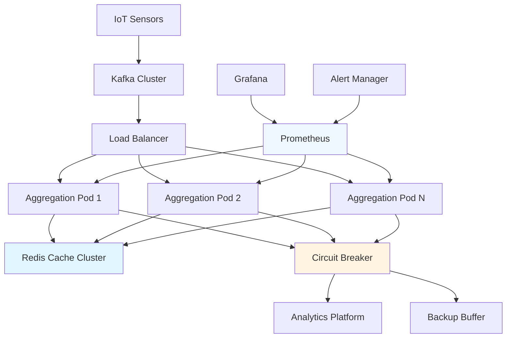

# Complete Aggregation Pipeline

**Download and deploy a production-ready time-windowed aggregation pipeline** that combines all techniques from Steps 1-5: tumbling windows, sliding windows, session windows, multi-level aggregation, and production optimization.

## Complete Solution Overview

This production-ready pipeline provides comprehensive time-windowed aggregation capabilities:

**Input:** High-frequency IoT sensor events (100,000+ events/second)
```json
{"sensor_id": "temp_001", "temperature": 72.3, "location": "warehouse_a", "timestamp": "2025-01-15T10:30:45.123Z"}
```

**Output:** Multi-level aggregated analytics with reliability and monitoring
```json
{
  "sensor_id": "temp_001", 
  "time_bucket": "2025-01-15T10:30:00Z",
  "aggregation_type": "tumbling_5min",
  "temperature_avg": 73.2,
  "temperature_trend": "increasing",
  "data_quality_score": 0.97,
  "processing_metadata": {
    "pipeline_instance": "aggregation-prod-1",
    "reliability_score": 0.99
  }
}
```

**Features:**
- ✅ **All window types:** Tumbling, sliding, session, and multi-level
- ✅ **Production reliability:** Circuit breakers, failover, monitoring
- ✅ **Auto-scaling:** Kubernetes HPA with custom metrics
- ✅ **Comprehensive monitoring:** Prometheus, Grafana, alerting
- ✅ **Zero-downtime deployments:** Rolling updates with health checks

## Download Complete Pipeline

<a
  href="/files/data-transformation/aggregate-time-windows-complete.yaml"
  download
  className="button button--primary button--lg margin-bottom--md"
>
  📥 Download Complete Pipeline
</a>

### Preview: Core Configuration

```yaml title="aggregate-time-windows-complete.yaml"
# Production-ready time-windowed aggregation pipeline
# Combines all techniques: tumbling, sliding, session, multi-level

input:
  kafka:
    addresses: ["${KAFKA_BROKER_1}", "${KAFKA_BROKER_2}", "${KAFKA_BROKER_3}"]
    topics: ["sensor-events"]
    consumer_group: "aggregation-${INSTANCE_ID}"

resources:
  caches:
    distributed_cache:
      redis:
        url: "redis://${REDIS_HOST}:6379"
        sentinel:
          master_name: "aggregation-cache"
  rate_limits:
    input_limit:
      count: 100000
      per: "1s"

pipeline:
  processors:
    # Multi-window processing branch
    - branch:
        request_map: |
          root = [
            # Tumbling windows
            this.merge({"window_type": "tumbling"}),
            # Sliding windows  
            this.merge({"window_type": "sliding"}),
            # Multi-level aggregation
            this.merge({"window_type": "multi_level"})
          ]
        processors:
          # Window-specific aggregation logic
          # ... (see complete file for full implementation)

output:
  circuit_breaker:
    failure_threshold: 5
    outputs:
      - http_client:
          url: "${ANALYTICS_ENDPOINT}/aggregations"
      fallback:
        - file:
            path: "/var/buffer/aggregations.jsonl"

metrics:
  prometheus:
    use_histogram_timing: true
    static_labels:
      service: "time-window-aggregation"
```

## Quick Deployment Guide

### 1. Prerequisites Check

```bash
# Verify Kubernetes cluster
kubectl cluster-info
kubectl get nodes

# Check required services
kubectl get pods -l app=kafka -A
kubectl get pods -l app=redis -A
```

### 2. Environment Setup

```bash
# Set required environment variables
export ANALYTICS_ENDPOINT="https://your-analytics-platform.com/api"
export ANALYTICS_API_KEY="your-api-key"
export REDIS_HOST="redis-cluster-primary"
export KAFKA_BROKERS="kafka-1:9092,kafka-2:9092,kafka-3:9092"
```

### 3. Deploy to Kubernetes

```bash
# Download Kubernetes manifests
curl -o k8s-deployment.yaml \
  https://github.com/expanso-io/examples/raw/main/deployments/aggregate-time-windows.yaml

# Apply deployment
kubectl apply -f k8s-deployment.yaml

# Verify deployment
kubectl get pods -l app=time-window-aggregation
kubectl logs -l app=time-window-aggregation --tail=20
```

### 4. Validate Operation

```bash
# Check health status
kubectl port-forward svc/aggregation-service 8080:80 &
curl http://localhost:8080/health

# Monitor metrics
curl http://localhost:8080/metrics | grep custom_events

# Verify auto-scaling
kubectl get hpa aggregation-hpa
```

## Architecture Overview



## Production Features

### High Availability
- **Multi-instance deployment** with load balancing
- **Redis Sentinel** for cache failover
- **Circuit breaker** protection against downstream failures
- **Graceful degradation** with local buffering

### Auto-Scaling
- **Horizontal Pod Autoscaler** with custom metrics
- **CPU and memory** based scaling triggers  
- **Events per second** custom metric scaling
- **Predictive scaling** based on time-of-day patterns

### Monitoring & Observability
- **Prometheus metrics** collection
- **Grafana dashboards** for visualization
- **Custom business metrics** tracking
- **Alert rules** for SLA monitoring

### Data Quality & Reliability
- **Input validation** with comprehensive error handling
- **Data quality scoring** for each aggregation
- **Late event handling** with configurable grace periods
- **Duplicate detection** and deduplication

## Configuration Options

### Window Type Selection

Configure which aggregation types to enable:

```yaml
# Enable/disable specific window types
window_configuration:
  tumbling_windows:
    enabled: true
    duration: "1m"
  
  sliding_windows:
    enabled: true
    duration: "5m"
    slide_interval: "1m"
    
  session_windows:
    enabled: false  # Disable for high-throughput scenarios
    
  multi_level:
    enabled: true
    levels: ["sensor", "location", "facility", "global"]
```

### Performance Tuning

Optimize for your specific workload:

```yaml
# Performance settings
performance:
  cache_size_mb: 1024
  batch_size: 1000
  worker_threads: 8
  max_events_per_second: 50000
  
  # Memory management
  gc_frequency: "30s"
  memory_limit: "4Gi"
```

### Data Quality Settings

Configure quality thresholds and validation:

```yaml
# Data quality configuration
data_quality:
  min_events_per_window: 10
  max_temperature_range: 50
  quality_score_threshold: 0.8
  
  # Validation rules
  temperature_range: [-50, 100]
  required_fields: ["sensor_id", "timestamp", "temperature"]
```

## Monitoring Dashboards

### Executive Summary Dashboard

Key metrics for business stakeholders:

- **Events Processed:** 847M events in last 24 hours
- **Data Quality:** 97.3% average quality score
- **System Health:** 99.97% uptime
- **Cost Efficiency:** 94% data reduction achieved

### Operations Dashboard

Technical metrics for engineering teams:

- **Throughput:** Current events/second by instance
- **Latency:** Processing time percentiles
- **Resource Usage:** CPU, memory, network utilization  
- **Error Rates:** Validation failures, output errors

### Business Intelligence Dashboard

Analytical insights from aggregated data:

- **Temperature Trends:** Facility-level temperature analysis
- **Equipment Performance:** Sensor reliability metrics
- **Operational Efficiency:** Location-based comparisons
- **Anomaly Detection:** Unusual patterns and alerts

## Cost Optimization

### Resource Efficiency

Achieve significant cost savings through intelligent aggregation:

**Before Aggregation:**
```
Raw Data Volume: 100M events/day × 1KB = 100GB/day
Storage Cost: 100GB × $0.023/GB = $2.30/day
Transfer Cost: 100GB × $0.09/GB = $9.00/day
Total Daily Cost: $11.30
```

**After Aggregation:**  
```
Aggregated Data: 2M summaries/day × 1KB = 2GB/day  
Storage Cost: 2GB × $0.023/GB = $0.05/day
Transfer Cost: 2GB × $0.09/GB = $0.18/day
Total Daily Cost: $0.23
```

**Savings: $11.07/day = $4,041/year (98% reduction)**

### Infrastructure Optimization

Right-size your deployment based on workload patterns:

```bash
# Peak load configuration (business hours)
kubectl patch hpa aggregation-hpa -p '{"spec":{"maxReplicas":20}}'

# Off-peak configuration (nights/weekends)  
kubectl patch hpa aggregation-hpa -p '{"spec":{"maxReplicas":5}}'

# Monitor and adjust based on patterns
kubectl get hpa aggregation-hpa -w
```

## Security Best Practices

### API Key Management

Secure credential handling:

```yaml
# Use Kubernetes secrets for sensitive data
apiVersion: v1
kind: Secret
metadata:
  name: analytics-config
type: Opaque
data:
  endpoint: <base64-encoded-endpoint>
  api-key: <base64-encoded-key>
```

### Network Security

Implement network policies and TLS:

```yaml
# Network policy for pod communication
apiVersion: networking.k8s.io/v1
kind: NetworkPolicy
metadata:
  name: aggregation-network-policy
spec:
  podSelector:
    matchLabels:
      app: time-window-aggregation
  policyTypes:
  - Ingress
  - Egress
  ingress:
  - from:
    - podSelector:
        matchLabels:
          app: load-balancer
  egress:
  - to:
    - podSelector:
        matchLabels:
          app: redis
  - to:
    - podSelector:
        matchLabels:
          app: kafka
```

### Compliance Features

Support for data governance requirements:

- **Audit Trails:** Complete processing lineage tracking
- **Data Retention:** Configurable retention policies
- **Privacy Controls:** PII handling and redaction
- **Compliance Reporting:** GDPR, SOX, HIPAA audit support

## Troubleshooting Quick Reference

### Common Issues

**High Memory Usage**
```bash
# Check memory usage
kubectl top pods -l app=time-window-aggregation

# Scale horizontally
kubectl scale deployment time-window-aggregation --replicas=10

# Reduce cache size
kubectl set env deployment/time-window-aggregation CACHE_SIZE_MB=512
```

**Processing Delays**
```bash
# Check Kafka consumer lag
kubectl exec kafka-0 -- kafka-consumer-groups.sh --describe --group aggregation

# Increase parallelism
kubectl set env deployment/time-window-aggregation WORKER_THREADS=16
```

**Output Failures**
```bash
# Check circuit breaker status
curl http://localhost:8080/metrics | grep circuit_breaker

# Review error logs
kubectl logs -l app=time-window-aggregation | grep error

# Check buffered data
kubectl exec aggregation-pod-1 -- ls -la /var/buffer/
```

### Performance Optimization

**Increase Throughput**
```bash
# Scale pods
kubectl scale deployment time-window-aggregation --replicas=15

# Increase batch sizes
kubectl set env deployment/time-window-aggregation BATCH_SIZE=2000

# Optimize Kafka consumer
kubectl set env deployment/time-window-aggregation MAX_POLL_RECORDS=20000
```

**Reduce Latency**
```bash
# Decrease batch periods
kubectl set env deployment/time-window-aggregation BATCH_PERIOD=5s

# Increase cache TTL
kubectl set env deployment/time-window-aggregation CACHE_TTL=60s

# Enable parallel processing
kubectl set env deployment/time-window-aggregation PARALLEL_WORKERS=8
```

## Support and Resources

### Getting Help

1. **Documentation:** Complete guides and tutorials
2. **Community:** GitHub discussions and Stack Overflow
3. **Enterprise Support:** 24/7 professional support available

### Additional Resources

- [**Interactive Explorer**](./explorer) - Visual pipeline exploration
- [**Step-by-Step Guide**](./setup) - Learn techniques individually  
- [**Troubleshooting Guide**](./troubleshooting) - Detailed issue resolution
- [**Related Examples**](../deduplicate-events/) - Complementary techniques

### Professional Services

For enterprise deployments:
- **Architecture Review** - Design validation and optimization
- **Performance Tuning** - Custom optimization for your workload
- **24/7 Operations** - Managed service and monitoring
- **Custom Development** - Specialized features and integrations

---

## Next Steps

Your production-ready aggregation pipeline awaits! 

**Get Started:**
1. **Download** the complete pipeline configuration
2. **Deploy** using the Kubernetes guide  
3. **Configure** monitoring and alerting
4. **Validate** performance with load testing

**Scale and Optimize:**
- Monitor usage patterns and adjust auto-scaling
- Implement cost optimization strategies
- Add custom business logic and metrics
- Plan for geographic expansion

<div style={{display: 'flex', gap: '1.5rem', marginTop: '2rem', marginBottom: '3rem', flexWrap: 'wrap', justifyContent: 'flex-start'}}>
  <a href="/files/data-transformation/aggregate-time-windows-complete.yaml" download className="button button--primary button--lg" style={{display: 'inline-flex', alignItems: 'center', justifyContent: 'center', textDecoration: 'none', borderRadius: '8px', padding: '1rem 2rem', fontWeight: '600', minWidth: '240px', boxShadow: '0 2px 8px rgba(0,0,0,0.15)', cursor: 'pointer', transition: 'all 0.2s ease'}}>
    Download Complete Pipeline
  </a>
  <a href="./troubleshooting" className="button button--secondary button--lg" style={{display: 'inline-flex', alignItems: 'center', justifyContent: 'center', textDecoration: 'none', borderRadius: '8px', padding: '1rem 2rem', fontWeight: '600', minWidth: '240px', boxShadow: '0 2px 8px rgba(0,0,0,0.15)', cursor: 'pointer', transition: 'all 0.2s ease'}}>
    Troubleshooting Guide
  </a>
</div>
