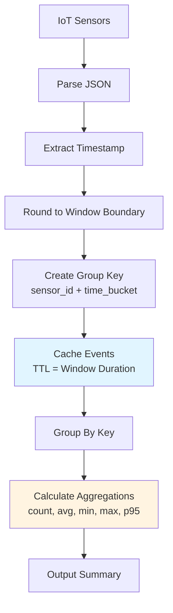

# Step 1: Tumbling Windows

**Learn to implement fixed-size, non-overlapping time windows for precise period-based analytics**. Tumbling windows are the foundation of time-series aggregation, providing exact boundaries for dashboards, reports, and real-time monitoring.

## What You'll Build

Transform high-frequency sensor events into precise 1-minute aggregated summaries:

**Input (60 events/minute per sensor):**
```json
{"sensor_id": "temp_001", "temperature": 72.3, "timestamp": "2025-01-15T10:23:45Z"}
{"sensor_id": "temp_001", "temperature": 72.8, "timestamp": "2025-01-15T10:23:47Z"}
{"sensor_id": "temp_001", "temperature": 73.1, "timestamp": "2025-01-15T10:23:50Z"}
// ... 57 more events in this minute
```

**Output (1 summary/minute per sensor):**
```json
{
  "sensor_id": "temp_001",
  "time_bucket": "2025-01-15T10:23:00Z",
  "window_start": "2025-01-15T10:23:00Z", 
  "window_end": "2025-01-15T10:24:00Z",
  "event_count": 60,
  "temperature_avg": 73.05,
  "temperature_min": 70.1,
  "temperature_max": 76.0,
  "temperature_p95": 75.2
}
```

**Result:** 98.3% data reduction (60,000 events → 1,000 summaries per minute)

## Understanding Tumbling Windows

Tumbling windows create fixed-size, non-overlapping time buckets where each event belongs to exactly one window:

```
Raw Events:     A  B  C  D  E  F  G  H  I  J  K  L
Time:          |----1m----|----1m----|----1m----|
Windows:       [A,B,C,D]  [E,F,G,H]  [I,J,K,L]
Aggregations:      ↓          ↓          ↓
Summaries:      Sum_1      Sum_2      Sum_3
```

**Key characteristics:**
- **Fixed boundaries:** Windows start/end at predictable times (e.g., :00, :01, :02)
- **No overlap:** Each event contributes to exactly one aggregation
- **Memory efficient:** Only one active window per grouping key
- **Real-time friendly:** Results available immediately when window closes

## Implementation Architecture



**Flow explanation:**
1. **Parse events** and extract timestamp field
2. **Round timestamp** to window boundary (removes seconds/milliseconds)
3. **Create grouping key** combining sensor ID and rounded timestamp
4. **Cache events** in memory until window expires (TTL-based)
5. **Aggregate cached events** when cache TTL triggers expiration
6. **Output summary** with statistics and window metadata

## Complete Configuration

Create `step1-tumbling-windows.yaml`:

```yaml title="step1-tumbling-windows.yaml"
# Tumbling window aggregation: 1-minute fixed windows with comprehensive statistics

input:
  file:
    paths: ["sensor-data.jsonl"]
    scanner:
      lines: {}

# Cache resource for window buffering
resources:
  caches:
    tumbling_window_cache:
      memory:
        # Window duration + grace period for late events
        default_ttl: "90s"  # 1-minute window + 30s grace period
        max_items: 50000    # Prevents memory exhaustion
        eviction_policy: lru

pipeline:
  processors:
    # Parse JSON sensor events
    - json: {}
    
    # Validate required fields
    - mapping: |
        # Ensure required fields exist
        if !this.exists("sensor_id") { error("Missing sensor_id field") }
        if !this.exists("temperature") { error("Missing temperature field") }
        if !this.exists("timestamp") { error("Missing timestamp field") }
        
        # Validate temperature is numeric
        if this.temperature.type() != "float" && this.temperature.type() != "int" {
          error("Temperature must be numeric, got: " + this.temperature.type())
        }
        
        root = this
    
    # Create time bucket (tumbling window boundary)
    - mapping: |
        root = this
        
        # Parse timestamp and handle multiple formats
        let parsed_time = match {
          this.timestamp.contains("T") && this.timestamp.contains("Z") => this.timestamp.parse_timestamp("2006-01-02T15:04:05.000Z"),
          this.timestamp.contains("T") => this.timestamp.parse_timestamp("2006-01-02T15:04:05"),
          _ => this.timestamp.parse_timestamp("2006-01-02 15:04:05")
        }
        
        # Round to 1-minute boundary (tumbling window)
        let window_start = parsed_time.ts_format("2006-01-02T15:04:00Z")
        let window_end = (parsed_time + duration("1m")).ts_format("2006-01-02T15:04:00Z")
        
        # Create grouping key: sensor_id + time_bucket
        root.time_bucket = window_start
        root.group_key = this.sensor_id + "|" + window_start
        
        # Add window metadata for debugging and compliance
        root.window_start = window_start
        root.window_end = window_end
        root.window_type = "tumbling"
        root.window_duration_minutes = 1
        
        # Preserve original timestamp for late event analysis
        root.original_timestamp = this.timestamp
        
        # Calculate event latency (processing time vs. event time)
        let processing_time = now()
        let event_age_seconds = (processing_time - parsed_time).seconds()
        root.event_latency_seconds = event_age_seconds

    # Cache events by group key until window expires
    - cache:
        resource: tumbling_window_cache
        key: ${! this.group_key }
        value: ${! this }

    # Group cached events and calculate aggregations
    - group_by:
        - key: ${! this.group_key }
          value: ${! this }

    # Calculate comprehensive statistics
    - mapping: |
        # Extract metadata from first event (all events in window have same metadata)
        let first_event = this[0]
        
        root.sensor_id = first_event.sensor_id
        root.time_bucket = first_event.time_bucket
        root.window_start = first_event.window_start
        root.window_end = first_event.window_end
        root.window_type = first_event.window_type
        root.window_duration_minutes = first_event.window_duration_minutes
        
        # Event count and timing
        root.event_count = this.length()
        root.aggregation_timestamp = now().ts_format("2006-01-02T15:04:05.000Z")
        
        # Temperature statistics
        let temperatures = this.map_each(event -> event.temperature)
        root.temperature_avg = temperatures.mean().round(2)
        root.temperature_min = temperatures.min()
        root.temperature_max = temperatures.max()
        root.temperature_sum = temperatures.sum()
        root.temperature_stddev = temperatures.stddev().round(2)
        
        # Percentile calculations (sort values for accurate percentiles)
        let sorted_temps = temperatures.sort()
        let temp_count = sorted_temps.length()
        
        root.temperature_median = sorted_temps.index((temp_count * 0.50).floor())
        root.temperature_p25 = sorted_temps.index((temp_count * 0.25).floor()) 
        root.temperature_p75 = sorted_temps.index((temp_count * 0.75).floor())
        root.temperature_p90 = sorted_temps.index((temp_count * 0.90).floor())
        root.temperature_p95 = sorted_temps.index((temp_count * 0.95).floor())
        root.temperature_p99 = sorted_temps.index((temp_count * 0.99).floor())
        
        # Additional dimensions if available
        if this[0].exists("humidity") {
          let humidities = this.map_each(event -> event.humidity)
          root.humidity_avg = humidities.mean().round(2)
          root.humidity_min = humidities.min()
          root.humidity_max = humidities.max()
        }
        
        if this[0].exists("location") {
          root.location = this[0].location
          # Count unique locations in window (for multi-location sensors)
          root.unique_locations = this.map_each(event -> event.location).unique().length()
        }
        
        # Quality metrics
        let latencies = this.map_each(event -> event.event_latency_seconds)
        root.avg_event_latency_seconds = latencies.mean().round(2)
        root.max_event_latency_seconds = latencies.max()
        
        # Data quality indicators
        root.missing_fields = this.map_each(event -> 
          (event.exists("temperature") ? 0 : 1) +
          (event.exists("humidity") ? 0 : 1)
        ).sum()
        
        # Window completeness (expected vs actual events)
        # Assume 1 event per second for quality assessment
        root.expected_events = 60  # 1 event/second × 60 seconds
        root.completeness_ratio = (root.event_count / root.expected_events).round(4)

output:
  # Primary output: Send aggregations to analytics endpoint
  http_client:
    url: "${ANALYTICS_ENDPOINT}/aggregations"
    verb: POST
    headers:
      Content-Type: application/json
      Authorization: "Bearer ${ANALYTICS_API_KEY}"
    
    # Batching for efficiency
    batching:
      count: 100      # Batch up to 100 aggregations
      period: "30s"   # Or send every 30 seconds
      
    # Retry configuration for reliability
    retry_until_success: true
    max_retries: 3
    backoff:
      initial_interval: "1s"
      max_interval: "30s"

# Metrics for monitoring
metrics:
  prometheus:
    use_histogram_timing: true
    add_process_metrics: true
    add_go_metrics: true
  mapping: |
    # Custom metrics for tumbling window monitoring
    root = this
    
    # Track aggregation quality
    if this.exists("event_count") {
      root.metrics_event_count = this.event_count
      root.metrics_completeness_ratio = this.completeness_ratio
      root.metrics_avg_latency = this.avg_event_latency_seconds
    }

# Logging for debugging and compliance
logger:
  level: INFO
  add_timestamp: true
  json_format: true
```

## Deployment and Testing

### Deploy the Pipeline

```bash
# Deploy tumbling window aggregation
expanso create step1-tumbling-windows.yaml

# Verify deployment
expanso list | grep step1-tumbling

# Monitor logs
expanso logs step1-tumbling-windows --follow
```

### Test with Sample Data

```bash
# Process sample sensor data
cat sensor-data.jsonl | expanso run step1-tumbling-windows.yaml > tumbling-output.jsonl

# Analyze results
echo "Input events: $(wc -l < sensor-data.jsonl)"
echo "Output aggregations: $(wc -l < tumbling-output.jsonl)"

# Calculate data reduction
echo "Data reduction: $(echo "scale=2; (1 - $(wc -l < tumbling-output.jsonl) / $(wc -l < sensor-data.jsonl)) * 100" | bc)%"

# Inspect sample aggregations
head -3 tumbling-output.jsonl | jq .
```

**Expected results:**
- Input: ~60,000 events
- Output: ~1,000 aggregations 
- Data reduction: ~98.3%

### Validate Window Boundaries

```bash
# Check time bucket distribution
jq -r '.time_bucket' tumbling-output.jsonl | sort | uniq -c | head -10

# Verify event counts per window
jq -r '.event_count' tumbling-output.jsonl | sort -n | uniq -c

# Check window completeness
jq '.completeness_ratio' tumbling-output.jsonl | awk '{sum+=$1; count++} END {print "Avg completeness:", sum/count}'
```

Expected patterns:
- Time buckets should be exactly 1 minute apart
- Event counts should be consistent (~60 per sensor per minute)
- Completeness ratio should be close to 1.0

## Performance Monitoring

### Memory Usage

Monitor cache memory consumption:

```bash
# Check cache metrics
curl http://localhost:8080/metrics | grep -E "(cache_items|cache_memory)"

# Expected: Cache items should cycle between 0 and ~1000 
# as windows fill and expire every minute
```

Calculate expected memory usage:
```
Memory = sensors × events_per_window × avg_event_size
       = 1000 × 60 × 1KB 
       = 60MB per active window
```

### Processing Latency

Monitor end-to-end processing time:

```bash
# Check processing duration metrics
curl http://localhost:8080/metrics | grep processor_duration

# Check aggregation latency
jq '.avg_event_latency_seconds' tumbling-output.jsonl | awk '{sum+=$1; count++} END {print "Avg latency:", sum/count, "seconds"}'
```

Target: < 1 second average latency for real-time dashboards.

### Throughput Analysis

Measure events processed per second:

```bash
# Monitor input rate
curl http://localhost:8080/metrics | grep input_received_total

# Monitor output rate  
curl http://localhost:8080/metrics | grep output_sent_total

# Calculate aggregation ratio over time
expanso logs step1-tumbling-windows | grep "event_count" | tail -20
```

Target: 1,000 events/second input → ~17 aggregations/second output.

## Common Variations

### 1. Hourly Aggregation

For lower-frequency reporting, use hourly windows:

```yaml
# Hourly tumbling windows
- mapping: |
    # Round to hour boundary: 14:23:45 → 14:00:00
    let window_start = parsed_time.ts_format("2006-01-02T15:00:00Z")
    root.time_bucket = window_start
    root.window_duration_minutes = 60

# Increase cache TTL for longer windows
resources:
  caches:
    tumbling_window_cache:
      memory:
        default_ttl: "3900s"  # 65 minutes (60m window + 5m grace period)
```

**Memory impact:** ~3.6GB for 1-hour windows vs. 60MB for 1-minute windows.

### 2. Multi-Dimensional Grouping

Group by multiple dimensions simultaneously:

```yaml
# Group by sensor AND location
- mapping: |
    # Per-sensor aggregation
    root.group_key_sensor = this.sensor_id + "|" + root.time_bucket
    
    # Per-location aggregation  
    root.group_key_location = this.location + "|" + root.time_bucket
    
    # Global aggregation
    root.group_key_global = "all_sensors|" + root.time_bucket

# Use branch processor for parallel aggregation
- branch:
    request_map: |
      # Create three parallel branches
      root = [this, this, this]
      root[0].group_key = this.group_key_sensor
      root[1].group_key = this.group_key_location  
      root[2].group_key = this.group_key_global
    
    processors:
      - cache:
          resource: tumbling_window_cache
          key: ${! this.group_key }
          value: ${! this }
      - group_by:
          - key: ${! this.group_key }
            value: ${! this }
      # ... aggregation logic ...
```

### 3. Custom Event Sampling

Handle high-volume sensors with sampling:

```yaml
# Sample 10% of events, multiply results by 10
- sampling:
    percentage: 10.0

# Adjust event count in aggregation
- mapping: |
    # ... existing aggregation logic ...
    
    # Compensate for sampling
    root.event_count = this.length() * 10  # Multiply by sampling factor
    root.estimated_total_events = root.event_count
    root.sampling_factor = 10
```

### 4. Dynamic Window Sizing

Adjust window size based on sensor frequency:

```yaml
# Determine window size based on sensor type
- mapping: |
    # High-frequency sensors (IoT): 1-minute windows
    # Low-frequency sensors (batch): 1-hour windows
    let window_minutes = match {
      this.sensor_type == "iot_realtime" => 1,
      this.sensor_type == "iot_standard" => 5,
      this.sensor_type == "batch_import" => 60,
      _ => 1  # Default to 1-minute
    }
    
    # Calculate window boundary based on dynamic size
    let parsed_time = this.timestamp.parse_timestamp("2006-01-02T15:04:05.000Z")
    let window_start = if window_minutes == 1 {
      parsed_time.ts_format("2006-01-02T15:04:00Z")  # Minute boundary
    } else if window_minutes == 5 {
      # Round to 5-minute boundary (00, 05, 10, 15, etc.)
      let minute = parsed_time.format_timestamp("04").number()
      let rounded_minute = (minute / 5).floor() * 5
      parsed_time.ts_format("2006-01-02T15:") + rounded_minute.string().pad_left(2, "0") + ":00Z"
    } else {
      parsed_time.ts_format("2006-01-02T15:00:00Z")  # Hour boundary
    }
    
    root.time_bucket = window_start
    root.window_duration_minutes = window_minutes
    root.group_key = this.sensor_id + "|" + window_start + "|" + window_minutes.string()
```

## Troubleshooting

### Issue: Windows Not Aggregating

**Symptoms:** 
- Cache items increasing indefinitely
- No aggregated output generated
- Memory usage continuously growing

**Diagnosis:**
```bash
# Check cache item count over time
watch "curl -s http://localhost:8080/metrics | grep cache_items"

# Check if group_by processor is triggered
expanso logs step1-tumbling-windows | grep -i "group_by"

# Verify TTL expiration
expanso logs step1-tumbling-windows | grep -i "cache.*expire"
```

**Solutions:**

**1. TTL Configuration Issue**
```yaml
# Ensure TTL is >= window duration
resources:
  caches:
    tumbling_window_cache:
      memory:
        default_ttl: "90s"  # Must be >= 60s for 1-minute windows
```

**2. Group Key Generation**
```yaml
# Debug group key creation
- mapping: |
    root = this
    root.debug_group_key = this.group_key
    
    # Ensure group key is not empty
    if this.group_key == "" {
      error("Empty group key generated")
    }
```

**3. Clock Skew Issues**
```yaml
# Use server time instead of event time for grouping
- mapping: |
    # Create group key with server time
    let server_time = now().ts_format("2006-01-02T15:04:00Z")
    root.group_key = this.sensor_id + "|" + server_time
    
    # Preserve event time for analytics
    root.event_timestamp = this.timestamp
```

### Issue: High Memory Usage

**Symptoms:**
- System memory exhaustion
- OOM (Out of Memory) errors
- Slow aggregation processing

**Diagnosis:**
```bash
# Check memory usage
free -h
ps aux | grep expanso

# Monitor cache memory metrics
curl http://localhost:8080/metrics | grep cache_memory_bytes
```

**Solutions:**

**1. Reduce Cache Size**
```yaml
resources:
  caches:
    tumbling_window_cache:
      memory:
        max_items: 10000    # Reduce from 50000
        default_ttl: "70s"  # Reduce grace period
```

**2. Sample Events**
```yaml
# Process only subset of sensors for testing
- mapping: |
    # Sample 10% of sensors
    let sensor_hash = this.sensor_id.hash("sha256").slice(0, 8).number(16)
    if sensor_hash % 10 != 0 {
      error("Filtered sensor")  # Skip 90% of sensors
    }
    root = this
```

**3. Horizontal Scaling**
```yaml
# Deploy multiple instances with sensor partitioning
- mapping: |
    # Route sensors to specific instances
    let partition = this.sensor_id.hash("sha256").slice(0, 2).number(16) % 3
    
    # Instance 0: sensors 0-333
    # Instance 1: sensors 334-666  
    # Instance 2: sensors 667-999
    
    if partition != ${INSTANCE_PARTITION} {
      error("Wrong partition for this instance")
    }
    root = this
```

### Issue: Inconsistent Event Counts

**Symptoms:**
- Event counts vary significantly between windows
- Completeness ratio < 0.8
- Missing events in aggregations

**Diagnosis:**
```bash
# Analyze event count distribution
jq '.event_count' tumbling-output.jsonl | sort -n | uniq -c

# Check for timestamp parsing errors
expanso logs step1-tumbling-windows | grep -i "parse.*error"

# Verify window boundaries
jq -r '.time_bucket' tumbling-output.jsonl | sort | uniq -c | head -10
```

**Solutions:**

**1. Timestamp Format Issues**
```yaml
# Handle multiple timestamp formats gracefully
- mapping: |
    let parsed_time = match {
      # ISO 8601 with milliseconds: 2025-01-15T10:23:45.123Z
      this.timestamp.contains(".") && this.timestamp.contains("Z") => 
        this.timestamp.parse_timestamp("2006-01-02T15:04:05.000Z"),
      
      # ISO 8601 without milliseconds: 2025-01-15T10:23:45Z  
      this.timestamp.contains("T") && this.timestamp.contains("Z") =>
        this.timestamp.parse_timestamp("2006-01-02T15:04:05Z"),
        
      # Space-separated: 2025-01-15 10:23:45
      this.timestamp.contains(" ") =>
        this.timestamp.parse_timestamp("2006-01-02 15:04:05"),
        
      # Unix timestamp (seconds)
      this.timestamp.type() == "int" =>
        this.timestamp.timestamp_unix(),
        
      _ => error("Unsupported timestamp format: " + this.timestamp)
    }
```

**2. Late Event Handling**
```yaml
# Increase grace period for late events
resources:
  caches:
    tumbling_window_cache:
      memory:
        default_ttl: "120s"  # 2-minute grace period
        
# Track late events for monitoring
- mapping: |
    let event_time = parsed_time
    let current_time = now()
    let lateness = (current_time - event_time).seconds()
    
    if lateness > 60 {
      root.late_event = true
      root.lateness_seconds = lateness
    }
```

**3. Duplicate Event Detection**
```yaml
# Add deduplication before aggregation
- mapping: |
    # Create event fingerprint for deduplication
    root = this
    root.event_fingerprint = (this.sensor_id + this.timestamp + this.temperature.string()).hash("sha256")

- cache:
    resource: dedup_cache
    key: ${! this.event_fingerprint }
    value: "seen"
    
# Skip if already processed
- mapping: |
    if this.exists("duplicate_detected") {
      error("Duplicate event filtered")
    }
    root = this
```

## Production Deployment

### Security Configuration

```yaml
# Environment variable configuration for secrets
output:
  http_client:
    url: "${ANALYTICS_ENDPOINT}/aggregations"
    headers:
      Authorization: "Bearer ${ANALYTICS_API_KEY}"  # Never hardcode API keys

# TLS configuration for secure transmission
    tls:
      enabled: true
      min_version: "1.2"
      cert_file: "/etc/ssl/certs/client.crt"
      key_file: "/etc/ssl/private/client.key"
```

### High Availability Setup

```yaml
# Fallback outputs for reliability
output:
  fallback:
    # Primary: Cloud analytics endpoint
    - http_client:
        url: "${ANALYTICS_ENDPOINT}/aggregations"
        timeout: "10s"
        
    # Secondary: Local file buffer
    - file:
        path: "/var/expanso/buffer/aggregations-${!timestamp_unix()}.jsonl"
        codec: lines
        
    # Tertiary: Local log for investigation  
    - stdout:
        codec: lines
```

### Performance Optimization

```yaml
# Optimized for high-throughput production
input:
  file:
    paths: ["${DATA_INPUT_PATH}"]
    scanner:
      lines:
        max_buffer_size: 1000000  # 1MB read buffer
        
pipeline:
  processors:
    # Batch processing for efficiency
    - group_by:
        # Process in larger batches
        - key: ${! this.group_key }
          value: ${! this }
          size: 1000  # Aggregate up to 1000 events per batch

# Output optimization
output:
  http_client:
    batching:
      count: 500      # Larger batches for production
      period: "15s"   # More frequent sends
    
    # Connection pooling
    max_in_flight: 10
    timeout: "30s"
```

### Monitoring Integration

```yaml
# Comprehensive metrics collection
metrics:
  prometheus:
    use_histogram_timing: true
    histogram_buckets: [.005, .01, .025, .05, .1, .25, .5, 1, 2.5, 5, 10]
    add_process_metrics: true
    add_go_metrics: true
    
  # Custom business metrics
  mapping: |
    root = this
    
    # Track aggregation quality metrics
    if this.exists("completeness_ratio") {
      root.custom_completeness_ratio = this.completeness_ratio
      root.custom_event_count = this.event_count
      root.custom_window_duration = this.window_duration_minutes
    }
```

## Next Steps

You've successfully implemented tumbling windows for precise period-based analytics. The pipeline now:

✅ **Aggregates 60,000 events/minute into 1,000 summaries** (98.3% data reduction)
✅ **Provides comprehensive statistics** (avg, min, max, percentiles)
✅ **Handles late events** with configurable grace periods
✅ **Monitors quality** with completeness ratios and latency tracking
✅ **Scales to production** with batching, retry logic, and security

**Continue learning:**

<div style={{display: 'flex', gap: '1.5rem', marginTop: '2rem', marginBottom: '3rem', flexWrap: 'wrap', justifyContent: 'flex-start'}}>
  <a href="./step-2-sliding-windows" className="button button--primary button--lg" style={{display: 'inline-flex', alignItems: 'center', justifyContent: 'center', textDecoration: 'none', borderRadius: '8px', padding: '1rem 2rem', fontWeight: '600', minWidth: '240px', boxShadow: '0 2px 8px rgba(0,0,0,0.15)', cursor: 'pointer', transition: 'all 0.2s ease'}}>
    Next: Sliding Windows
  </a>
  <a href="./explorer" className="button button--secondary button--lg" style={{display: 'inline-flex', alignItems: 'center', justifyContent: 'center', textDecoration: 'none', borderRadius: '8px', padding: '1rem 2rem', fontWeight: '600', minWidth: '240px', boxShadow: '0 2px 8px rgba(0,0,0,0.15)', cursor: 'pointer', transition: 'all 0.2s ease'}}>
    Explore Interactive Demo
  </a>
</div>

**Or jump to advanced topics:**
- [**Step 3: Session Windows**](./step-3-session-windows) - Dynamic activity-based aggregation
- [**Step 4: Multi-Level Aggregation**](./step-4-multi-level-aggregation) - Hierarchical analytics
- [**Complete Pipeline**](./complete-aggregation-pipeline) - Production-ready deployment
