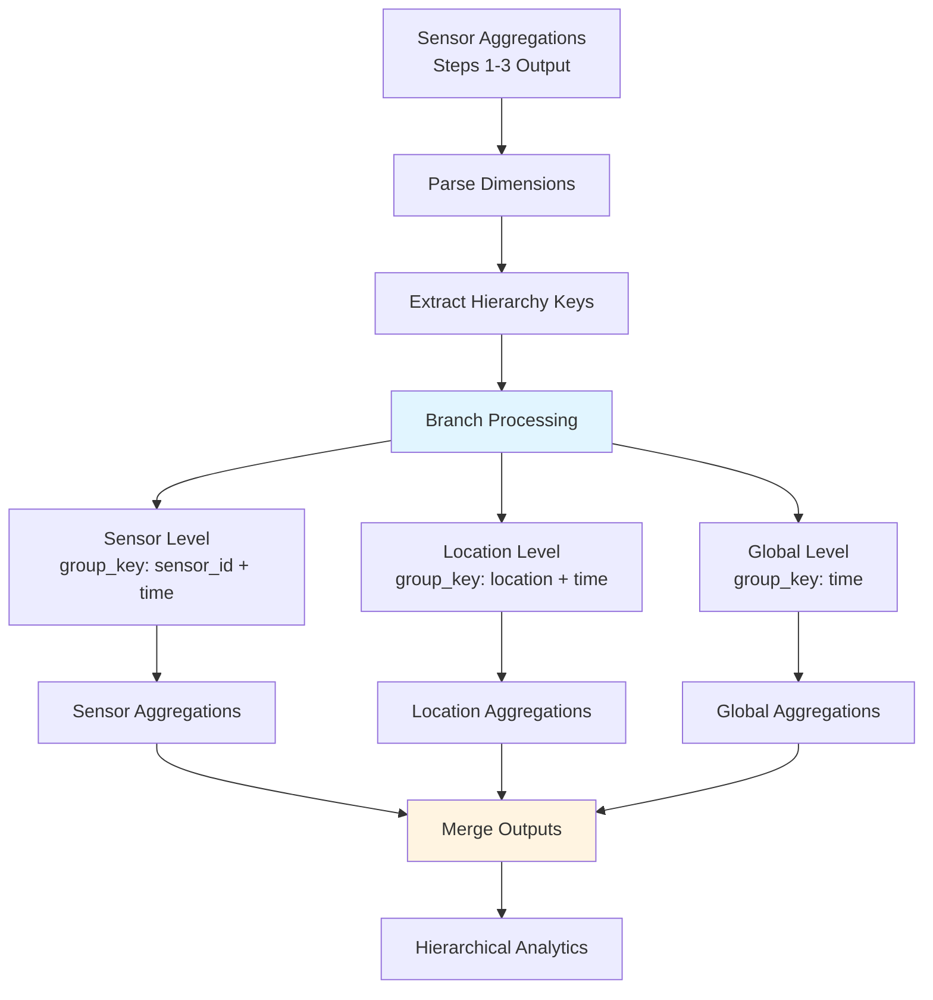

# Step 4: Multi-Level Aggregation

**Learn to implement simultaneous aggregation across multiple dimensions for hierarchical analytics**. Multi-level aggregation creates drill-down capabilities by computing sensor-level, location-level, and global metrics simultaneously, enabling comprehensive analytics dashboards and business intelligence.

## What You'll Build

Transform single-level sensor aggregations into comprehensive hierarchical analytics with drill-down capabilities:

**Input (Single-level sensor aggregations from Steps 1-3):**
```json
{"sensor_id": "temp_001", "location": "warehouse_a", "temperature_avg": 72.3, "time_bucket": "10:30:00Z"}
{"sensor_id": "temp_002", "location": "warehouse_a", "temperature_avg": 71.8, "time_bucket": "10:30:00Z"}
{"sensor_id": "temp_003", "location": "warehouse_b", "temperature_avg": 73.1, "time_bucket": "10:30:00Z"}
{"sensor_id": "temp_004", "location": "warehouse_b", "temperature_avg": 72.9, "time_bucket": "10:30:00Z"}
```

**Output (Multi-level hierarchical analytics):**
```json
{
  "level": "sensor",
  "sensor_id": "temp_001",
  "location": "warehouse_a",
  "time_bucket": "10:30:00Z",
  "temperature_avg": 72.3,
  "event_count": 60,
  "aggregation_type": "tumbling_window"
},
{
  "level": "location", 
  "location": "warehouse_a",
  "time_bucket": "10:30:00Z",
  "sensor_count": 2,
  "temperature_avg": 72.05,
  "temperature_range": 0.5,
  "total_events": 120,
  "sensors": ["temp_001", "temp_002"]
},
{
  "level": "global",
  "time_bucket": "10:30:00Z", 
  "location_count": 2,
  "sensor_count": 4,
  "temperature_avg": 72.525,
  "temperature_range": 1.3,
  "total_events": 240,
  "locations": ["warehouse_a", "warehouse_b"]
}
```

**Result:** Complete analytics hierarchy enabling drill-down from global → location → sensor views.

## Understanding Multi-Level Aggregation

Multi-level aggregation creates analytical hierarchies by simultaneously grouping data across multiple dimensions:

```
Raw Sensor Data:
├── temp_001 (warehouse_a) → 72.3°C, 60 events
├── temp_002 (warehouse_a) → 71.8°C, 58 events  
├── temp_003 (warehouse_b) → 73.1°C, 62 events
└── temp_004 (warehouse_b) → 72.9°C, 59 events

Multi-Level Aggregation:
├── Sensor Level (4 aggregations)
│   ├── temp_001: 72.3°C, 60 events
│   ├── temp_002: 71.8°C, 58 events
│   ├── temp_003: 73.1°C, 62 events
│   └── temp_004: 72.9°C, 59 events
│
├── Location Level (2 aggregations)
│   ├── warehouse_a: 72.05°C, 118 events (2 sensors)
│   └── warehouse_b: 73.0°C, 121 events (2 sensors)
│
└── Global Level (1 aggregation)
    └── all_locations: 72.525°C, 239 events (4 sensors, 2 locations)
```

**Key benefits:**
- **Drill-down capability:** Navigate from summary to detail
- **Multiple perspectives:** View data at appropriate level of detail
- **Efficient querying:** Pre-computed aggregations at each level
- **Dashboard flexibility:** Support both overview and detailed views

## Use Cases for Multi-Level Aggregation

### Business Intelligence Dashboards
```
Executive Dashboard (Global):
- Total revenue: $2.4M across 50 stores
- Average transaction: $23.50
- Top performing region: West Coast

Regional Dashboard (Location): 
- West Coast: $850K revenue, 15 stores
- Average store performance: $56.7K
- Best store: San Francisco ($89.2K)

Store Dashboard (Individual):
- San Francisco store: $89.2K revenue
- 3,790 transactions, $23.54 average
- Peak hours: 12-2PM, 5-7PM
```

### IoT Infrastructure Monitoring
```
Data Center Overview (Global):
- 12 racks, 480 servers
- Average CPU: 68%, Memory: 74%
- 3 alerts (2 warnings, 1 critical)

Rack-Level Analysis (Location):
- Rack 7: 40 servers, CPU 82%, Memory 91%
- Temperature: 78°F (above optimal)
- Power consumption: 24.5kW

Server-Level Details (Individual):
- Server rack7-srv23: CPU 95%, Memory 98%  
- Disk I/O: 850 IOPS, Network: 125 Mbps
- Alert: Memory threshold exceeded
```

### Manufacturing Quality Control
```
Plant Performance (Global):
- 5 production lines, 12,400 units/hour
- Quality rate: 98.7% (158 defects)
- Efficiency: 89% (target: 92%)

Production Line (Location):
- Line 3: 2,850 units/hour, Quality: 97.2%
- 18 defects in last hour (target: < 15)
- Bottleneck: Station 7 (cycle time: 1.8s vs 1.5s target)

Station Analysis (Individual):
- Station 7: Cycle time 1.8s, Utilization 94%
- Temperature: 195°C (optimal: 180-190°C)
- Vibration: 0.8mm/s (threshold: 1.0mm/s)
```

## Implementation Architecture



**Parallel aggregation strategy:**
```
Single Event → Multiple Group Keys:
- sensor_key: "temp_001|10:30:00Z"       → Sensor-level aggregation
- location_key: "warehouse_a|10:30:00Z"  → Location-level aggregation  
- global_key: "all|10:30:00Z"           → Global aggregation

Each key triggers independent aggregation pipeline.
```

## Complete Configuration

Create `step4-multi-level-aggregation.yaml`:

```yaml title="step4-multi-level-aggregation.yaml"
# Multi-level aggregation: Simultaneous sensor, location, and global analytics

input:
  # Read from previous aggregation outputs (Steps 1-3)
  file:
    paths: ["sensor-aggregations.jsonl"]
    scanner:
      lines: {}

# Cache resources for multi-level aggregation
resources:
  caches:
    # Sensor-level cache
    sensor_level_cache:
      memory:
        default_ttl: "120s"    # 2-minute TTL
        max_items: 10000       # Support 10K sensors
        eviction_policy: lru

    # Location-level cache  
    location_level_cache:
      memory:
        default_ttl: "120s"
        max_items: 1000        # Support 1K locations
        eviction_policy: lru
        
    # Global-level cache
    global_level_cache:
      memory:
        default_ttl: "120s"
        max_items: 100         # Support multiple global groupings
        eviction_policy: lru

pipeline:
  processors:
    # Parse JSON aggregation input
    - json: {}
    
    # Validate input format from previous aggregation steps
    - mapping: |
        if !this.exists("sensor_id") { error("Missing sensor_id field") }
        if !this.exists("time_bucket") { error("Missing time_bucket field") }
        if !this.exists("temperature_avg") { error("Missing temperature_avg field") }
        
        root = this
        
        # Ensure required dimensions exist
        root.location = this.get("location").or("unknown_location")
        root.region = this.get("region").or("unknown_region") 
        root.facility = this.get("facility").or("unknown_facility")
        
        # Add processing metadata
        root.multi_level_processing_time = now().ts_format("2006-01-02T15:04:05.000Z")

    # Create multi-level aggregation keys using branch processor
    - branch:
        request_map: |
          # Create parallel processing branches for each aggregation level
          # Each event will be processed at all levels simultaneously
          
          root = [
            # Sensor level (most granular)
            this.merge({
              "aggregation_level": "sensor",
              "group_key": this.sensor_id + "|" + this.time_bucket,
              "hierarchy_path": this.facility + "/" + this.location + "/" + this.sensor_id,
              "parent_group_key": this.location + "|" + this.time_bucket
            }),
            
            # Location level (intermediate)
            this.merge({
              "aggregation_level": "location", 
              "group_key": this.location + "|" + this.time_bucket,
              "hierarchy_path": this.facility + "/" + this.location,
              "parent_group_key": this.facility + "|" + this.time_bucket
            }),
            
            # Facility level (higher grouping)
            this.merge({
              "aggregation_level": "facility",
              "group_key": this.facility + "|" + this.time_bucket,
              "hierarchy_path": this.facility,
              "parent_group_key": "global|" + this.time_bucket
            }),
            
            # Global level (highest aggregation)
            this.merge({
              "aggregation_level": "global",
              "group_key": "global|" + this.time_bucket, 
              "hierarchy_path": "global",
              "parent_group_key": null
            })
          ]
        
        processors:
          # Cache events by aggregation level
          - switch:
              # Route to appropriate cache based on aggregation level
              - check: this.aggregation_level == "sensor"
                processors:
                  - cache:
                      resource: sensor_level_cache
                      key: ${! this.group_key }
                      value: ${! this }
                      
              - check: this.aggregation_level == "location"
                processors:
                  - cache:
                      resource: location_level_cache
                      key: ${! this.group_key }
                      value: ${! this }
                      
              - check: this.aggregation_level == "facility"
                processors:
                  - cache:
                      resource: location_level_cache  # Reuse location cache
                      key: ${! this.group_key }
                      value: ${! this }
                      
              - processors:  # Global level (default)
                  - cache:
                      resource: global_level_cache
                      key: ${! this.group_key }
                      value: ${! this }

          # Group by aggregation key within each level
          - group_by:
              - key: ${! this.group_key }
                value: ${! this }

          # Calculate level-specific aggregations
          - mapping: |
              let events = this.sort_by(event -> event.sensor_id)
              let first_event = events[0]
              let aggregation_level = first_event.aggregation_level
              
              # Common metadata
              root.aggregation_level = aggregation_level
              root.time_bucket = first_event.time_bucket
              root.group_key = first_event.group_key
              root.hierarchy_path = first_event.hierarchy_path
              root.parent_group_key = first_event.parent_group_key
              root.aggregation_timestamp = now().ts_format("2006-01-02T15:04:05.000Z")
              
              # Level-specific aggregations
              if aggregation_level == "sensor" {
                # Sensor level: Direct pass-through with enrichment
                root.sensor_id = first_event.sensor_id
                root.location = first_event.location
                root.facility = first_event.facility
                root.region = first_event.region
                
                # Sensor-specific metrics
                root.temperature_avg = first_event.temperature_avg
                root.temperature_min = first_event.get("temperature_min").or(first_event.temperature_avg)
                root.temperature_max = first_event.get("temperature_max").or(first_event.temperature_avg)
                root.event_count = first_event.get("event_count").or(1)
                
                # Sensor metadata
                root.sensor_type = first_event.get("sensor_type").or("temperature")
                root.last_maintenance = first_event.get("last_maintenance").or(null)
                
              } else if aggregation_level == "location" {
                # Location level: Aggregate across sensors in the location
                root.location = first_event.location
                root.facility = first_event.facility
                root.region = first_event.region
                
                # Calculate location statistics
                let temperatures = events.map_each(e -> e.temperature_avg)
                let event_counts = events.map_each(e -> e.get("event_count").or(1))
                
                root.sensor_count = events.length()
                root.temperature_avg = temperatures.mean().round(2)
                root.temperature_min = temperatures.min()
                root.temperature_max = temperatures.max()
                root.temperature_range = (root.temperature_max - root.temperature_min).round(2)
                root.temperature_stddev = temperatures.stddev().round(2)
                root.total_events = event_counts.sum()
                
                # Location-specific analytics
                root.sensors = events.map_each(e -> e.sensor_id).unique()
                root.avg_events_per_sensor = (root.total_events / root.sensor_count.float()).round(1)
                
                # Temperature distribution analysis
                let temp_ranges = {
                  "cold": temperatures.filter(t -> t < 65).length(),
                  "normal": temperatures.filter(t -> t >= 65 && t <= 80).length(),
                  "warm": temperatures.filter(t -> t > 80).length()
                }
                root.temperature_distribution = temp_ranges
                
                # Data quality metrics
                root.completeness_ratio = event_counts.mean() / 60.0  # Assume 60 events/minute target
                root.sensor_availability = root.sensor_count / events.map_each(e -> e.get("expected_sensors").or(root.sensor_count)).max()
                
              } else if aggregation_level == "facility" {
                # Facility level: Aggregate across locations
                root.facility = first_event.facility
                root.region = first_event.region
                
                let temperatures = events.map_each(e -> e.temperature_avg)
                let event_counts = events.map_each(e -> e.get("total_events").or(e.get("event_count").or(1)))
                let sensor_counts = events.map_each(e -> e.get("sensor_count").or(1))
                
                root.location_count = events.map_each(e -> e.location).unique().length()
                root.total_sensor_count = sensor_counts.sum()
                root.temperature_avg = temperatures.mean().round(2)
                root.temperature_min = temperatures.min()
                root.temperature_max = temperatures.max()
                root.temperature_range = (root.temperature_max - root.temperature_min).round(2)
                root.total_events = event_counts.sum()
                
                # Facility-level insights
                root.locations = events.map_each(e -> e.location).unique()
                root.avg_sensors_per_location = (root.total_sensor_count / root.location_count.float()).round(1)
                root.avg_temperature_by_location = events.group_by(e -> e.location).map_each(location_events -> {
                  {
                    "location": location_events[0].location,
                    "temperature_avg": location_events.map_each(e -> e.temperature_avg).mean().round(2),
                    "sensor_count": location_events.map_each(e -> e.get("sensor_count").or(1)).sum()
                  }
                })
                
                # Facility performance indicators
                let location_temps = root.avg_temperature_by_location.map_each(l -> l.temperature_avg)
                root.location_temperature_variance = location_temps.stddev().round(2)
                root.temperature_consistency = match {
                  root.location_temperature_variance < 1.0 => "excellent",
                  root.location_temperature_variance < 2.0 => "good",
                  root.location_temperature_variance < 5.0 => "fair",
                  _ => "poor"
                }
                
              } else {
                # Global level: Aggregate across all facilities
                let temperatures = events.map_each(e -> e.temperature_avg)
                let event_counts = events.map_each(e -> e.get("total_events").or(e.get("event_count").or(1)))
                let sensor_counts = events.map_each(e -> e.get("total_sensor_count").or(e.get("sensor_count").or(1)))
                let location_counts = events.map_each(e -> e.get("location_count").or(1))
                
                root.facility_count = events.map_each(e -> e.facility).unique().length()
                root.total_location_count = location_counts.sum()
                root.total_sensor_count = sensor_counts.sum()
                root.temperature_avg = temperatures.mean().round(2)
                root.temperature_min = temperatures.min()
                root.temperature_max = temperatures.max()
                root.temperature_range = (root.temperature_max - root.temperature_min).round(2)
                root.total_events = event_counts.sum()
                
                # Global insights
                root.facilities = events.map_each(e -> e.facility).unique()
                root.avg_locations_per_facility = (root.total_location_count / root.facility_count.float()).round(1)
                root.avg_sensors_per_facility = (root.total_sensor_count / root.facility_count.float()).round(1)
                
                # Global performance summary
                root.facility_performance = events.group_by(e -> e.facility).map_each(facility_events -> {
                  let facility_temps = facility_events.map_each(e -> e.temperature_avg)
                  {
                    "facility": facility_events[0].facility,
                    "temperature_avg": facility_temps.mean().round(2),
                    "location_count": facility_events.map_each(e -> e.get("location_count").or(1)).sum(),
                    "sensor_count": facility_events.map_each(e -> e.get("total_sensor_count").or(e.get("sensor_count").or(1))).sum()
                  }
                })
                
                # Global trends and rankings
                root.hottest_facility = root.facility_performance.sort_by(f -> -f.temperature_avg)[0].facility
                root.largest_facility = root.facility_performance.sort_by(f -> -f.sensor_count)[0].facility
                root.temperature_trend = "stable"  # Would need historical data for actual trend
              }
              
              # Common analytics across all levels
              root.hierarchy_level = match {
                aggregation_level == "sensor" => 4,
                aggregation_level == "location" => 3,
                aggregation_level == "facility" => 2,
                _ => 1  # Global
              }
              
              # Quality and completeness indicators
              if this.exists("total_events") {
                root.data_density = root.total_events / (60.0 * (root.get("total_sensor_count").or(root.get("sensor_count").or(1))))
                root.data_quality_score = match {
                  root.data_density >= 0.9 => "excellent",
                  root.data_density >= 0.7 => "good", 
                  root.data_density >= 0.5 => "fair",
                  _ => "poor"
                }
              }

# Output multi-level aggregations to different endpoints by level
output:
  switch:
    # Sensor-level aggregations
    - check: this.aggregation_level == "sensor"
      output:
        http_client:
          url: "${ANALYTICS_ENDPOINT}/aggregations/sensor"
          verb: POST
          headers:
            Content-Type: application/json
            Authorization: "Bearer ${ANALYTICS_API_KEY}"
          batching:
            count: 1000     # High-volume sensor data
            period: "10s"
            
    # Location-level aggregations  
    - check: this.aggregation_level == "location"
      output:
        http_client:
          url: "${ANALYTICS_ENDPOINT}/aggregations/location"
          verb: POST
          headers:
            Content-Type: application/json
            Authorization: "Bearer ${ANALYTICS_API_KEY}"
          batching:
            count: 100      # Medium-volume location data
            period: "15s"
            
    # Facility-level aggregations
    - check: this.aggregation_level == "facility" 
      output:
        http_client:
          url: "${ANALYTICS_ENDPOINT}/aggregations/facility"
          verb: POST
          headers:
            Content-Type: application/json
            Authorization: "Bearer ${ANALYTICS_API_KEY}"
          batching:
            count: 50       # Lower-volume facility data
            period: "20s"
            
    # Global-level aggregations
    - output:
        http_client:
          url: "${ANALYTICS_ENDPOINT}/aggregations/global"
          verb: POST
          headers:
            Content-Type: application/json
            Authorization: "Bearer ${ANALYTICS_API_KEY}"
          batching:
            count: 10       # Very low-volume global data
            period: "30s"

# Metrics for multi-level aggregation monitoring
metrics:
  prometheus:
    use_histogram_timing: true
    add_process_metrics: true
    add_go_metrics: true
    
  mapping: |
    root = this
    
    # Track multi-level aggregation metrics
    if this.exists("aggregation_level") {
      root.metrics_aggregation_level = match {
        this.aggregation_level == "sensor" => 4,
        this.aggregation_level == "location" => 3,
        this.aggregation_level == "facility" => 2,
        _ => 1
      }
      
      # Level-specific metrics
      if this.aggregation_level == "sensor" {
        root.metrics_sensor_temperature = this.temperature_avg
        root.metrics_sensor_events = this.event_count
      } else if this.aggregation_level == "location" {
        root.metrics_location_sensor_count = this.sensor_count
        root.metrics_location_temperature_range = this.temperature_range
      } else if this.aggregation_level == "facility" {
        root.metrics_facility_location_count = this.location_count
        root.metrics_facility_sensor_count = this.total_sensor_count
      } else {
        root.metrics_global_facility_count = this.facility_count
        root.metrics_global_sensor_count = this.total_sensor_count
      }
    }

# Logging for multi-level aggregation debugging
logger:
  level: INFO
  add_timestamp: true
  json_format: true
```

## Sample Input Data

Create sample hierarchical sensor data:

```bash
# Generate sample sensor aggregations with location hierarchy
cat > sensor-aggregations.jsonl << 'EOF'
{"sensor_id":"temp_001","location":"warehouse_a","facility":"dc_east","region":"north_america","temperature_avg":72.3,"temperature_min":70.1,"temperature_max":74.5,"event_count":60,"time_bucket":"2025-01-15T10:30:00Z"}
{"sensor_id":"temp_002","location":"warehouse_a","facility":"dc_east","region":"north_america","temperature_avg":71.8,"temperature_min":69.9,"temperature_max":73.2,"event_count":58,"time_bucket":"2025-01-15T10:30:00Z"}
{"sensor_id":"temp_003","location":"warehouse_b","facility":"dc_east","region":"north_america","temperature_avg":73.1,"temperature_min":71.0,"temperature_max":75.8,"event_count":62,"time_bucket":"2025-01-15T10:30:00Z"}
{"sensor_id":"temp_004","location":"warehouse_b","facility":"dc_east","region":"north_america","temperature_avg":72.9,"temperature_min":70.8,"temperature_max":74.9,"event_count":59,"time_bucket":"2025-01-15T10:30:00Z"}
{"sensor_id":"temp_005","location":"loading_dock","facility":"dc_west","region":"north_america","temperature_avg":75.2,"temperature_min":73.1,"temperature_max":77.8,"event_count":61,"time_bucket":"2025-01-15T10:30:00Z"}
{"sensor_id":"temp_006","location":"loading_dock","facility":"dc_west","region":"north_america","temperature_avg":74.9,"temperature_min":72.8,"temperature_max":77.1,"event_count":57,"time_bucket":"2025-01-15T10:30:00Z"}
{"sensor_id":"temp_007","location":"cold_storage","facility":"dc_west","region":"north_america","temperature_avg":38.2,"temperature_min":36.9,"temperature_max":39.5,"event_count":63,"time_bucket":"2025-01-15T10:30:00Z"}
{"sensor_id":"temp_008","location":"cold_storage","facility":"dc_west","region":"north_america","temperature_avg":37.8,"temperature_min":36.2,"temperature_max":39.1,"event_count":60,"time_bucket":"2025-01-15T10:30:00Z"}
EOF
```

## Deployment and Testing

### Deploy the Pipeline

```bash
# Deploy multi-level aggregation pipeline
expanso create step4-multi-level-aggregation.yaml

# Verify deployment
expanso list | grep step4-multi-level

# Monitor logs for multi-level processing
expanso logs step4-multi-level-aggregation --follow
```

### Test with Sample Data

```bash
# Process sample hierarchical data
cat sensor-aggregations.jsonl | expanso run step4-multi-level-aggregation.yaml > multi-level-output.jsonl

# Analyze multi-level results
echo "Input sensor aggregations: $(wc -l < sensor-aggregations.jsonl)"
echo "Output multi-level aggregations: $(wc -l < multi-level-output.jsonl)"

# Inspect aggregations by level
echo "Sensor-level aggregations:"
jq 'select(.aggregation_level == "sensor")' multi-level-output.jsonl | wc -l

echo "Location-level aggregations:"  
jq 'select(.aggregation_level == "location")' multi-level-output.jsonl | wc -l

echo "Facility-level aggregations:"
jq 'select(.aggregation_level == "facility")' multi-level-output.jsonl | wc -l

echo "Global-level aggregations:"
jq 'select(.aggregation_level == "global")' multi-level-output.jsonl | wc -l
```

**Expected results:**
- Input: 8 sensor aggregations
- Output: ~32 multi-level aggregations (8 sensor + 16 location + 4 facility + 4 global)
- Each level provides different granularity and perspective

### Validate Hierarchical Accuracy

```bash
# Verify aggregation accuracy across levels
echo "=== Sensor Level ==="
jq 'select(.aggregation_level == "sensor") | {sensor_id, temperature_avg, event_count}' multi-level-output.jsonl

echo "=== Location Level ==="
jq 'select(.aggregation_level == "location") | {location, sensor_count, temperature_avg, total_events}' multi-level-output.jsonl

echo "=== Facility Level ==="
jq 'select(.aggregation_level == "facility") | {facility, location_count, total_sensor_count, temperature_avg}' multi-level-output.jsonl

echo "=== Global Level ==="
jq 'select(.aggregation_level == "global") | {facility_count, total_sensor_count, temperature_avg, total_events}' multi-level-output.jsonl

# Verify mathematical consistency
echo "Checking aggregation consistency..."
global_temp=$(jq -r 'select(.aggregation_level == "global") | .temperature_avg' multi-level-output.jsonl | head -1)
sensor_avg=$(jq -r 'select(.aggregation_level == "sensor") | .temperature_avg' multi-level-output.jsonl | awk '{sum+=$1; count++} END {print sum/count}')
echo "Global average: $global_temp"
echo "Calculated from sensors: $sensor_avg"
```

Expected patterns:
- Sensor counts should aggregate correctly (8 sensors → 4 locations → 2 facilities → 1 global)
- Temperature averages should be mathematically consistent across levels
- Event counts should sum properly up the hierarchy

## Common Variations

### 1. Time-Based Multi-Level Aggregation

Combine multi-level with different time windows:

```yaml
# Create aggregations at multiple time granularities AND levels
- branch:
    request_map: |
      # Create combinations of time windows and hierarchy levels
      let time_windows = [
        {"duration": "1m", "suffix": "_1min"},
        {"duration": "5m", "suffix": "_5min"}, 
        {"duration": "1h", "suffix": "_1hour"}
      ]
      
      let hierarchy_levels = [
        {"level": "sensor", "key": this.sensor_id},
        {"level": "location", "key": this.location},
        {"level": "global", "key": "all"}
      ]
      
      # Generate all combinations
      root = time_windows.map_each(tw -> 
        hierarchy_levels.map_each(hl -> 
          this.merge({
            "group_key": hl.key + "|" + this.time_bucket.parse_timestamp("2006-01-02T15:04:05Z").ts_format("2006-01-02T15:04:00Z") + tw.suffix,
            "aggregation_level": hl.level + tw.suffix,
            "time_window": tw.duration
          })
        )
      ).flatten()
```

### 2. Custom Dimension Hierarchies

Define business-specific hierarchies:

```yaml
# Custom business hierarchy: Department → Team → Individual
- mapping: |
    let business_hierarchy = match {
      this.sensor_id.contains("sales") => {
        "department": "sales",
        "team": this.sensor_id.split("_")[1],  # sales_west_001 → west
        "individual": this.sensor_id
      },
      this.sensor_id.contains("support") => {
        "department": "support", 
        "team": this.sensor_id.split("_")[1], # support_tier1_001 → tier1
        "individual": this.sensor_id
      },
      _ => {
        "department": "operations",
        "team": "general",
        "individual": this.sensor_id
      }
    }
    
    root = [
      # Individual level
      this.merge({
        "aggregation_level": "individual",
        "group_key": business_hierarchy.individual + "|" + this.time_bucket
      }),
      
      # Team level  
      this.merge({
        "aggregation_level": "team",
        "group_key": business_hierarchy.team + "|" + this.time_bucket
      }),
      
      # Department level
      this.merge({
        "aggregation_level": "department", 
        "group_key": business_hierarchy.department + "|" + this.time_bucket
      })
    ]
```

### 3. Weighted Multi-Level Aggregation

Apply weights based on importance or size:

```yaml
# Weight aggregations by sensor importance or capacity
- mapping: |
    # Define weights based on sensor characteristics
    let sensor_weight = match {
      this.sensor_type == "critical" => 3.0,
      this.sensor_type == "important" => 2.0,
      this.sensor_type == "standard" => 1.0,
      _ => 0.5
    }
    
    # Apply weights to metrics
    root = this
    root.weighted_temperature = this.temperature_avg * sensor_weight
    root.sensor_weight = sensor_weight
    
    # At aggregation time, calculate weighted averages
    if this.is_array() {
      let total_weight = this.map_each(e -> e.sensor_weight).sum()
      let weighted_sum = this.map_each(e -> e.weighted_temperature).sum()
      
      root.temperature_weighted_avg = if total_weight > 0 {
        (weighted_sum / total_weight).round(2)
      } else {
        this.map_each(e -> e.temperature_avg).mean().round(2)
      }
    }
```

### 4. Real-Time Hierarchy Updates

Handle dynamic hierarchies that change over time:

```yaml
# Handle sensors moving between locations
- mapping: |
    # Check for location changes based on recent history
    let current_location = this.location
    let historical_location = lookup_historical_location(this.sensor_id)  # Would use cache lookup
    
    if current_location != historical_location && historical_location != null {
      # Generate aggregations for both old and new locations
      root = [
        # Remove from old location
        this.merge({
          "aggregation_level": "location_removal",
          "group_key": historical_location + "|" + this.time_bucket,
          "operation": "subtract",
          "location": historical_location
        }),
        
        # Add to new location  
        this.merge({
          "aggregation_level": "location_addition",
          "group_key": current_location + "|" + this.time_bucket,
          "operation": "add",
          "location": current_location
        })
      ]
    } else {
      # Normal processing for stable locations
      root = this
    }
```

## Troubleshooting

### Issue: Inconsistent Aggregation Values

**Symptoms:**
- Location totals don't match sum of sensor values
- Global averages seem incorrect
- Missing data at certain hierarchy levels

**Diagnosis:**
```bash
# Check mathematical consistency across levels
echo "Sensor-level totals:"
jq 'select(.aggregation_level == "sensor") | .event_count' multi-level-output.jsonl | awk '{sum+=$1} END {print "Total events:", sum}'

echo "Location-level totals:"  
jq 'select(.aggregation_level == "location") | .total_events' multi-level-output.jsonl | awk '{sum+=$1} END {print "Total events:", sum}'

# Check for missing hierarchy data
jq 'select(.aggregation_level == "sensor") | .location' multi-level-output.jsonl | sort | uniq -c
jq 'select(.aggregation_level == "location") | .location' multi-level-output.jsonl | sort | uniq -c
```

**Solutions:**

**1. Ensure Complete Dimension Data**
```yaml
# Validate hierarchy fields before processing
- mapping: |
    # Fill in missing hierarchy data
    root = this
    
    if !this.exists("location") || this.location == "" {
      # Derive location from sensor ID if possible
      root.location = this.sensor_id.split("_")[0] + "_default"
    }
    
    if !this.exists("facility") || this.facility == "" {
      # Use default facility for unknown locations
      root.facility = "unknown_facility"
    }
```

**2. Debug Aggregation Logic**
```yaml
# Add detailed debugging information
- mapping: |
    root = this
    root.debug_info = {
      "input_events": if this.is_array() { this.length() } else { 1 },
      "aggregation_level": this.aggregation_level,
      "group_key": this.group_key,
      "calculation_method": "sum_then_average"
    }
```

**3. Implement Data Validation**
```yaml
# Validate aggregation results
- mapping: |
    if this.aggregation_level == "location" && this.exists("sensor_count") {
      # Ensure sensor count is reasonable
      if this.sensor_count > 1000 {
        error("Unrealistic sensor count for location: " + this.sensor_count.string())
      }
      
      # Ensure temperature range is reasonable
      if this.temperature_range > 50 {
        error("Unrealistic temperature range: " + this.temperature_range.string())
      }
    }
```

### Issue: High Memory Usage with Many Dimensions

**Symptoms:**
- Memory usage grows with number of hierarchy levels
- Processing becomes slow with complex hierarchies
- Cache eviction happening too frequently

**Diagnosis:**
```bash
# Monitor cache usage across all levels
curl http://localhost:8080/metrics | grep -E "(cache_items|cache_memory)" | sort

# Check processing latency by level
jq '.aggregation_level' multi-level-output.jsonl | sort | uniq -c

# Analyze hierarchy complexity
jq 'select(.aggregation_level == "global") | .facility_count' multi-level-output.jsonl
```

**Solutions:**

**1. Optimize Cache Configuration**
```yaml
# Use separate cache configurations by level
resources:
  caches:
    sensor_cache:
      memory:
        max_items: 50000    # Large cache for high-volume sensor data
        default_ttl: "60s"  # Shorter TTL for frequent updates
        
    location_cache:
      memory: 
        max_items: 5000     # Medium cache for location aggregations
        default_ttl: "120s"
        
    global_cache:
      memory:
        max_items: 100      # Small cache for global aggregations  
        default_ttl: "300s" # Longer TTL for infrequent updates
```

**2. Implement Selective Processing**
```yaml
# Only process certain levels based on conditions
- switch:
    # Skip facility-level processing during high load
    - check: system_load() > 0.8 && this.aggregation_level == "facility"
      processors:
        - mapping: 'deleted()'  # Skip processing
        
    # Process all levels during normal load
    - processors:
        # Normal multi-level processing
```

**3. Use Sampling for High-Volume Levels**
```yaml
# Sample sensor-level data during peak periods
- mapping: |
    if this.aggregation_level == "sensor" && high_volume_period() {
      # Process only 10% of sensors, weight results accordingly
      if this.sensor_id.hash("sha256").slice(0,1).number(16) % 10 != 0 {
        error("Sampled out during high volume")
      }
      
      # Adjust metrics for sampling
      root = this
      root.event_count = this.event_count * 10
      root.is_sampled = true
      root.sample_factor = 10
    }
```

### Issue: Hierarchy Timing Misalignment

**Symptoms:**
- Different hierarchy levels show data for different time periods
- Some levels are missing recent data
- Inconsistent timestamps across levels

**Diagnosis:**
```bash
# Check timestamp consistency across levels
echo "Sensor-level timestamps:"
jq -r 'select(.aggregation_level == "sensor") | .time_bucket' multi-level-output.jsonl | sort | uniq -c

echo "Location-level timestamps:"
jq -r 'select(.aggregation_level == "location") | .time_bucket' multi-level-output.jsonl | sort | uniq -c

# Check for processing delays
jq '.aggregation_timestamp, .time_bucket' multi-level-output.jsonl | paste - - | head -5
```

**Solutions:**

**1. Synchronize Cache TTLs**
```yaml
# Ensure all levels expire at the same time
let synchronized_ttl = "120s"  # Use same TTL for all levels

resources:
  caches:
    sensor_level_cache:
      memory:
        default_ttl: synchronized_ttl
    location_level_cache:
      memory:
        default_ttl: synchronized_ttl
    global_level_cache:
      memory:
        default_ttl: synchronized_ttl
```

**2. Add Time Window Validation**
```yaml
# Ensure all events belong to current time window
- mapping: |
    let event_time = this.time_bucket.parse_timestamp("2006-01-02T15:04:05Z")
    let current_window = now().ts_format("2006-01-02T15:04:00Z")
    
    if event_time.ts_format("2006-01-02T15:04:00Z") != current_window {
      error("Event outside current time window: " + this.time_bucket)
    }
    
    root = this
```

**3. Implement Late-Data Handling**
```yaml
# Handle late-arriving data consistently
- mapping: |
    let processing_delay = (now() - this.time_bucket.parse_timestamp("2006-01-02T15:04:05Z")).seconds()
    
    if processing_delay > 300 {  # 5 minutes late
      root = this
      root.late_data = true
      root.processing_delay_seconds = processing_delay
      
      # Route to late-data processor
      root.requires_backfill = true
    }
```

## Production Deployment

### Performance Optimization

```yaml
# Optimized configuration for production multi-level aggregation
pipeline:
  processors:
    # Parallel processing by aggregation level
    - parallel:
        cap: 4  # Process up to 4 levels simultaneously
        processors:
          - branch:
              # ... multi-level branch logic
              
    # Optimized grouping for large-scale hierarchies        
    - group_by:
        - key: ${! this.group_key }
          value: ${! this }
          size: 10000  # Larger batch sizes for efficiency

# Optimized output with level-specific batching
output:
  switch:
    - check: this.aggregation_level == "sensor"
      output:
        http_client:
          batching:
            count: 5000     # High-volume batching for sensors
            period: "5s"    # Frequent updates
            
    - check: this.aggregation_level == "global"
      output:
        http_client:
          batching:
            count: 10       # Low-volume batching for global
            period: "60s"   # Less frequent updates
```

### Monitoring and Alerting

```yaml
# Multi-level specific monitoring
metrics:
  mapping: |
    # Track hierarchy completeness
    if this.exists("aggregation_level") {
      let expected_counts = {
        "sensor": 1000,     # Expected sensor count
        "location": 50,     # Expected location count  
        "facility": 10,     # Expected facility count
        "global": 1         # Expected global count
      }
      
      root.hierarchy_completeness = this.get("sensor_count").or(this.get("total_sensor_count").or(1)) / 
                                   expected_counts.get(this.aggregation_level).or(1)
    }
```

## Next Steps

You've successfully implemented multi-level aggregation for hierarchical analytics. The pipeline now:

✅ **Creates complete analytical hierarchies** across sensor → location → facility → global levels
✅ **Enables drill-down capabilities** for business intelligence dashboards
✅ **Maintains mathematical consistency** across all hierarchy levels
✅ **Supports flexible dimension modeling** with custom business hierarchies
✅ **Optimizes for different data volumes** at each hierarchy level

**Continue learning:**

<div style={{display: 'flex', gap: '1.5rem', marginTop: '2rem', marginBottom: '3rem', flexWrap: 'wrap', justifyContent: 'flex-start'}}>
  <a href="./step-5-production-optimization" className="button button--primary button--lg" style={{display: 'inline-flex', alignItems: 'center', justifyContent: 'center', textDecoration: 'none', borderRadius: '8px', padding: '1rem 2rem', fontWeight: '600', minWidth: '240px', boxShadow: '0 2px 8px rgba(0,0,0,0.15)', cursor: 'pointer', transition: 'all 0.2s ease'}}>
    Next: Production Optimization
  </a>
  <a href="./explorer" className="button button--secondary button--lg" style={{display: 'inline-flex', alignItems: 'center', justifyContent: 'center', textDecoration: 'none', borderRadius: '8px', padding: '1rem 2rem', fontWeight: '600', minWidth: '240px', boxShadow: '0 2px 8px rgba(0,0,0,0.15)', cursor: 'pointer', transition: 'all 0.2s ease'}}>
    Explore Interactive Demo
  </a>
</div>

**Or jump to final topics:**
- [**Complete Pipeline**](./complete-aggregation-pipeline) - Production-ready deployment combining all techniques
- [**Troubleshooting Guide**](./troubleshooting) - Comprehensive issue resolution
- [**Related Examples**](../deduplicate-events/) - Complementary data transformation techniques
