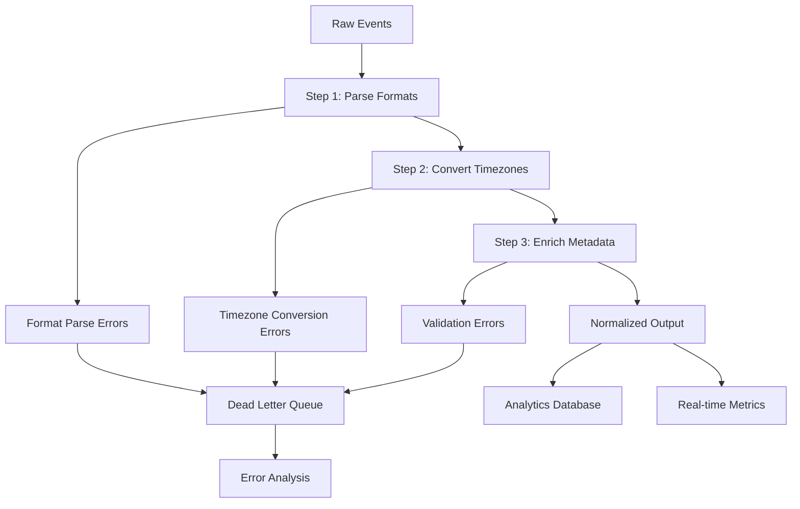

# Complete Timestamp Normalization Pipeline

Deploy a production-ready timestamp normalization pipeline that combines all three steps: format parsing, timezone conversion, and metadata enrichment. This complete solution includes error handling, monitoring, performance optimization, and compliance features.

## Production Architecture

The complete pipeline processes events through three sequential stages:

### Pipeline Flow



### Performance Characteristics

- **Throughput:** 10,000+ events/second/core
- **Latency:** &lt;5ms per event (99th percentile)
- **Memory:** ~50MB base + ~1MB per 1,000 events/second
- **CPU:** ~1 core per 10,000 events/second

## Complete Pipeline Configuration

Create `normalize-timestamps-complete.yaml`:

```yaml title="normalize-timestamps-complete.yaml"
input:
  # Production input - replace with your data source
  kafka:
    addresses: ["${KAFKA_BROKERS}"]
    topics: ["${INPUT_TOPIC:raw-events}"]
    consumer_group: "timestamp-normalizer"
    start_from_oldest: false
    
    # Performance tuning
    batching:
      count: 1000
      period: "5s"

pipeline:
  processors:
    #==========================================================================
    # STEP 1: PARSE TIMESTAMP FORMATS
    #==========================================================================
    
    # Preserve original event for audit trail
    - mapping: |
        root = this
        root.timestamp_original = this.timestamp
        root.processing_metadata = {
          "pipeline_version": "v1.3.0",
          "processing_start": now().format_timestamp_iso8601(),
          "stage": "format_parsing"
        }

    # Detect timestamp format
    - mapping: |
        let ts = this.timestamp.string()
        
        root = this
        root.format_detected = if ts.re_match("^\\d{4}-\\d{2}-\\d{2}T\\d{2}:\\d{2}:\\d{2}") {
          if ts.contains("Z") || ts.re_match("[-+]\\d{2}:?\\d{2}$") {
            "iso8601_offset"
          } else {
            "iso8601_naive"
          }
        } else if ts.re_match("^\\d{10}$") {
          "unix_seconds"
        } else if ts.re_match("^\\d{13}$") {
          "unix_milliseconds"
        } else if ts.re_match("^\\d{2}/\\w{3}/\\d{4}:\\d{2}:\\d{2}:\\d{2}") {
          "apache_log"
        } else if ts.re_match("^\\d{14}$") {
          "compact_datetime"
        } else if ts.re_match("^\\d{4}-\\d{2}-\\d{2} \\d{2}:\\d{2}:\\d{2}$") {
          "custom_datetime"
        } else {
          "unknown"
        }

    # Parse timestamp with error handling
    - catch:
      - mapping: |
          let format = this.format_detected
          let ts = this.timestamp_original
          
          root = this
          
          # Extract original timezone information
          root.timezone_original = if format == "iso8601_offset" {
            if ts.string().contains("Z") {
              "UTC"
            } else {
              ts.string().re_find_all("[-+]\\d{2}:?\\d{2}$").index(0)
            }
          } else if format == "custom_datetime" && this.timezone.type() == "string" {
            this.timezone
          } else {
            "unknown"
          }
          
          # Parse to standardized timestamp
          root.timestamp_parsed = if format == "iso8601_offset" {
            ts.parse_timestamp_iso8601()
          } else if format == "iso8601_naive" {
            (ts.string() + "Z").parse_timestamp_iso8601()
          } else if format == "unix_seconds" {
            ts.timestamp_unix()
          } else if format == "unix_milliseconds" {
            (ts.number() / 1000).timestamp_unix()
          } else if format == "apache_log" {
            ts.parse_timestamp("02/Jan/2006:15:04:05 -0700")
          } else if format == "compact_datetime" {
            ts.parse_timestamp("20060102150405")
          } else if format == "custom_datetime" {
            if this.timezone.type() == "string" {
              ts.string().parse_timestamp_strptime("%Y-%m-%d %H:%M:%S", this.timezone)
            } else {
              (ts.string() + " UTC").parse_timestamp("2006-01-02 15:04:05 MST")
            }
          } else {
            throw("Unsupported timestamp format: " + format + " for value: " + ts.string())
          }
          
          # Mark successful parsing
          root.processing_metadata.parse_success = true
      
      # Error handling for parse failures
      - mapping: |
          root = this
          root.processing_metadata.parse_success = false
          root.processing_metadata.parse_error = error()
          root.dlq_reason = "timestamp_parse_failed"
          root.timestamp_parsed = null

    #==========================================================================
    # STEP 2: CONVERT TO UTC  
    #==========================================================================
    
    - mapping: |
        root = this
        root.processing_metadata.stage = "timezone_conversion"
        
        # Skip conversion if parsing failed
        root = if !this.processing_metadata.parse_success {
          this
        } else {
          let parsed_ts = this.timestamp_parsed
          let tz_original = this.timezone_original.string()
          
          # Convert to UTC
          root.timestamp_utc = if tz_original == "UTC" || tz_original == "Z" || tz_original == "unknown" {
            parsed_ts
          } else {
            parsed_ts.format_timestamp_iso8601("UTC")
          }
          
          # Calculate timezone offset in minutes
          root.timezone_offset_minutes = if tz_original == "UTC" || tz_original == "Z" || tz_original == "unknown" {
            0
          } else if tz_original.re_match("^[-+]\\d{2}:?\\d{2}$") {
            let clean_tz = tz_original.re_replace_all("[^-+\\d]", "")
            let sign = if clean_tz.index(0) == "-" { -1 } else { 1 }
            let hours = clean_tz.slice(1, 3).number()
            let minutes = clean_tz.slice(3, 5).number()
            sign * (hours * 60 + minutes)
          } else {
            let original_unix = parsed_ts.timestamp_unix()
            let utc_unix = this.timestamp_utc.parse_timestamp_iso8601().timestamp_unix()
            (original_unix - utc_unix) / 60
          }
          
          # Set primary timestamp to UTC
          root.timestamp = this.timestamp_utc
          root.processing_metadata.conversion_success = true
          
          this
        }

    #==========================================================================
    # STEP 3: ENRICH TIME METADATA
    #==========================================================================
    
    - mapping: |
        root = this
        root.processing_metadata.stage = "metadata_enrichment"
        
        # Skip enrichment if previous steps failed
        root = if !this.processing_metadata.parse_success {
          this
        } else {
          let ts = this.timestamp.parse_timestamp_iso8601()
          
          # Extract all time components
          root.time_metadata = {
            # Basic components
            "year": ts.format_timestamp("2006", "UTC").number(),
            "month": ts.format_timestamp("01", "UTC").number(),
            "day": ts.format_timestamp("02", "UTC").number(),
            "hour": ts.format_timestamp("15", "UTC").number(),
            "minute": ts.format_timestamp("04", "UTC").number(),
            "second": ts.format_timestamp("05", "UTC").number(),
            
            # Calendar information
            "day_of_week": ts.format_timestamp("Monday", "UTC"),
            "day_of_week_num": ts.format_timestamp("1", "UTC").number(),
            "day_of_year": ts.format_timestamp("002", "UTC").number(),
            "week_of_year": ts.format_timestamp("02", "UTC").number(),
            
            # Business logic
            "is_weekend": ts.format_timestamp("1", "UTC").number() >= 6,
            "is_business_hours": (ts.format_timestamp("1", "UTC").number() >= 1 && ts.format_timestamp("1", "UTC").number() <= 5) &&
                               (ts.format_timestamp("15", "UTC").number() >= 9 && ts.format_timestamp("15", "UTC").number() < 17),
            
            # Quarters
            "quarter": if ts.format_timestamp("01", "UTC").number() <= 3 { "Q1" } 
                      else if ts.format_timestamp("01", "UTC").number() <= 6 { "Q2" }
                      else if ts.format_timestamp("01", "UTC").number() <= 9 { "Q3" }
                      else { "Q4" },
            
            # Aggregation buckets
            "hour_bucket": ts.format_timestamp("2006-01-02T15", "UTC") + ":00:00Z",
            "day_bucket": ts.format_timestamp("2006-01-02", "UTC"),
            "month_bucket": ts.format_timestamp("2006-01", "UTC"),
            
            # Unix timestamp for calculations
            "unix_timestamp": ts.timestamp_unix()
          }
          
          root.processing_metadata.enrichment_success = true
          
          this
        }

    #==========================================================================
    # VALIDATION & QUALITY CHECKS
    #==========================================================================
    
    - mapping: |
        root = this
        
        # Comprehensive validation
        let now_unix = now().timestamp_unix()
        let ts_unix = if this.time_metadata.unix_timestamp.type() == "number" {
          this.time_metadata.unix_timestamp
        } else {
          0
        }
        
        root.validation = {
          "parse_success": this.processing_metadata.parse_success,
          "conversion_success": this.processing_metadata.conversion_success || true,
          "enrichment_success": this.processing_metadata.enrichment_success || true,
          "timestamp_reasonable": ts_unix > (now_unix - 31536000) && ts_unix < (now_unix + 86400),  # 1 year past to 1 day future
          "offset_reasonable": if this.timezone_offset_minutes.type() == "number" { this.timezone_offset_minutes.abs() <= 840 } else { true }
        }
        
        # Overall quality score
        root.quality_score = if this.validation.parse_success && 
                               this.validation.conversion_success && 
                               this.validation.enrichment_success &&
                               this.validation.timestamp_reasonable &&
                               this.validation.offset_reasonable {
          1.0
        } else if this.validation.parse_success && this.validation.timestamp_reasonable {
          0.8
        } else if this.validation.parse_success {
          0.6
        } else {
          0.0
        }

    #==========================================================================
    # PERFORMANCE & MONITORING
    #==========================================================================
    
    # Add processing completion timestamp
    - mapping: |
        root = this
        root.processing_metadata.processing_end = now().format_timestamp_iso8601()
        root.processing_metadata.processing_duration_ms = (
          now().timestamp_unix_milli() - 
          this.processing_metadata.processing_start.parse_timestamp_iso8601().timestamp_unix_milli()
        )

    # Performance metrics
    - metric:
        type: counter
        name: "timestamp_events_processed_total"
        labels:
          format: '${! json("format_detected") }'
          success: '${! if json("quality_score") >= 0.8 { "true" } else { "false" } }'
        value: 1

    - metric:
        type: histogram
        name: "timestamp_processing_duration_ms"
        value: '${! json("processing_metadata.processing_duration_ms") }'

    - metric:
        type: gauge
        name: "timestamp_quality_score"
        value: '${! json("quality_score") }'

    #==========================================================================
    # ERROR ROUTING
    #==========================================================================
    
    # Route failed events to DLQ
    - switch:
      - check: 'json("quality_score") < 0.6'
        output:
          kafka:
            addresses: ["${KAFKA_BROKERS}"]
            topic: "${DLQ_TOPIC:timestamp-dlq}"
            key: '${! json("event_id") }'
            metadata:
              include_patterns: [".*"]

output:
  # Primary output - normalized events
  kafka:
    addresses: ["${KAFKA_BROKERS}"]
    topic: "${OUTPUT_TOPIC:normalized-timestamps}"
    key: '${! json("event_id") }'
    max_message_bytes: "10MB"
    
    # Partitioning for performance
    partition: '${! json("time_metadata.month_bucket").hash() % 12 }'
    
    # Compression for throughput
    compression: "snappy"
    
    metadata:
      exclude_patterns: ["processing_metadata.*", "validation.*"]

# Metrics and monitoring
metrics:
  prometheus:
    path: "/metrics"
    port: 9090

logging:
  level: "INFO"
  format: "json"
  static_fields:
    service: "timestamp-normalizer"
    version: "1.3.0"
```

## Environment Configuration

Create `.env.production`:

```bash title=".env.production"
# Kafka Configuration
KAFKA_BROKERS=kafka1.internal:9092,kafka2.internal:9092,kafka3.internal:9092
INPUT_TOPIC=raw-events
OUTPUT_TOPIC=normalized-timestamps  
DLQ_TOPIC=timestamp-dlq

# Performance Settings
EXPANSO_WORKER_THREADS=8
EXPANSO_MEMORY_LIMIT=2GB
EXPANSO_BATCH_SIZE=1000
EXPANSO_FLUSH_TIMEOUT=5s

# Monitoring
EXPANSO_METRICS_ENABLED=true
EXPANSO_LOG_LEVEL=INFO

# Security
KAFKA_SECURITY_PROTOCOL=SASL_SSL
KAFKA_SASL_MECHANISM=PLAIN
KAFKA_SASL_USERNAME=${KAFKA_USERNAME}
KAFKA_SASL_PASSWORD=${KAFKA_PASSWORD}
```

## Production Deployment

### Docker Deployment

Create `Dockerfile`:

```dockerfile title="Dockerfile"
FROM expanso/edge:1.3.0

# Copy pipeline configuration
COPY normalize-timestamps-complete.yaml /etc/expanso/pipeline.yaml
COPY .env.production /etc/expanso/.env

# Performance optimization
ENV EXPANSO_WORKER_THREADS=8
ENV EXPANSO_MEMORY_LIMIT=2GB

# Health check
HEALTHCHECK --interval=30s --timeout=5s --retries=3 \
  CMD expanso health-check || exit 1

# Expose metrics port
EXPOSE 9090

CMD ["expanso", "run", "/etc/expanso/pipeline.yaml"]
```

Build and deploy:

```bash
# Build container
docker build -t timestamp-normalizer:1.3.0 .

# Deploy to production
docker run -d \
  --name timestamp-normalizer \
  --restart=unless-stopped \
  -p 9090:9090 \
  -e KAFKA_USERNAME="${KAFKA_USERNAME}" \
  -e KAFKA_PASSWORD="${KAFKA_PASSWORD}" \
  timestamp-normalizer:1.3.0
```

### Kubernetes Deployment

Create `k8s-deployment.yaml`:

```yaml title="k8s-deployment.yaml"
apiVersion: apps/v1
kind: Deployment
metadata:
  name: timestamp-normalizer
  labels:
    app: timestamp-normalizer
spec:
  replicas: 3
  selector:
    matchLabels:
      app: timestamp-normalizer
  template:
    metadata:
      labels:
        app: timestamp-normalizer
    spec:
      containers:
      - name: timestamp-normalizer
        image: timestamp-normalizer:1.3.0
        ports:
        - containerPort: 9090
          name: metrics
        env:
        - name: KAFKA_USERNAME
          valueFrom:
            secretKeyRef:
              name: kafka-credentials
              key: username
        - name: KAFKA_PASSWORD
          valueFrom:
            secretKeyRef:
              name: kafka-credentials  
              key: password
        resources:
          requests:
            cpu: "1"
            memory: "1Gi"
          limits:
            cpu: "2"
            memory: "2Gi"
        livenessProbe:
          httpGet:
            path: /health
            port: 9090
          initialDelaySeconds: 30
          periodSeconds: 10
        readinessProbe:
          httpGet:
            path: /ready
            port: 9090
          initialDelaySeconds: 5
          periodSeconds: 5

---
apiVersion: v1
kind: Service
metadata:
  name: timestamp-normalizer-metrics
  labels:
    app: timestamp-normalizer
spec:
  ports:
  - port: 9090
    name: metrics
  selector:
    app: timestamp-normalizer
```

Deploy to Kubernetes:

```bash
kubectl apply -f k8s-deployment.yaml
```

## Monitoring & Alerting

### Prometheus Metrics

Key metrics exposed by the pipeline:

```promql
# Processing rate
rate(timestamp_events_processed_total[5m])

# Success rate
rate(timestamp_events_processed_total{success="true"}[5m]) / 
rate(timestamp_events_processed_total[5m])

# Processing latency (95th percentile)
histogram_quantile(0.95, rate(timestamp_processing_duration_ms_bucket[5m]))

# Quality score
avg(timestamp_quality_score)

# Format distribution
sum by (format) (timestamp_events_processed_total)
```

### Grafana Dashboard

Create `grafana-dashboard.json`:

```json title="grafana-dashboard.json"
{
  "dashboard": {
    "title": "Timestamp Normalization Pipeline",
    "panels": [
      {
        "title": "Processing Rate",
        "type": "graph",
        "targets": [
          {
            "expr": "rate(timestamp_events_processed_total[5m])",
            "legendFormat": "Events/sec"
          }
        ]
      },
      {
        "title": "Success Rate",
        "type": "singlestat",
        "targets": [
          {
            "expr": "rate(timestamp_events_processed_total{success=\"true\"}[5m]) / rate(timestamp_events_processed_total[5m]) * 100",
            "legendFormat": "% Success"
          }
        ]
      },
      {
        "title": "Processing Latency",
        "type": "graph", 
        "targets": [
          {
            "expr": "histogram_quantile(0.50, rate(timestamp_processing_duration_ms_bucket[5m]))",
            "legendFormat": "50th percentile"
          },
          {
            "expr": "histogram_quantile(0.95, rate(timestamp_processing_duration_ms_bucket[5m]))",
            "legendFormat": "95th percentile"
          }
        ]
      },
      {
        "title": "Format Distribution",
        "type": "piechart",
        "targets": [
          {
            "expr": "sum by (format) (timestamp_events_processed_total)",
            "legendFormat": "{{format}}"
          }
        ]
      }
    ]
  }
}
```

### Alert Rules

Create `alerts.yaml`:

```yaml title="alerts.yaml"
groups:
- name: timestamp-normalization
  rules:
  - alert: TimestampProcessingRateHigh
    expr: rate(timestamp_events_processed_total[5m]) > 15000
    for: 5m
    labels:
      severity: warning
    annotations:
      summary: "High timestamp processing rate detected"
      description: "Processing rate is {{ $value }} events/sec, above normal threshold"

  - alert: TimestampSuccessRateLow
    expr: rate(timestamp_events_processed_total{success="true"}[5m]) / rate(timestamp_events_processed_total[5m]) < 0.95
    for: 2m
    labels:
      severity: critical
    annotations:
      summary: "Low timestamp processing success rate"
      description: "Success rate is {{ $value | humanizePercentage }}, below 95% threshold"

  - alert: TimestampProcessingLatencyHigh
    expr: histogram_quantile(0.95, rate(timestamp_processing_duration_ms_bucket[5m])) > 20
    for: 5m
    labels:
      severity: warning
    annotations:
      summary: "High timestamp processing latency"
      description: "95th percentile latency is {{ $value }}ms, above 20ms threshold"

  - alert: TimestampDLQRateHigh
    expr: rate(timestamp_events_processed_total{success="false"}[5m]) > 100
    for: 3m
    labels:
      severity: warning
    annotations:
      summary: "High dead letter queue rate"
      description: "{{ $value }} events/sec going to DLQ, investigate data quality"
```

## Performance Optimization

### Throughput Tuning

Optimize for high-volume scenarios:

```yaml
# High-throughput configuration
input:
  kafka:
    # Increase batch size
    batching:
      count: 2000
      period: "10s"
    
    # Parallel consumers
    consumer_group: "timestamp-normalizer"
    partition_consumers: 4

pipeline:
  # Reduce processing overhead
  processors:
    - cache:
        resource: "format_cache"
        key: '${! json("timestamp").string().slice(0, 10) }'  # Cache by date
        ttl: "1h"
        
output:
  kafka:
    # Batch output for performance
    batching:
      count: 1000
      period: "5s"
    
    # Compression
    compression: "lz4"
```

### Memory Optimization

Configure for memory-constrained environments:

```yaml
# Memory-optimized configuration
pipeline:
  # Reduce metadata overhead
  processors:
    - mapping: |
        root = {
          "event_id": this.event_id,
          "timestamp": this.timestamp_utc,
          "time_metadata": this.time_metadata,
          # Minimal processing metadata
          "quality": this.quality_score
        }
```

### Latency Optimization

Optimize for real-time processing:

```yaml
# Low-latency configuration  
input:
  kafka:
    batching:
      count: 100        # Smaller batches
      period: "1s"      # Faster flushing

pipeline:
  processors:
    # Skip expensive operations for real-time
    - branch:
        request_map: 'root = this'
        result_map: 'root.fast_track = true'
        processors:
          - mapping: |
              # Simplified processing for low latency
              root.timestamp = this.timestamp_original.parse_timestamp_iso8601().format_timestamp_iso8601("UTC")
              root.hour = this.timestamp.parse_timestamp_iso8601().format_timestamp("15", "UTC").number()
```

## Testing & Validation

### Load Testing

Test pipeline performance under load:

```bash
# Generate test data
python3 generate-test-data.py --events 100000 --output test-events.jsonl

# Run load test
expanso load-test \
  --input test-events.jsonl \
  --pipeline normalize-timestamps-complete.yaml \
  --duration 300s \
  --target-rate 10000
```

### Integration Testing

Test with realistic data sources:

```bash
# Test with production-like data
cat > integration-test.yaml << 'EOF'
input:
  file:
    paths: ["./sample-production-data.jsonl"]

pipeline:
  processors:
    # Include complete pipeline
    - !include "normalize-timestamps-complete.yaml"
    
    # Add validation checks
    - mapping: |
        # Validate output format
        root.test_result = {
          "has_timestamp": this.timestamp.type() == "string",
          "has_metadata": this.time_metadata.type() == "object",
          "utc_format": this.timestamp.contains("Z")
        }

output:
  file:
    path: "./test-output.jsonl"
EOF

expanso run integration-test.yaml
```

### Data Quality Validation

Validate normalization accuracy:

```python
#!/usr/bin/env python3
"""Validate timestamp normalization accuracy."""

import json
import sys
from datetime import datetime, timezone

def validate_normalization(input_file, output_file):
    """Validate timestamp normalization results."""
    
    with open(input_file) as inf, open(output_file) as outf:
        for input_line, output_line in zip(inf, outf):
            input_event = json.loads(input_line)
            output_event = json.loads(output_line)
            
            # Validate UTC conversion
            original_ts = input_event['timestamp']
            normalized_ts = output_event['timestamp']
            
            if not normalized_ts.endswith('Z'):
                print(f"ERROR: Not UTC format: {normalized_ts}")
                continue
                
            # Validate metadata consistency
            metadata = output_event['time_metadata']
            parsed_dt = datetime.fromisoformat(normalized_ts.replace('Z', '+00:00'))
            
            if metadata['year'] != parsed_dt.year:
                print(f"ERROR: Year mismatch: {metadata['year']} vs {parsed_dt.year}")
            
            if metadata['month'] != parsed_dt.month:
                print(f"ERROR: Month mismatch: {metadata['month']} vs {parsed_dt.month}")
            
            print(f"✓ Validated: {input_event['event_id']}")

if __name__ == '__main__':
    validate_normalization(sys.argv[1], sys.argv[2])
```

## Security & Compliance

### GDPR Compliance

Ensure proper data handling:

```yaml
# GDPR compliance features
pipeline:
  processors:
    # Audit trail for Article 30
    - mapping: |
        root.gdpr_audit = {
          "processing_purpose": "timestamp_normalization_for_analytics",
          "lawful_basis": "legitimate_interest",
          "data_controller": "YourCompany",
          "processing_timestamp": now().format_timestamp_iso8601(),
          "retention_period": "7_years",
          "data_subject_rights": "contact_dpo@yourcompany.com"
        }
```

### Secret Management

Secure sensitive configuration:

```yaml
# Use secret references instead of hardcoded values
input:
  kafka:
    sasl:
      username: "${SECRET:kafka_username}"
      password: "${SECRET:kafka_password}"

# TLS encryption
tls:
  enabled: true
  cert_file: "${SECRET:tls_cert_path}"
  key_file: "${SECRET:tls_key_path}"
```

## Disaster Recovery

### Backup Strategy

Configure pipeline state backup:

```bash
# Backup pipeline state
expanso backup \
  --pipeline timestamp-normalizer \
  --output s3://backup-bucket/timestamp-normalizer/$(date +%Y%m%d)
```

### Recovery Procedures

```bash
# Restore from backup
expanso restore \
  --source s3://backup-bucket/timestamp-normalizer/20251020 \
  --pipeline timestamp-normalizer

# Verify restoration
expanso pipeline status timestamp-normalizer
```

## Cost Optimization

### Resource Right-Sizing

Monitor and optimize resource usage:

```promql
# Memory utilization
expanso_memory_usage_bytes / expanso_memory_limit_bytes * 100

# CPU utilization
rate(expanso_cpu_usage_seconds_total[5m]) * 100

# Network throughput
rate(expanso_network_bytes_total[5m])
```

### Auto-Scaling Configuration

```yaml title="hpa.yaml"
apiVersion: autoscaling/v2
kind: HorizontalPodAutoscaler
metadata:
  name: timestamp-normalizer-hpa
spec:
  scaleTargetRef:
    apiVersion: apps/v1
    kind: Deployment
    name: timestamp-normalizer
  minReplicas: 2
  maxReplicas: 10
  metrics:
  - type: Resource
    resource:
      name: cpu
      target:
        type: Utilization
        averageUtilization: 70
  - type: Resource
    resource:
      name: memory
      target:
        type: Utilization
        averageUtilization: 80
```

---

## Production Checklist

Before deploying to production:

### Configuration
- [ ] Environment variables configured
- [ ] Kafka topics created with proper partitioning
- [ ] Secret management implemented
- [ ] TLS/SSL certificates installed

### Monitoring
- [ ] Prometheus metrics configured
- [ ] Grafana dashboard deployed
- [ ] Alert rules configured
- [ ] Log aggregation setup

### Performance
- [ ] Load testing completed
- [ ] Resource limits configured
- [ ] Auto-scaling policies defined
- [ ] Backup strategy implemented

### Security
- [ ] GDPR compliance verified
- [ ] Access controls configured
- [ ] Audit logging enabled
- [ ] Security scanning completed

### Documentation
- [ ] Runbook created
- [ ] Troubleshooting guide updated
- [ ] Team training completed
- [ ] SLA definitions documented

## Next Steps

Your timestamp normalization pipeline is production-ready! Consider these enhancements:

<div style={{display: 'flex', gap: '1.5rem', marginTop: '2rem', marginBottom: '3rem', flexWrap: 'wrap', justifyContent: 'flex-start'}}>
  <a href="./troubleshooting" className="button button--primary button--lg" style={{display: 'inline-flex', alignItems: 'center', justifyContent: 'center', textDecoration: 'none', borderRadius: '8px', padding: '1rem 2rem', fontWeight: '600', minWidth: '240px', boxShadow: '0 2px 8px rgba(0,0,0,0.15)', cursor: 'pointer', transition: 'all 0.2s ease'}}>
    Troubleshooting Guide
  </a>
  <a href="../aggregate-time-windows/" className="button button--secondary button--lg" style={{display: 'inline-flex', alignItems: 'center', justifyContent: 'center', textDecoration: 'none', borderRadius: '8px', padding: '1rem 2rem', fontWeight: '600', minWidth: '240px', boxShadow: '0 2px 8px rgba(0,0,0,0.15)', cursor: 'pointer', transition: 'all 0.2s ease'}}>
    Time Window Aggregation
  </a>
</div>

**Related Solutions:**
- [Parse Structured Logs](../parse-logs/) - Extract timestamps from log formats
- [Remove PII](../../data-security/remove-pii/) - Secure timestamp handling
- [Production Pipeline](../../log-processing/production-pipeline/) - Enterprise deployment patterns
