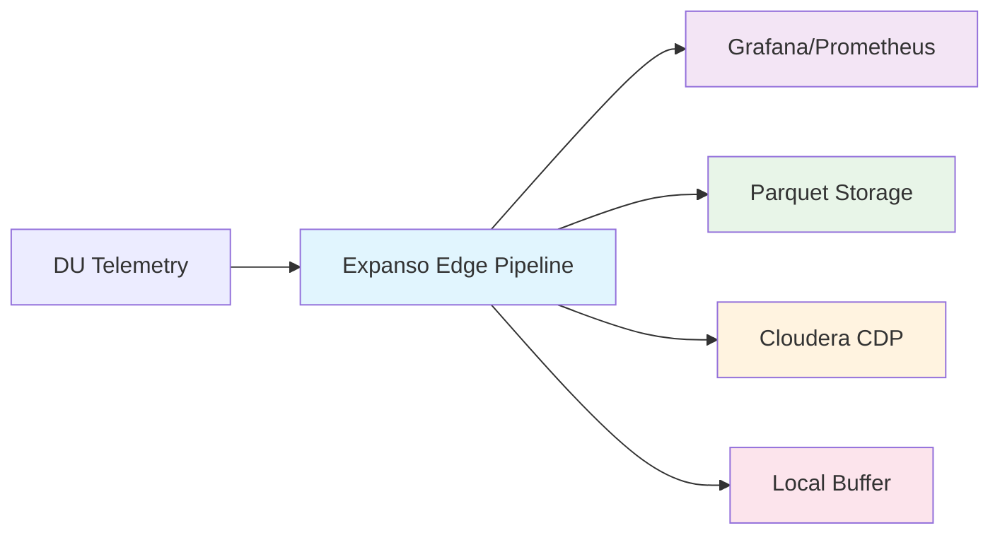

# O-RAN Edge Telemetry: Multi-Destination Data Pipeline

Streamline O-RAN network observability with a single edge pipeline that collects telemetry from DU/RU/CU nodes and routes data simultaneously to multiple destinations: real-time dashboards, analytics platforms, and long-term storage.

## The Problem

Telco operators managing O-RAN networks face a complex observability challenge:

- **Thousands of distributed edge nodes** generate continuous telemetry (DU, RU, CU units)
- **Multiple consumption patterns** require the same data:
  - Real-time dashboards (Grafana) for NOC operations
  - Long-term storage (Parquet) for capacity planning
  - Analytics platforms (Cloudera) for ML/AI insights
  - Compliance reporting for PTP timing requirements
- **Current solutions are inefficient**: Separate collection agents for each destination create bandwidth waste, complexity, and inconsistent data

The result: 3-5x network overhead, data synchronization issues, and operational complexity that doesn't scale.

## The Solution

**Single collection, multiple destinations**: Expanso Edge pipelines run on OpenShift Single Node OpenShift (SNO) directly alongside RAN workloads, collecting O-RAN telemetry once and routing to all destinations simultaneously.

### Key Benefits

- **99% bandwidth reduction**: Transform and filter at the edge before transmission
- **Zero data loss**: Local buffering when connectivity drops
- **Unified data model**: Consistent schemas across all destinations
- **Edge resilience**: Continues operating during network partitions
- **OpenShift native**: Runs as certified operator on existing SNO infrastructure

## What You'll Build

This guide walks through creating a production-ready O-RAN telemetry pipeline that:

1. **Collects** PTP timing, CPU, PRB utilization, and RF metrics from DU nodes
2. **Transforms** raw telemetry with Bloblang processing (compliance classification, enrichment)
3. **Routes** to multiple destinations using fan-out broker pattern
4. **Monitors** pipeline health with built-in observability

### Key Metrics Processed

| Metric | Source | Purpose | Compliance Threshold |
|--------|--------|---------|---------------------|
| PTP4L Offset | DU Timing | 5G sync compliance | less than ±100ns (compliant), ±1000ns (critical) |
| PRB DL/UL % | DU Scheduler | Resource utilization | >90% (congested) |
| CPU % | DU System | Performance monitoring | >80% (alert) |
| RSRP/SINR | UE Reports | RF quality | RSRP <-120dBm (poor coverage) |

## Prerequisites

- Expanso Edge running on OpenShift SNO nodes
- Access to DU telemetry endpoints or files
- Grafana + OTEL Collector + Prometheus stack
- Parquet writer capability
- Cloudera Data Platform (CDP) or Kafka endpoint

## Next Steps

Ready to build your O-RAN edge pipeline? Start with [setup and prerequisites](./setup.mdx).
