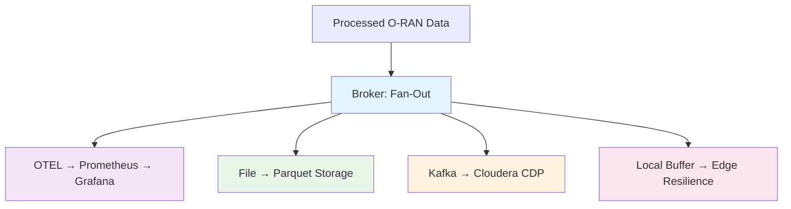

# Step 3: Multi-Destination Routing

Configure the broker output pattern to simultaneously route processed O-RAN telemetry to real-time dashboards, long-term storage, analytics platforms, and edge buffers.

## The Fan-Out Pattern

The key value proposition: **collect once, route everywhere**. Instead of running separate agents for each destination, use Expanso Edge's broker output to fan out data simultaneously.



### Benefits of This Approach

- **Single collection point**: One agent, one set of credentials
- **Guaranteed consistency**: All destinations get identical data
- **Reduced network load**: Process once at edge, not in each destination
- **Independent scaling**: Each output can have different throughput/retry policies
- **Zero data loss**: Local buffering continues during outages

## Core Broker Configuration

```yaml
output:
  broker:
    pattern: fan_out  # Send to ALL outputs simultaneously
    outputs:
      # Output 1: Real-time observability
      - label: "grafana_otel"
        
      # Output 2: Long-term analytics storage  
      - label: "parquet_storage"
        
      # Output 3: Analytics platform
      - label: "cloudera_kafka"
        
      # Output 4: Edge resilience buffer
      - label: "local_buffer"
```

## Output 1: Real-Time Dashboards (Grafana via OTEL)

Route to Grafana for NOC real-time monitoring:

```yaml
# Output 1: OTEL Collector → Prometheus → Grafana
- label: "grafana_otel"
  http_client:
    url: "${OTEL_ENDPOINT}/v1/metrics"
    verb: POST
    headers:
      Content-Type: "application/json"
      Authorization: "Bearer ${OTEL_TOKEN}"
    
    # Transform to OpenTelemetry Protocol (OTLP) format
    processors:
      - mapping: |
          root = {
            "resourceMetrics": [{
              "resource": {
                "attributes": [
                  {"key": "du_id", "value": {"stringValue": this.du_id}},
                  {"key": "cell_id", "value": {"stringValue": this.cell_id}},
                  {"key": "gnb_id", "value": {"stringValue": this.gnb_id}},
                  {"key": "region", "value": {"stringValue": this.region}},
                  {"key": "ptp_compliance", "value": {"stringValue": this.ptp_compliance}}
                ]
              },
              "scopeMetrics": [{
                "scope": {"name": "oran.du.telemetry", "version": "1.0"},
                "metrics": [
                  {
                    "name": "oran_ptp_offset_nanoseconds",
                    "description": "PTP timing offset from master clock",
                    "unit": "ns",
                    "gauge": {
                      "dataPoints": [{
                        "timeUnixNano": this.timestamp_ns.string(),
                        "asDouble": this.ptp4l_offset_ns
                      }]
                    }
                  },
                  {
                    "name": "oran_ptp_compliance_score", 
                    "description": "PTP compliance score (0-100)",
                    "unit": "1",
                    "gauge": {
                      "dataPoints": [{
                        "timeUnixNano": this.timestamp_ns.string(),
                        "asDouble": this.ptp_score
                      }]
                    }
                  },
                  {
                    "name": "oran_prb_utilization_percent",
                    "description": "Physical Resource Block utilization",
                    "unit": "%",
                    "gauge": {
                      "dataPoints": [
                        {
                          "timeUnixNano": this.timestamp_ns.string(),
                          "asDouble": this.prb_dl_pct,
                          "attributes": [{"key": "direction", "value": {"stringValue": "downlink"}}]
                        },
                        {
                          "timeUnixNano": this.timestamp_ns.string(),
                          "asDouble": this.prb_ul_pct,
                          "attributes": [{"key": "direction", "value": {"stringValue": "uplink"}}]
                        }
                      ]
                    }
                  },
                  {
                    "name": "oran_cpu_utilization_percent",
                    "description": "DU CPU utilization",
                    "unit": "%", 
                    "gauge": {
                      "dataPoints": [{
                        "timeUnixNano": this.timestamp_ns.string(),
                        "asDouble": this.cpu_pct
                      }]
                    }
                  },
                  {
                    "name": "oran_rf_health_score",
                    "description": "RF quality health score (0-100)",
                    "unit": "1",
                    "gauge": {
                      "dataPoints": [{
                        "timeUnixNano": this.timestamp_ns.string(),
                        "asDouble": this.rf_health_score
                      }]
                    }
                  }
                ]
              }]
            }]
          }
    
    # Retry and error handling
    retry_until_success: false
    max_retries: 3
    backoff:
      initial_interval: "1s"
      max_interval: "30s"
      max_elapsed_time: "5m"
```

## Output 2: Parquet Storage (Long-Term Analytics)

Store data in columnar Parquet format for efficient analytics:

```yaml
# Output 2: Parquet file storage
- label: "parquet_storage"
  file:
    path: "/data/oran-telemetry/${!this.timestamp_ns.ts_format(\"2006-01-02\")}/du-metrics-${!uuid_v4()}.jsonl"
    codec: lines
    
    # Processors to optimize for Parquet ingestion
    processors:
      - mapping: |
          # Flatten structure for columnar efficiency
          root = {
            "timestamp_ns": this.timestamp_ns,
            "date": this.timestamp_ns.ts_format("2006-01-02"),
            "hour": this.timestamp_ns.ts_format("15"),
            
            # Identifiers
            "du_id": this.du_id,
            "cell_id": this.cell_id,
            "gnb_id": this.gnb_id,
            "region": this.region,
            "sector": this.sector,
            "site_type": this.site_type,
            
            # PTP metrics
            "ptp_offset_ns": this.ptp4l_offset_ns,
            "ptp_compliance": this.ptp_compliance,
            "ptp_score": this.ptp_score,
            
            # Resource utilization
            "prb_dl_pct": this.prb_dl_pct,
            "prb_ul_pct": this.prb_ul_pct,
            "prb_efficiency": this.prb_efficiency,
            "congestion_level": this.congestion_level,
            "capacity_headroom_pct": this.capacity_headroom_pct,
            
            # System performance
            "cpu_pct": this.cpu_pct,
            "memory_pct": this.memory_pct,
            "disk_pct": this.disk_pct,
            
            # RF metrics
            "rsrp_dbm": this.rsrp_dbm,
            "sinr_db": this.sinr_db,
            "rsrp_quality": this.rsrp_quality,
            "sinr_quality": this.sinr_quality,
            "rf_health_score": this.rf_health_score,
            
            # Derived metrics
            "spectral_efficiency_dl": this.spectral_efficiency_dl,
            "estimated_coverage_radius_m": this.estimated_coverage_radius_m,
            "time_to_congestion_min": this.time_to_congestion_min
          }
    
    # File rotation and compression
    batching:
      count: 1000        # Batch for efficiency
      period: "5m"       # Force flush every 5 minutes
      
    # Auto-compress completed files
    processors:
      - archive:
          format: tar
          path: "/data/oran-telemetry-compressed/${!this.date}/du-metrics-${!this.hour}.tar.gz"
```

### Parquet Conversion Script

For downstream analytics, convert JSON Lines to Parquet:

```python
# scripts/convert_to_parquet.py
import pandas as pd
import pyarrow as pa
import pyarrow.parquet as pq
import json
import glob

def convert_jsonl_to_parquet(input_pattern, output_path):
    """Convert JSON Lines files to Parquet with optimal schema"""
    
    # Define schema for better compression and query performance
    schema = pa.schema([
        ('timestamp_ns', pa.int64()),
        ('date', pa.string()),
        ('hour', pa.string()),
        ('du_id', pa.string()),
        ('cell_id', pa.string()),
        ('gnb_id', pa.string()),
        ('region', pa.string()),
        ('ptp_offset_ns', pa.int32()),
        ('ptp_compliance', pa.string()),
        ('ptp_score', pa.int8()),
        ('prb_dl_pct', pa.int8()),
        ('prb_ul_pct', pa.int8()),
        ('cpu_pct', pa.int8()),
        ('rsrp_dbm', pa.int16()),
        ('sinr_db', pa.int8()),
        ('rf_health_score', pa.int8())
    ])
    
    # Process files in batches
    for file_path in glob.glob(input_pattern):
        df = pd.read_json(file_path, lines=True)
        table = pa.Table.from_pandas(df, schema=schema)
        
        # Write with partitioning for query efficiency  
        pq.write_to_dataset(
            table, 
            root_path=output_path,
            partition_cols=['date', 'region', 'gnb_id'],
            compression='snappy',
            use_dictionary=['du_id', 'cell_id', 'ptp_compliance']
        )
```

## Output 3: Cloudera Analytics Platform

Route to Cloudera Data Platform via Kafka:

```yaml
# Output 3: Cloudera Data Platform via Kafka
- label: "cloudera_kafka"
  kafka:
    addresses: ["${KAFKA_BOOTSTRAP_SERVERS}"]
    topic: "oran-telemetry-raw"
    client_id: "expanso-edge-oran-pipeline"
    
    # Kafka producer configuration
    producer:
      max_message_bytes: 10485760  # 10MB
      compression: snappy
      idempotent: true
      acks: all
    
    # Authentication
    sasl:
      mechanism: "PLAIN"
      user: "${KAFKA_USERNAME}"
      password: "${KAFKA_PASSWORD}"
    tls:
      enabled: true
      skip_cert_verify: false
    
    # Message formatting for Cloudera
    processors:
      - mapping: |
          # Cloudera-optimized JSON structure
          root = {
            "schema": {
              "type": "oran_du_telemetry",
              "version": "1.2.0"
            },
            "metadata": {
              "event_time": this.timestamp_iso,
              "source_system": "expanso_edge",
              "pipeline_id": this.pipeline_id,
              "data_quality_score": 95
            },
            "identifier": {
              "du_id": this.du_id,
              "cell_id": this.cell_id,
              "gnb_id": this.gnb_id,
              "site_hierarchy": this.network_hierarchy
            },
            "measurements": {
              "timing": {
                "ptp_offset_ns": this.ptp4l_offset_ns,
                "compliance_status": this.ptp_compliance,
                "compliance_score": this.ptp_score,
                "alert_level": this.ptp_alert_level
              },
              "resources": {
                "prb_downlink_percent": this.prb_dl_pct,
                "prb_uplink_percent": this.prb_ul_pct,
                "overall_efficiency": this.prb_efficiency,
                "congestion_classification": this.congestion_level,
                "capacity_remaining_percent": this.capacity_headroom_pct
              },
              "system": {
                "cpu_utilization_percent": this.cpu_pct,
                "memory_utilization_percent": this.memory_pct,
                "disk_utilization_percent": this.disk_pct
              },
              "radio": {
                "rsrp_dbm": this.rsrp_dbm,
                "sinr_db": this.sinr_db,
                "coverage_quality": this.rsrp_quality,
                "signal_quality": this.sinr_quality,
                "composite_rf_score": this.rf_health_score
              }
            },
            "analytics": {
              "spectral_efficiency": this.spectral_efficiency_dl,
              "coverage_radius_meters": this.estimated_coverage_radius_m,
              "congestion_prediction_minutes": this.time_to_congestion_min
            }
          }
    
    # Message key for partitioning
    key: "${!this.gnb_id}-${!this.cell_id}"
    
    # Retry configuration
    retry_until_success: false
    max_retries: 5
    backoff:
      initial_interval: "2s"
      max_interval: "60s"
```

## Output 4: Local Buffer (Edge Resilience)

Maintain local buffer for network resilience:

```yaml
# Output 4: Local buffer for edge resilience
- label: "local_buffer"
  file:
    path: "/data/buffer/oran-${!count(\"buffer\")}.jsonl"
    codec: lines
    
    # Buffer management
    processors:
      - mapping: |
          # Add buffer metadata
          root = this
          root.buffer_metadata = {
            "buffered_at": now().ts_format("2006-01-02T15:04:05Z"),
            "buffer_node": env("NODE_ID"),
            "buffer_reason": "edge_resilience",
            "original_timestamp": this.timestamp_iso
          }
    
    # File rotation based on size and time
    batching:
      count: 10000      # 10k records per file
      period: "1h"      # Or hourly rotation
      
    # Automatic cleanup of old buffer files
    processors:
      - workflow:
          meta_path: "buffer_cleanup"
          order: [["cleanup_old_files"]]
          cleanup_old_files:
            - mapping: |
                # Mark files older than 7 days for cleanup
                let file_age_hours = (now().ts_unix() - this.buffer_metadata.buffered_at.ts_unix()) / 3600
                root = if file_age_hours > 168 {  # 7 days
                  {"action": "delete", "file_path": meta("path")}
                } else {
                  deleted()
                }
```

### Buffer Replay Mechanism

Automatically replay buffered data when connectivity returns:

```yaml
# Separate pipeline to replay buffered data
name: oran-buffer-replay
config:
  input:
    file:
      paths: ["/data/buffer/oran-*.jsonl"]
      scanner:
        lines: {}
      
  pipeline:
    processors:
      - mapping: |
          # Check if original destinations are reachable
          root = this
          root.replay_timestamp = now()
          
      # Test connectivity before replay
      - http:
          url: "${OTEL_ENDPOINT}/health"
          verb: "GET"
          timeout: "5s"
          processors:
            - mapping: |
                # Only proceed if health check passes
                root = if this.status == "ok" { 
                  this 
                } else { 
                  deleted() 
                }
  
  output:
    # Replay to same destinations (without buffer)
    broker:
      pattern: fan_out
      outputs:
        - label: "grafana_otel_replay"
        - label: "cloudera_kafka_replay"
        # Skip parquet and buffer to avoid duplicates
```

## Error Handling and Dead Letter Queue

Handle failures gracefully with error routing:

```yaml
# Add error handling to each output
output:
  broker:
    pattern: fan_out_sequential  # Continue on individual failures
    outputs:
      # Wrap each output with error handling
      - try:
        - label: "grafana_otel"
          # ... grafana config ...
        catch:
        - label: "error_queue"
          file:
            path: "/data/errors/grafana-errors-${!now().ts_format(\"2006-01-02\")}.jsonl" 
            processors:
              - mapping: |
                  root = {
                    "original_message": this,
                    "error_timestamp": now(),
                    "error_destination": "grafana_otel",
                    "error_details": error()
                  }
      
      # Similar try/catch for other outputs...
```

## Monitoring Pipeline Health

Track the health of each output destination:

```yaml
# Add metrics collection for pipeline monitoring
pipeline:
  processors:
    - metric:
        type: counter
        name: "oran_messages_processed"
        labels:
          pipeline_id: "oran-edge-telemetry"
          
    - metric:
        type: histogram  
        name: "oran_processing_duration_ms"
        buckets: [1, 5, 10, 25, 50, 100, 250, 500, 1000]
        
output:
  broker:
    outputs:
      # Add success/failure metrics to each output
      - processors:
          - metric:
              type: counter
              name: "oran_output_success"
              labels:
                destination: "grafana"
        # ... output config ...
```

## Next Steps

With multi-destination routing configured, proceed to [building Grafana dashboards](./step-4-grafana-dashboards.mdx) to visualize your O-RAN telemetry in real-time.