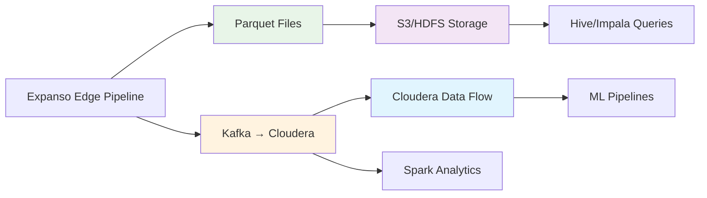

# Step 5: Parquet Storage and Cloudera Integration

Configure long-term analytics with efficient Parquet storage and seamless integration with Cloudera Data Platform for ML/AI insights and historical analysis.

## Long-Term Analytics Architecture



## Parquet Storage Optimization

### File Organization Strategy

Organize Parquet files for optimal query performance:

```bash
# Recommended directory structure
/data/oran-telemetry/
├── year=2024/
│   ├── month=02/
│   │   ├── day=10/
│   │   │   ├── region=us-west-2/
│   │   │   │   ├── gnb_id=gnb-seattle-01/
│   │   │   │   │   ├── part-000000.parquet
│   │   │   │   │   ├── part-000001.parquet
│   │   │   │   │   └── ...
│   │   │   │   └── gnb_id=gnb-seattle-02/
│   │   │   └── region=us-east-1/
│   │   └── day=11/
│   └── month=03/
└── _metadata/
    ├── schema.avro
    ├── table_metadata.json
    └── partition_manifest.json
```

### Enhanced Parquet Configuration

Configure the pipeline for optimal Parquet output:

```yaml
# Parquet output with advanced configuration
- label: "parquet_optimized"
  file:
    path: "/data/oran-telemetry/year=${!this.timestamp_ns.ts_format(\"2006\")}/month=${!this.timestamp_ns.ts_format(\"01\")}/day=${!this.timestamp_ns.ts_format(\"02\")}/region=${!this.region}/gnb_id=${!this.gnb_id}/part-${!uuid_v4().hash(\"xxhash\").string().slice(0,6)}.jsonl"
    codec: lines
    
    # Optimized batching for Parquet conversion
    batching:
      count: 100000        # 100k records per file (optimal for Parquet)
      period: "15m"        # Force flush every 15 minutes
      byte_size: 50MB      # Target file size
      
    processors:
      # Schema optimization for Parquet
      - mapping: |
          # Flatten and optimize data types for columnar storage
          root = {
            # Partition keys (repeated for each record but compressed)
            "partition_year": this.timestamp_ns.ts_format("2006").number(),
            "partition_month": this.timestamp_ns.ts_format("01").number(), 
            "partition_day": this.timestamp_ns.ts_format("02").number(),
            "region": this.region,
            "gnb_id": this.gnb_id,
            
            # Timestamp as epoch nanoseconds (int64)
            "timestamp_ns": this.timestamp_ns,
            "hour_of_day": this.timestamp_ns.ts_format("15").number(),
            "minute_of_hour": this.timestamp_ns.ts_format("04").number(),
            
            # Identifiers (dictionary encoded)
            "du_id": this.du_id,
            "cell_id": this.cell_id,
            "sector": this.sector,
            "site_type": this.site_type,
            
            # PTP metrics (optimized types)
            "ptp_offset_ns": this.ptp4l_offset_ns,  # int32 (-2B to +2B ns)
            "ptp_compliance_enum": match this.ptp_compliance {
              "compliant" => 0,
              "degraded" => 1, 
              "critical" => 2,
              "non_compliant" => 3,
              _ => -1
            },
            "ptp_score": this.ptp_score,  # uint8 (0-100)
            
            # Resource utilization (uint8 0-100)
            "prb_dl_pct": this.prb_dl_pct,
            "prb_ul_pct": this.prb_ul_pct,
            "prb_efficiency": this.prb_efficiency,
            "capacity_headroom_pct": this.capacity_headroom_pct,
            
            # System metrics (optimized ranges)
            "cpu_pct": this.cpu_pct,        # uint8
            "memory_pct": this.memory_pct,  # uint8  
            "disk_pct": this.disk_pct,      # uint8
            
            # RF metrics (appropriate precision)
            "rsrp_dbm": this.rsrp_dbm,      # int16 (-150 to 0 dBm)
            "sinr_db": this.sinr_db,        # int8 (-20 to +50 dB)
            "rf_health_score": this.rf_health_score,  # uint8
            
            # Derived analytics (float32 for efficiency)
            "spectral_efficiency_dl": this.spectral_efficiency_dl,
            "coverage_radius_m": this.estimated_coverage_radius_m,
            "congestion_prediction_min": this.time_to_congestion_min,
            
            # Quality flags (boolean/bitmap)
            "data_quality_flags": {
              "ptp_valid": this.ptp4l_offset_ns != null,
              "prb_valid": this.prb_dl_pct != null && this.prb_ul_pct != null,
              "rf_valid": this.rsrp_dbm != null && this.sinr_db != null,
              "system_valid": this.cpu_pct != null
            }
          }
          
      # Add file-level metadata
      - mapping: |
          root.file_metadata = {
            "created_at": now().ts_format("2006-01-02T15:04:05Z"),
            "pipeline_version": "1.2.0",
            "schema_version": "1.0",
            "record_count": count("parquet_records"),
            "compression": "snappy",
            "source_node": env("NODE_ID")
          }
```

### Parquet Conversion Service

Create a dedicated service to convert JSON Lines to optimized Parquet:

```python
# services/parquet-converter.py
import pandas as pd
import pyarrow as pa
import pyarrow.parquet as pq
import pyarrow.compute as pc
from typing import Dict, List
import json
import glob
import os
from datetime import datetime

class ORANParquetConverter:
    def __init__(self, input_path: str, output_path: str):
        self.input_path = input_path
        self.output_path = output_path
        self.schema = self._create_optimized_schema()
        
    def _create_optimized_schema(self) -> pa.Schema:
        """Define optimized schema for O-RAN telemetry"""
        return pa.schema([
            # Partition keys
            ('partition_year', pa.int16()),
            ('partition_month', pa.int8()),
            ('partition_day', pa.int8()),
            ('region', pa.string()),
            ('gnb_id', pa.string()),
            
            # Timestamps
            ('timestamp_ns', pa.int64()),
            ('hour_of_day', pa.int8()),
            ('minute_of_hour', pa.int8()),
            
            # Identifiers (dictionary encoded)
            ('du_id', pa.dictionary(pa.int8(), pa.string())),
            ('cell_id', pa.dictionary(pa.int8(), pa.string())),
            ('sector', pa.dictionary(pa.int8(), pa.string())),
            ('site_type', pa.dictionary(pa.int8(), pa.string())),
            
            # PTP metrics
            ('ptp_offset_ns', pa.int32()),
            ('ptp_compliance_enum', pa.int8()),
            ('ptp_score', pa.int8()),
            
            # Resource utilization
            ('prb_dl_pct', pa.int8()),
            ('prb_ul_pct', pa.int8()),
            ('prb_efficiency', pa.int8()),
            ('capacity_headroom_pct', pa.int8()),
            
            # System metrics
            ('cpu_pct', pa.int8()),
            ('memory_pct', pa.int8()),
            ('disk_pct', pa.int8()),
            
            # RF metrics
            ('rsrp_dbm', pa.int16()),
            ('sinr_db', pa.int8()),
            ('rf_health_score', pa.int8()),
            
            # Analytics
            ('spectral_efficiency_dl', pa.float32()),
            ('coverage_radius_m', pa.int32()),
            ('congestion_prediction_min', pa.int16()),
            
            # Quality flags as struct
            ('data_quality_flags', pa.struct([
                ('ptp_valid', pa.bool_()),
                ('prb_valid', pa.bool_()),
                ('rf_valid', pa.bool_()),
                ('system_valid', pa.bool_())
            ]))
        ])
    
    def convert_batch(self, input_pattern: str) -> None:
        """Convert batch of JSON Lines files to Parquet"""
        for file_path in glob.glob(input_pattern):
            try:
                # Read JSON Lines
                df = pd.read_json(file_path, lines=True)
                
                # Data type optimization
                df = self._optimize_datatypes(df)
                
                # Create PyArrow table with schema
                table = pa.Table.from_pandas(df, schema=self.schema, preserve_index=False)
                
                # Add computed columns
                table = self._add_computed_columns(table)
                
                # Determine output path with partitioning
                output_file = self._generate_output_path(table)
                
                # Write with optimal settings
                pq.write_table(
                    table, 
                    output_file,
                    compression='snappy',
                    use_dictionary=['du_id', 'cell_id', 'sector', 'site_type'],
                    row_group_size=50000,
                    data_page_size=1024*1024  # 1MB pages
                )
                
                print(f"Converted {file_path} to {output_file}")
                
                # Optional: Delete source file after successful conversion
                if os.getenv('DELETE_SOURCE_AFTER_CONVERSION', 'false').lower() == 'true':
                    os.remove(file_path)
                    
            except Exception as e:
                print(f"Error converting {file_path}: {e}")
    
    def _optimize_datatypes(self, df: pd.DataFrame) -> pd.DataFrame:
        """Optimize pandas datatypes for memory efficiency"""
        # Convert numeric columns to optimal types
        numeric_optimizations = {
            'ptp_score': 'int8',
            'prb_dl_pct': 'int8',
            'prb_ul_pct': 'int8', 
            'cpu_pct': 'int8',
            'memory_pct': 'int8',
            'disk_pct': 'int8',
            'rf_health_score': 'int8',
            'rsrp_dbm': 'int16',
            'sinr_db': 'int8'
        }
        
        for col, dtype in numeric_optimizations.items():
            if col in df.columns:
                df[col] = df[col].astype(dtype)
        
        # Convert categorical columns
        categorical_cols = ['du_id', 'cell_id', 'sector', 'site_type', 'region']
        for col in categorical_cols:
            if col in df.columns:
                df[col] = df[col].astype('category')
                
        return df
    
    def _add_computed_columns(self, table: pa.Table) -> pa.Table:
        """Add computed columns for analytics"""
        # Example: Add time-based columns for time series analysis
        timestamps = table['timestamp_ns']
        
        # Day of week (0=Monday, 6=Sunday)
        day_of_week = pc.day_of_week(pc.cast(timestamps, pa.timestamp('ns')))
        
        # Business hours flag (8AM-6PM local time)
        hour_of_day = table['hour_of_day']
        business_hours = pc.and_(pc.greater_equal(hour_of_day, pa.scalar(8)),
                                pc.less(hour_of_day, pa.scalar(18)))
        
        # Add new columns
        table = table.append_column('day_of_week', day_of_week)
        table = table.append_column('business_hours', business_hours)
        
        return table
    
    def _generate_output_path(self, table: pa.Table) -> str:
        """Generate partitioned output path"""
        # Extract partition values from first row
        first_row = table.slice(0, 1).to_pandas().iloc[0]
        
        partition_path = os.path.join(
            self.output_path,
            f"year={first_row['partition_year']}",
            f"month={first_row['partition_month']:02d}",
            f"day={first_row['partition_day']:02d}",
            f"region={first_row['region']}",
            f"gnb_id={first_row['gnb_id']}"
        )
        
        os.makedirs(partition_path, exist_ok=True)
        
        # Generate unique filename
        timestamp = datetime.now().strftime("%Y%m%d_%H%M%S")
        filename = f"oran_telemetry_{timestamp}_{os.getpid()}.parquet"
        
        return os.path.join(partition_path, filename)

# Usage
if __name__ == "__main__":
    converter = ORANParquetConverter(
        input_path="/data/oran-telemetry/raw",
        output_path="/data/oran-telemetry/parquet"
    )
    
    # Process all pending files
    converter.convert_batch("/data/oran-telemetry/raw/*.jsonl")
```

## Cloudera Data Platform Integration

### Kafka Configuration for Cloudera

Configure Kafka output optimized for Cloudera ingestion:

```yaml
# Enhanced Kafka output for Cloudera
- label: "cloudera_optimized"
  kafka:
    addresses: ["${KAFKA_BOOTSTRAP_SERVERS}"]
    topic: "oran-telemetry-structured"
    client_id: "expanso-oran-pipeline-v2"
    
    # Producer optimization for analytics workloads
    producer:
      max_message_bytes: 10485760  # 10MB
      compression: "lz4"           # Better for analytics than snappy
      batch_size: 65536           # 64KB batch size
      linger_ms: 100              # Allow batching for efficiency
      acks: "all"                 # Durability for analytics
      idempotent: true            # Exactly-once semantics
      
    # Partitioning strategy for parallel processing
    partition: "${!this.gnb_id.hash(\"xxhash\") % 12}"  # 12 partitions for parallelism
    
    # Message key for log compaction (if needed)
    key: "${!this.du_id}-${!this.cell_id}-${!this.timestamp_ns.ts_format(\"2006010215\")}"
    
    # Authentication for Cloudera environment
    sasl:
      mechanism: "SCRAM-SHA-512"
      user: "${KAFKA_USERNAME}"
      password: "${KAFKA_PASSWORD}"
    tls:
      enabled: true
      ca_file: "/certs/kafka-ca.pem"
      cert_file: "/certs/kafka-client.pem" 
      key_file: "/certs/kafka-client-key.pem"
      
    # Message formatting for Cloudera Data Flow
    processors:
      # Transform to Cloudera-optimized schema
      - mapping: |
          root = {
            # Confluent Schema Registry compatible envelope
            "schema": {
              "type": "record",
              "name": "ORANTelemetry",
              "namespace": "com.expanso.oran.telemetry", 
              "version": "1.2.0"
            },
            
            # Event metadata
            "metadata": {
              "event_time": this.timestamp_ns,
              "event_time_iso": this.timestamp_iso,
              "ingestion_time": now().ts_unix_nano(),
              "source_pipeline": "expanso-edge-oran",
              "schema_version": "1.2.0",
              "data_quality_score": 95,
              "partition_key": this.gnb_id + "-" + this.cell_id
            },
            
            # Network topology
            "network": {
              "region": this.region,
              "market": this.market,
              "site_id": this.gnb_id,
              "du_id": this.du_id,
              "cell_id": this.cell_id,
              "sector": this.sector,
              "site_type": this.site_type,
              "coordinates": this.coordinates,
              "deployment_info": this.deployment_info
            },
            
            # Measurements with metadata
            "telemetry": {
              "timing": {
                "ptp_offset_ns": this.ptp4l_offset_ns,
                "ptp_compliance": this.ptp_compliance,
                "ptp_score": this.ptp_score,
                "alert_level": this.ptp_alert_level,
                "master_reachable": true,
                "sync_source": this.sync_source
              },
              "resources": {
                "prb_dl_percent": this.prb_dl_pct,
                "prb_ul_percent": this.prb_ul_pct,
                "prb_efficiency": this.prb_efficiency,
                "congestion_level": this.congestion_level,
                "capacity_headroom_percent": this.capacity_headroom_pct,
                "active_ue_count": this.active_ue_count,
                "spectral_efficiency": this.spectral_efficiency_dl
              },
              "system": {
                "cpu_percent": this.cpu_pct,
                "memory_percent": this.memory_pct,
                "disk_percent": this.disk_pct,
                "network_rx_mbps": this.network_rx_mbps,
                "network_tx_mbps": this.network_tx_mbps
              },
              "radio": {
                "rsrp_dbm": this.rsrp_dbm,
                "sinr_db": this.sinr_db,
                "rsrp_quality": this.rsrp_quality,
                "sinr_quality": this.sinr_quality,
                "rf_health_score": this.rf_health_score,
                "coverage_radius_m": this.estimated_coverage_radius_m
              }
            },
            
            # Analytics and predictions
            "analytics": {
              "predictions": {
                "congestion_time_min": this.time_to_congestion_min,
                "capacity_trend": "stable",  # Could be computed
                "maintenance_window": null
              },
              "anomalies": {
                "ptp_anomaly": this.ptp_score < 50,
                "capacity_anomaly": this.prb_dl_pct > 90,
                "rf_anomaly": this.rf_health_score < 40
              },
              "kpis": {
                "availability_percent": 99.9,
                "performance_score": (this.ptp_score + this.rf_health_score) / 2,
                "utilization_efficiency": this.prb_efficiency
              }
            }
          }
```

### Cloudera Data Flow (CDF) Integration

Create NiFi flow templates for processing O-RAN data:

```json
{
  "flowContents": {
    "identifier": "oran-telemetry-ingestion",
    "name": "O-RAN Telemetry Processing Flow",
    "processors": [
      {
        "identifier": "kafka-consumer",
        "type": "org.apache.nifi.processors.kafka.pubsub.ConsumeKafka_2_6",
        "properties": {
          "bootstrap.servers": "${kafka.bootstrap.servers}",
          "topic": "oran-telemetry-structured",
          "group.id": "oran-analytics-consumer",
          "auto.offset.reset": "earliest",
          "security.protocol": "SASL_SSL",
          "sasl.mechanism": "SCRAM-SHA-512"
        }
      },
      {
        "identifier": "json-validator",
        "type": "org.apache.nifi.processors.standard.ValidateRecord",
        "properties": {
          "record-reader": "json-reader",
          "record-writer": "json-writer",
          "schema-access-strategy": "schema-registry",
          "schema-registry": "confluent-schema-registry"
        }
      },
      {
        "identifier": "route-by-quality",
        "type": "org.apache.nifi.processors.standard.RouteOnAttribute",
        "properties": {
          "high-quality": "${analytics.kpis.performance_score:gt(80)}",
          "medium-quality": "${analytics.kpis.performance_score:ge(60):and(${analytics.kpis.performance_score:lt(80)})}",
          "low-quality": "${analytics.kpis.performance_score:lt(60)}"
        }
      },
      {
        "identifier": "hdfs-writer",
        "type": "org.apache.nifi.processors.hadoop.PutHDFS",
        "properties": {
          "hadoop-configuration-resources": "/etc/hadoop/conf/core-site.xml,/etc/hadoop/conf/hdfs-site.xml",
          "directory": "/oran/telemetry/year=${now():format('yyyy')}/month=${now():format('MM')}/day=${now():format('dd')}",
          "conflict-resolution": "append",
          "compression-codec": "SNAPPY"
        }
      },
      {
        "identifier": "kudu-writer", 
        "type": "org.apache.nifi.processors.kudu.PutKudu",
        "properties": {
          "kudu-masters": "${kudu.masters}",
          "table-name": "oran_telemetry_realtime",
          "operation-type": "INSERT_IGNORE"
        }
      }
    ],
    "connections": [
      {
        "source": "kafka-consumer",
        "destination": "json-validator"
      },
      {
        "source": "json-validator",
        "destination": "route-by-quality",
        "relationship": "valid"
      },
      {
        "source": "route-by-quality", 
        "destination": "hdfs-writer",
        "relationship": "high-quality"
      },
      {
        "source": "route-by-quality",
        "destination": "kudu-writer", 
        "relationship": "medium-quality"
      }
    ]
  }
}
```

### Spark Analytics Jobs

Create Spark jobs for advanced O-RAN analytics:

```python
# spark/oran_analytics.py
from pyspark.sql import SparkSession
from pyspark.sql.functions import *
from pyspark.sql.types import *
from pyspark.ml.feature import VectorAssembler
from pyspark.ml.clustering import KMeans
from pyspark.ml.regression import LinearRegression

class ORANAnalytics:
    def __init__(self, spark_session):
        self.spark = spark_session
    
    def load_telemetry_data(self, path: str, days: int = 7):
        """Load O-RAN telemetry from Parquet files"""
        date_filter = date_sub(current_date(), days)
        
        return self.spark.read.parquet(path) \
            .filter(col("partition_date") >= date_filter) \
            .cache()
    
    def calculate_kpis(self, df):
        """Calculate network-level KPIs"""
        return df.groupBy("region", "gnb_id", window("timestamp", "1 hour")) \
            .agg(
                avg("ptp_score").alias("avg_ptp_compliance"),
                avg("prb_efficiency").alias("avg_prb_efficiency"), 
                avg("rf_health_score").alias("avg_rf_quality"),
                max("prb_dl_pct").alias("peak_dl_utilization"),
                count("*").alias("measurement_count"),
                stddev("ptp_offset_ns").alias("ptp_jitter"),
                percentile_approx("cpu_pct", 0.95).alias("cpu_95th_percentile")
            )
    
    def predict_congestion(self, df):
        """ML model to predict cell congestion"""
        # Feature engineering
        features = VectorAssembler(
            inputCols=["prb_dl_pct", "prb_ul_pct", "active_ue_count", "hour_of_day"],
            outputCol="features"
        ).transform(df)
        
        # Linear regression for congestion prediction
        lr = LinearRegression(
            featuresCol="features", 
            labelCol="prb_dl_pct",
            maxIter=100
        )
        
        model = lr.fit(features)
        predictions = model.transform(features)
        
        return predictions.select(
            "du_id", "cell_id", "timestamp",
            "prb_dl_pct", "prediction",
            (col("prediction") - col("prb_dl_pct")).alias("predicted_change")
        )
    
    def anomaly_detection(self, df):
        """Detect anomalies using clustering"""
        feature_cols = ["ptp_score", "prb_efficiency", "rf_health_score", "cpu_pct"]
        
        assembler = VectorAssembler(inputCols=feature_cols, outputCol="features")
        df_with_features = assembler.transform(df)
        
        # K-means clustering for anomaly detection
        kmeans = KMeans(k=3, featuresCol="features", predictionCol="cluster")
        model = kmeans.fit(df_with_features)
        
        clustered = model.transform(df_with_features)
        
        # Identify outlier clusters
        cluster_stats = clustered.groupBy("cluster").agg(
            avg("ptp_score").alias("avg_ptp"),
            avg("rf_health_score").alias("avg_rf"),
            count("*").alias("cluster_size")
        )
        
        return clustered.join(cluster_stats, "cluster")
    
    def generate_daily_report(self, date: str):
        """Generate comprehensive daily analytics report"""
        df = self.load_telemetry_data("/data/oran-telemetry/parquet", days=1) \
            .filter(col("partition_date") == date)
        
        # Network health summary
        health_summary = df.agg(
            avg("ptp_score").alias("network_ptp_score"),
            avg("rf_health_score").alias("network_rf_score"),
            avg("prb_efficiency").alias("network_efficiency"),
            count(when(col("ptp_compliance_enum") == 0, 1)).alias("compliant_sites"),
            count("*").alias("total_measurements")
        ).collect()[0]
        
        # Top performers and worst performers
        site_performance = df.groupBy("gnb_id", "cell_id") \
            .agg(
                avg("ptp_score").alias("avg_ptp"),
                avg("rf_health_score").alias("avg_rf"),
                max("prb_dl_pct").alias("peak_utilization")
            ) \
            .orderBy(desc("avg_ptp"))
        
        # Congestion hotspots
        congestion_hotspots = df.filter(col("prb_dl_pct") > 90) \
            .groupBy("gnb_id", "cell_id") \
            .agg(
                count("*").alias("congestion_events"),
                max("prb_dl_pct").alias("max_utilization"),
                avg("active_ue_count").alias("avg_ue_count")
            ) \
            .orderBy(desc("congestion_events"))
        
        return {
            "health_summary": health_summary.asDict(),
            "top_performers": site_performance.limit(10).collect(),
            "congestion_hotspots": congestion_hotspots.limit(10).collect(),
            "date": date
        }

# Spark job execution
if __name__ == "__main__":
    spark = SparkSession.builder \
        .appName("ORAN-Analytics") \
        .config("spark.sql.adaptive.enabled", "true") \
        .config("spark.sql.adaptive.coalescePartitions.enabled", "true") \
        .getOrCreate()
    
    analytics = ORANAnalytics(spark)
    
    # Generate daily report
    report = analytics.generate_daily_report("2024-02-10")
    print(f"Network Health Score: {report['health_summary']['network_ptp_score']:.1f}")
    
    spark.stop()
```

## Data Retention and Lifecycle

Configure automated data lifecycle management:

```yaml
# Data retention policy
retention_policy:
  # Raw JSON Lines files (edge buffer)
  raw_data:
    path: "/data/oran-telemetry/raw"
    retention_days: 7
    compression: gzip
    
  # Parquet files (analytics storage)
  parquet_data:
    path: "/data/oran-telemetry/parquet" 
    hot_tier_days: 30      # Frequent access
    warm_tier_days: 180    # Occasional access 
    cold_tier_days: 1095   # Archival (3 years)
    deletion_days: 2555    # Legal retention (7 years)
    
  # Cloudera HDFS storage
  hdfs_data:
    path: "/oran/telemetry"
    compaction_schedule: "0 2 * * *"  # Daily at 2 AM
    partition_pruning: true
    metadata_cleanup: true

# Automated cleanup job
cleanup_job:
  schedule: "0 3 * * *"  # Daily at 3 AM
  actions:
    - compress_old_files:
        age_hours: 168  # 7 days
        format: "gzip"
    - move_to_cold_storage:
        age_days: 180
        destination: "s3://oran-archive/"
    - delete_expired:
        age_days: 2555
```

## Next Steps

With Parquet storage and Cloudera integration configured, proceed to the [complete pipeline configuration](./complete-oran-pipeline.mdx) to see the full production-ready YAML.