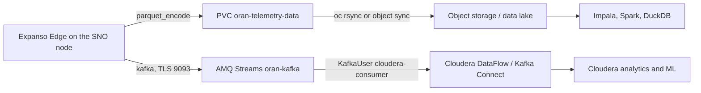

# Step 5: Parquet Storage and Cloudera Integration

The pipeline writes Parquet itself, on the node, to a PersistentVolumeClaim. There is no sidecar converter and no host directory. Cloudera reads the structured feed from the AMQ Streams topic over TLS.

## Work through this step

1. Decide the columns. Every field in the `parquet_encode` schema must be set by the output's mapping or marked `optional: true`.
2. Pick the batch size from the record rate. One batch is one file.
3. Apply the manifests from the [run path](/integrations/oran-telco-pipeline/setup), wait one batch period, then [read a file back](#reading-files-back).
4. Use the provisioned `cloudera-consumer` identity and the cluster CA for Cloudera. Do not share the producer's credentials.

## Long-Term Analytics Architecture


```mermaid
graph LR
    A[Expanso Edge on the SNO node] -->|parquet_encode| B[PVC oran-telemetry-data]
    A -->|kafka, TLS 9093| C[AMQ Streams oran-kafka]
    B -->|oc rsync or object sync| D[Object storage / data lake]
    C -->|KafkaUser cloudera-consumer| E[Cloudera DataFlow / Kafka Connect]
    D --> F[Impala, Spark, DuckDB]
    E --> G[Cloudera analytics and ML]
```

## Parquet on the PersistentVolumeClaim

The `file` output has exactly two fields, `path` and `codec`. Batching and encoding happen in a `broker` wrapped around it: its `batching` collects records, its `processors` run `parquet_encode` once per batch, and the resulting binary message is written with `codec: all-bytes`.

```yaml
- label: parquet_pvc
  broker:
    batching:
      count: 10000 # records per file
      period: 5m # or flush on time
      byte_size: 10000000 # or on size, whichever comes first
      processors:
        - parquet_encode:
            default_compression: zstd
            schema:
              - { name: timestamp_ns, type: INT64 }
              - { name: date, type: UTF8 }
              - { name: hour, type: INT32 }
              - { name: du_id, type: UTF8 }
              - { name: cell_id, type: UTF8 }
              - { name: gnb_id, type: UTF8 }
              - { name: region, type: UTF8 }
              - { name: sector, type: UTF8 }
              - { name: ptp_offset_ns, type: INT64, optional: true }
              - { name: ptp_review, type: UTF8, optional: true }
              - { name: ptp_score, type: INT32, optional: true }
              - { name: prb_dl_pct, type: DOUBLE, optional: true }
              - { name: prb_ul_pct, type: DOUBLE, optional: true }
              - { name: prb_efficiency, type: DOUBLE, optional: true }
              - { name: cpu_pct, type: DOUBLE, optional: true }
              - { name: memory_pct, type: DOUBLE, optional: true }
              - { name: rsrp_dbm, type: DOUBLE, optional: true }
              - { name: sinr_db, type: DOUBLE, optional: true }
              - { name: rf_health_score, type: DOUBLE, optional: true }
              - { name: data_quality_score, type: DOUBLE }
    outputs:
      - file:
          path: '/data/oran-telemetry/date=${! now().ts_format("2006-01-02") }/node=${! env("NODE_ID").or("unknown") }/part-${! uuid_v4() }.parquet'
          codec: all-bytes
```

`parquet_encode` is marked experimental in the component reference. Pin the agent image tag when you depend on it.

### File layout

The path is Hive-style, partitioned by date and by the OpenShift node name (`NODE_ID` comes from the pod's `spec.nodeName`). A batch mixes DUs and the path is evaluated once per file, so `region` and `gnb_id` stay inside the file as columns.

```
/data/oran-telemetry/
├── date=2026-02-10/
│   └── node=sno-seattle-01/
│       ├── part-6f1c9a2e-....parquet
│       └── part-a0b4d7e8-....parquet
└── date=2026-02-11/
    └── node=sno-seattle-01/
        └── part-....parquet
```

The claim is `50Gi` in `20-pvc-data.yaml`. Raise it, or shorten retention, before a site fills it.

### Reading files back

Copy a day out of the claim; DuckDB reads the partition directory directly.

```bash
oc -n oran-telemetry rsync \
  deploy/expanso-edge:/data/oran-telemetry/date=2026-02-10 ./oran-2026-02-10
```

```sql
-- duckdb
SELECT du_id, ptp_review, count(*) AS rows, avg(ptp_offset_ns) AS mean_ns
FROM read_parquet('oran-2026-02-10/**/*.parquet', hive_partitioning = true)
GROUP BY ALL ORDER BY du_id;
```

Compare per-DU row counts with the Kafka topic for the same window before trusting either copy.

### Retention and off-node sync

Nothing in the manifests ships Parquet off the cluster; the target differs per operator. A `CronJob` that mounts the claim and runs `rclone` to object storage, or a second Expanso job with a `file` input and an `aws_s3` output, both keep the restricted SCC intact. Until one exists, prune by age:

```bash
oc -n oran-telemetry exec deploy/expanso-edge -- \
  find /data/oran-telemetry -name '*.parquet' -mtime +14 -delete
```

Dead-letter files under `/data/dead-letter/` are small but unbounded. Replay and delete them on the same schedule.

## Cloudera Data Platform Integration

The pipeline produces to `oran-telemetry-structured` (12 partitions, keyed by `site_id-cell_id`, 7-day retention). The envelope is the `amq_streams_kafka` mapping in [Step 3](/integrations/oran-telco-pipeline/step-3-multi-destination-routing#output-3-amq-streams-kafka-over-tls).

### A consumer identity for Cloudera

`cloudera-consumer` has Read/Describe permissions on telemetry topics and its consumer group; the producer has Write/Describe topic permissions. The User Operator creates their password Secrets.

ACL source: [`45-kafka-consumer.yaml`](https://github.com/expanso-io/examples.expanso.io/blob/main/examples/integrations/oran-telco-pipeline/openshift/45-kafka-consumer.yaml).

```bash
oc -n oran-telemetry get secret oran-kafka-cluster-ca-cert \
  -o jsonpath='{.data.ca\.crt}' | base64 -d > oran-kafka-ca.crt
oc -n oran-telemetry get secret cloudera-consumer \
  -o jsonpath='{.data.password}' | base64 -d
```

### Consumer settings

Components on the SNO cluster connect to the internal bootstrap address. For a Cloudera cluster elsewhere, add a `type: route` listener (TLS passthrough) to the `Kafka` resource, keep `tls: true` and SCRAM on it, and use the address from `status.listeners`.

```properties
bootstrap.servers=oran-kafka-kafka-bootstrap.oran-telemetry.svc:9093
security.protocol=SASL_SSL
sasl.mechanism=SCRAM-SHA-512
sasl.jaas.config=org.apache.kafka.common.security.scram.ScramLoginModule required \
  username="cloudera-consumer" password="<from the Secret>";
ssl.truststore.type=PEM
ssl.truststore.location=/path/to/oran-kafka-ca.crt
group.id=cloudera-oran-telemetry
auto.offset.reset=earliest
```

The Parquet columns above and the Kafka envelope are the contract this example commits to.

## Next Steps

- [Run path](/integrations/oran-telco-pipeline/setup): apply the manifests and deploy the job
- [Complete reference](/integrations/oran-telco-pipeline/complete-oran-pipeline): the full job spec and the Deployment manifest
- [Step 4: Grafana dashboards](/integrations/oran-telco-pipeline/step-4-grafana-dashboards): the real-time view of the same records
