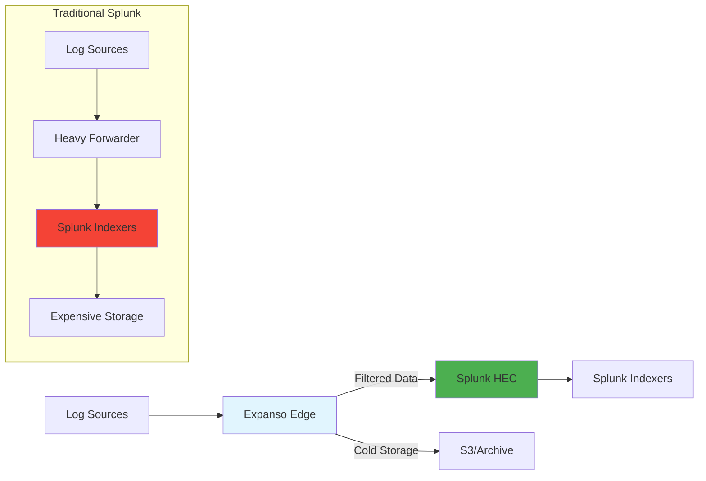

# Edge Processing for Splunk Environments

## The Problem: Splunk Costs Are Out of Control

If you're a Splunk administrator, this scenario sounds familiar:

- **Your indexing costs are skyrocketing** — Splunk charges $150-250 per GB indexed daily
- **60-80% of your log data is noise** — DEBUG messages, health checks, duplicate events
- **Heavy Forwarders are expensive to maintain** — require dedicated infrastructure and ongoing management
- **Data travels to indexers before any filtering happens** — you pay to process noise

**The math is brutal:** A typical enterprise with 1TB/day ingestion pays ~$200 × 1,000GB = **$200,000/day** to index data, where 700GB is noise. That's **$51M/year** wasted on indexing garbage.

## The Solution: Process Data AT THE SOURCE

Expanso Edge acts like an intelligent **Heavy Forwarder** that sits between your data sources and Splunk indexers. Instead of sending everything to Splunk and filtering later, Expanso:

✅ **Filters noise before it reaches Splunk** — drop DEBUG/TRACE, dedupe events, sample verbose sources  
✅ **Parses and enriches at the edge** — field extraction, normalization, metadata tagging  
✅ **Routes intelligently** — send security events to `security` index, metrics to `metrics`, etc.  
✅ **Reduces indexing volume by 60-80%** — only critical data reaches your indexers  

## Architecture: Expanso + Splunk Integration

**Key Benefits:**
- **Cost Reduction:** $200K/day → $60K/day (70% savings)
- **Better Performance:** Less data = faster searches
- **Compliance Ready:** PII masking before it enters Splunk
- **Multi-Destination:** Send to Splunk + S3 + metrics systems simultaneously

## If You Know Splunk, You Already Know Expanso

Expanso uses familiar Splunk concepts with more powerful capabilities:

| **Splunk Concept** | **Expanso Equivalent** | **Enhancement** |
|---|---|---|
| `inputs.conf` | Pipeline `input` section | Real-time parsing, multiformat support |
| `props.conf` / `transforms.conf` | Pipeline `processors` + Bloblang | Side-by-side SPL translations |
| `outputs.conf` | Pipeline `output` section | Multi-destination routing |
| Heavy Forwarder | Expanso Edge Node | Lightweight, cloud-managed |
| SPL field extraction | Bloblang mapping | More expressive, reusable |
| Deployment Server | Expanso Cloud Console | GitOps-driven, instant rollouts |

## What You'll Build

In this tutorial, you'll create a complete Splunk integration that:

1. **Collects logs like inputs.conf** — file monitoring, multiline parsing
2. **Parses data like props.conf** — field extraction, normalization  
3. **Filters before indexing** — the game-changer Splunk can't do natively
4. **Routes to Splunk HEC** — proper index/sourcetype tagging
5. **Advanced patterns** — multi-destination, compliance, metrics

## Prerequisites

- Expanso Edge installed ([installation guide](https://docs.expanso.io/edge/install))
- Splunk instance with HEC token configured
- Basic familiarity with Splunk configuration files

## Tutorial Navigation

import DocCardList from '@theme/DocCardList';

<DocCardList />

**Ready to reduce your Splunk costs by 70%?** Let's start with [Environment Setup](./setup).

---

*Expanso makes your Splunk investment go further. This isn't about replacing Splunk — it's about making it more efficient, cost-effective, and powerful.*