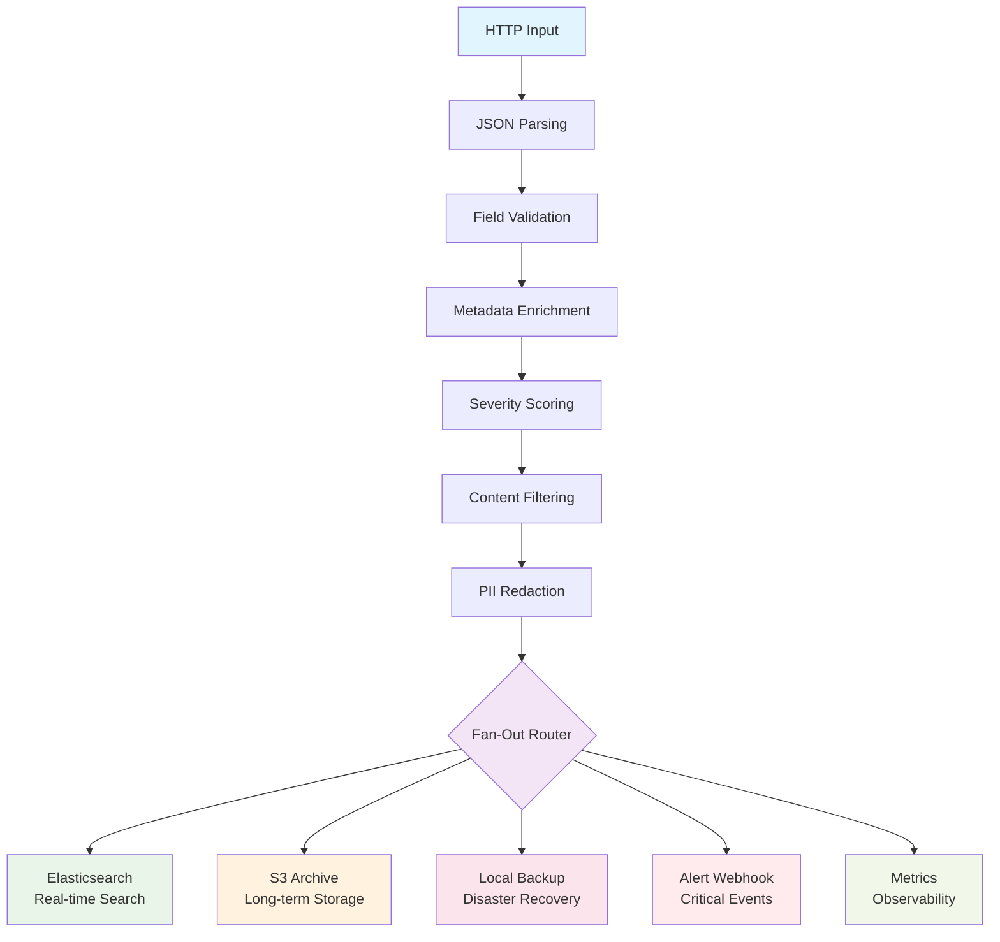

import CodeBlock from '@theme/CodeBlock';
import productionPipelineYaml from '!!raw-loader!../../../examples/log-processing/production-pipeline-complete.yaml';

# Complete Production Log Processing Pipeline

This is the complete, production-ready log processing pipeline that integrates all the features you've learned throughout this guide. It combines secure HTTP input, data validation, metadata enrichment, intelligent filtering, privacy protection, and multi-destination fan-out routing.

## What This Pipeline Provides

✅ **Enterprise-Grade Input** - Secure HTTP endpoints with authentication and rate limiting  
✅ **Data Quality Assurance** - JSON validation and schema enforcement  
✅ **Operational Intelligence** - Rich metadata enrichment and audit trails  
✅ **Cost Optimization** - Intelligent filtering and severity-based routing  
✅ **Privacy Compliance** - Comprehensive PII detection and redaction  
✅ **Multi-Destination Routing** - Optimized delivery to Elasticsearch, S3, and backup systems  

## Quick Deployment

### Prerequisites

Before deploying, ensure you have:

- **Expanso platform** installed and running
- **Environment variables** configured for external services
- **Required permissions** for S3 and Elasticsearch (if using)

### Set Environment Variables

```bash title="Configure environment variables"
# Required: API authentication
export LOG_API_KEY="$(openssl rand -base64 32)"

# Required: Node identification  
export NODE_ID="edge-node-$(hostname)"
export NODE_REGION="us-west-2"
export ENVIRONMENT="production"

# Optional: External services (set to empty string to disable)
export ELASTICSEARCH_URL="http://localhost:9200"
export ELASTICSEARCH_USERNAME=""
export ELASTICSEARCH_PASSWORD=""

export S3_BUCKET="my-company-logs-$(date +%s)"
export AWS_PROFILE="default" 
export AWS_REGION="us-west-2"

export ALERT_WEBHOOK_URL="https://hooks.slack.com/services/YOUR/SLACK/WEBHOOK"
export METRICS_URL="http://localhost:8086/write?db=logs"

# Optional: Filtering configuration
export MIN_PRIORITY_SCORE="3"
export DEBUG_LOGGING_ENABLED="false"
export FILTER_HEALTH_CHECKS="true"
```

### Deploy the Complete Pipeline

<CodeBlock language="yaml" title="production-pipeline-complete.yaml" showLineNumbers>
  {productionPipelineYaml}
</CodeBlock>

<a
  href="/files/log-processing/production-pipeline-complete.yaml"
  download
  className="button button--primary button--lg margin-top--md"
>
  📥 Download Complete Pipeline
</a>

Deploy the pipeline:

```bash
# Download and deploy the complete pipeline
curl -o production-pipeline-complete.yaml https://examples.expanso.io/files/log-processing/production-pipeline-complete.yaml

# Deploy to your edge nodes
expanso job deploy production-pipeline-complete.yaml

# Check deployment status
expanso job status log-processing-production-complete
```

### Verify Deployment

```bash
# Check pipeline health
curl http://localhost:8080/health

# Send a test log
curl -X POST http://localhost:8080/logs/ingest \
  -H "Content-Type: application/json" \
  -H "X-API-Key: $LOG_API_KEY" \
  -d '{
    "timestamp": "2025-10-20T10:30:45.123Z",
    "level": "INFO",
    "service": "test-service",
    "message": "Production pipeline deployment test",
    "test_deployment": true
  }'

# Check processing metrics
curl http://localhost:8080/metrics | grep pipeline
```

**Expected response:** `200 OK` with processing metrics showing successful ingestion.

## Pipeline Architecture

### Data Flow Overview



### Processing Stages

| Stage | Purpose | Processing Time | Key Features |
|-------|---------|----------------|--------------|
| **HTTP Input** | Secure ingestion | &lt;5ms | Rate limiting, authentication, CORS |
| **Validation** | Data quality | &lt;10ms | JSON parsing, required fields, schema |
| **Enrichment** | Context addition | &lt;15ms | Node metadata, lineage, business context |
| **Filtering** | Noise reduction | &lt;5ms | Severity scoring, content analysis |
| **Redaction** | Privacy protection | &lt;20ms | PII detection, GDPR compliance |
| **Fan-Out** | Multi-destination | &lt;30ms | Parallel routing, format optimization |

**Total Processing Time:** ~85ms per log event

## Configuration Deep Dive

### Input Configuration

```yaml
# Production HTTP input with security
input:
  http_server:
    address: "0.0.0.0:8080"
    path: /logs/ingest
    timeout: 10s
    rate_limit: "1000/1s"
    
    # Authentication
    auth:
      type: header
      header: "X-API-Key"
      required_value: "${LOG_API_KEY}"
    
    # Security headers
    cors:
      enabled: true
      allowed_origins: ["*"]
      allowed_methods: ["POST"]
    
    # Performance tuning
    max_request_size: 1048576
    max_connections: 1000
    keepalive: true
```

### Processing Pipeline

```yaml
# Comprehensive processing pipeline
pipeline:
  processors:
    # 1. JSON parsing with error handling
    - json_documents: {parts: []}
    
    # 2. Field validation and normalization
    - field_validation: {required: [timestamp, level, service, message]}
    
    # 3. Metadata enrichment
    - metadata_enrichment: {node, pipeline, business, audit}
    
    # 4. Severity scoring and prioritization
    - severity_scoring: {service_multipliers, content_analysis}
    
    # 5. Content-based filtering
    - intelligent_filtering: {priority_based, noise_reduction}
    
    # 6. Privacy protection
    - pii_redaction: {emails, phones, ssn, credit_cards, secrets}
    
    # 7. Final preparation for routing
    - output_preparation: {destination_specific_formatting}
```

### Output Destinations

```yaml
# Multi-destination fan-out
output:
  broker:
    pattern: fan_out
    outputs:
      # Real-time search
      - elasticsearch: {100 docs/5s, search optimized}
      
      # Long-term archive  
      - s3: {1000 docs/5min, compressed, hierarchical}
      
      # Disaster recovery
      - local_backup: {50 docs/10s, essential fields}
      
      # Critical alerts
      - webhook: {immediate, filtered for critical}
      
      # Metrics collection
      - metrics: {500 events/30s, aggregated}
```

## Production Deployment Checklist

### Pre-Deployment

- [ ] **Environment variables configured** with appropriate values
- [ ] **API keys generated** and stored securely  
- [ ] **S3 bucket created** with proper IAM permissions
- [ ] **Elasticsearch cluster** accessible and healthy
- [ ] **Webhook endpoints** configured for alerts
- [ ] **Edge nodes labeled** with `role: log-collector`

### Security Checklist

- [ ] **TLS certificates** installed for HTTPS endpoints (production)
- [ ] **API key rotation** scheduled and documented
- [ ] **Network security groups** configured to allow only required traffic
- [ ] **IAM roles** follow principle of least privilege
- [ ] **Webhook URLs** use HTTPS and authentication

### Monitoring Checklist

- [ ] **Prometheus metrics** collection enabled
- [ ] **Log delivery rates** monitored per destination
- [ ] **Error rates** tracked and alerting configured
- [ ] **Storage costs** monitored for S3 and Elasticsearch
- [ ] **Processing latency** tracked end-to-end

### Compliance Checklist

- [ ] **Data retention policies** configured (7 years for compliance)
- [ ] **PII redaction** tested and validated
- [ ] **Audit trails** captured for all processing
- [ ] **Geographic restrictions** enforced (GDPR zones)
- [ ] **Access logging** enabled for all components

## Performance Optimization

### High-Volume Environments (>10K logs/sec)

```yaml
# Optimized configuration for high throughput
input:
  http_server:
    rate_limit: "10000/1s"
    max_connections: 2000
    
pipeline:
  processors:
    # Batch processing for efficiency
    - archive: {format: json_array}
    - batch_processing: {size: 100}
    - unarchive: {format: json_array}

output:
  # Increased batch sizes
  elasticsearch:
    batching: {count: 500, period: 10s}
  s3:
    batching: {count: 5000, period: 10m}
```

### Cost Optimization

```yaml
# Configuration for cost savings
pipeline:
  processors:
    # Aggressive filtering
    - mapping: |
        # Filter more debug logs
        root = if this.level == "DEBUG" { deleted() } else { this }
        
output:
  s3:
    # Use cheaper storage class
    storage_class: GLACIER_IR  # Instant Retrieval
    
    # Larger batches to reduce API costs
    batching: {count: 10000, period: 30m}
```

### Multi-Region Deployment

```yaml
# Geographic distribution
selector:
  match_labels:
    role: log-collector
    region: "${DEPLOY_REGION:us-west-2}"

output:
  # Region-specific routing
  s3:
    bucket: "logs-${DEPLOY_REGION}"
    region: "${DEPLOY_REGION}"
```

## Testing and Validation

### Functional Testing

```bash
# Test all log levels
for level in DEBUG INFO WARN ERROR FATAL; do
  curl -X POST http://localhost:8080/logs/ingest \
    -H "Content-Type: application/json" \
    -H "X-API-Key: $LOG_API_KEY" \
    -d "{
      \"timestamp\": \"$(date -u +'%Y-%m-%dT%H:%M:%S.%3NZ')\",
      \"level\": \"$level\",
      \"service\": \"test-service\",
      \"message\": \"Testing $level level\"
    }"
done

# Test PII redaction
curl -X POST http://localhost:8080/logs/ingest \
  -H "Content-Type: application/json" \
  -H "X-API-Key: $LOG_API_KEY" \
  -d '{
    "timestamp": "2025-10-20T10:30:45.123Z",
    "level": "INFO",
    "service": "test-service", 
    "message": "User john.doe@example.com updated profile",
    "user_email": "john.doe@example.com",
    "credit_card": "4532-1234-5678-9012",
    "phone": "555-123-4567"
  }'

# Test error handling
curl -X POST http://localhost:8080/logs/ingest \
  -H "Content-Type: application/json" \
  -H "X-API-Key: $LOG_API_KEY" \
  -d 'invalid json content'
```

### Load Testing

```bash
# Load test with ab (Apache Bench)
echo '{"timestamp":"2025-10-20T10:30:45.123Z","level":"INFO","service":"load-test","message":"Load test message"}' > test-payload.json

ab -n 1000 -c 10 -p test-payload.json -T application/json \
   -H "X-API-Key: $LOG_API_KEY" \
   http://localhost:8080/logs/ingest

# Monitor during load test
watch -n 1 'curl -s http://localhost:8080/metrics | grep -E "(http_requests_total|processing_duration)"'
```

### Validation Checklist

- [ ] **All log levels processed** correctly
- [ ] **PII redaction working** for emails, phones, credit cards
- [ ] **Elasticsearch receiving** processed logs
- [ ] **S3 files created** with proper compression
- [ ] **Local backup files** contain essential data
- [ ] **Critical alerts sent** for ERROR/FATAL levels
- [ ] **Metrics collected** and aggregated properly

## Monitoring and Alerting

### Key Metrics to Monitor

```bash
# Processing metrics
http_requests_total                    # Total requests received
http_request_duration_seconds         # Request processing time
pipeline_processor_error_total        # Processing errors

# Output metrics  
output_success_total{destination="elasticsearch"}  # Successful deliveries
output_error_total{destination="s3"}              # Failed deliveries
output_batch_size_total                           # Batch sizes

# Business metrics
log_level_total{level="ERROR"}                    # Error log volume
pii_detected_total{type="email"}                 # PII detection rates
```

### Recommended Alerts

```yaml
# Critical alerts
alerts:
  - name: "High Error Rate"
    condition: "http_requests_total{status=~'4..|5..'} > 100/5m"
    severity: critical
    
  - name: "Output Delivery Failure"
    condition: "output_error_total > 10/5m"
    severity: high
    
  - name: "Processing Latency High"
    condition: "http_request_duration_seconds > 1.0"
    severity: warning
    
  - name: "PII Redaction Failure"
    condition: "pii_redaction_error_total > 0"
    severity: critical
```

## Maintenance and Operations

### Regular Maintenance Tasks

| Task | Frequency | Description |
|------|-----------|-------------|
| **Log file rotation** | Daily | Rotate and compress old log files |
| **Metrics review** | Weekly | Analyze processing patterns and performance |
| **Cost optimization** | Monthly | Review S3 storage costs and optimize |
| **Security audit** | Quarterly | Review API keys, permissions, compliance |

### Backup and Recovery

```bash
# Backup pipeline configuration
kubectl get expansojob log-processing-production-complete -o yaml > pipeline-backup.yaml

# Backup local files
tar -czf log-backup-$(date +%Y%m%d).tar.gz /var/log/expanso/

# Test disaster recovery
# 1. Stop pipeline
expanso job delete log-processing-production-complete

# 2. Restore from backup
expanso job deploy pipeline-backup.yaml

# 3. Verify recovery
curl http://localhost:8080/health
```

### Scaling Operations

```bash
# Scale to more nodes
expanso node label <node-id> role=log-collector

# Update pipeline to deploy to more nodes
# (Pipeline will automatically deploy to newly labeled nodes)

# Monitor resource usage
expanso node describe <node-id> | grep -A 5 "Resource Usage"
```

## Migration and Upgrades

### Upgrading from Previous Versions

```bash
# 1. Backup existing pipeline
expanso job get log-processing-pipeline -o yaml > old-pipeline-backup.yaml

# 2. Deploy new version with different name
sed 's/log-processing-pipeline/log-processing-production-complete/' production-pipeline-complete.yaml | expanso job deploy -

# 3. Test new version
# ... run tests ...

# 4. Switch traffic (update DNS/load balancer)
# 5. Remove old pipeline
expanso job delete log-processing-pipeline
```

### Configuration Updates

```bash
# Update environment variables
export NEW_SETTING="new-value"

# Redeploy pipeline (rolling update)
expanso job deploy production-pipeline-complete.yaml

# Monitor rollout
expanso job status log-processing-production-complete
```

## Troubleshooting Quick Reference

| Issue | Quick Fix | Detailed Solution |
|-------|-----------|------------------|
| **Authentication errors** | Check `LOG_API_KEY` environment variable | [Troubleshooting Guide](./troubleshooting) |
| **Elasticsearch connection** | Verify `ELASTICSEARCH_URL` and credentials | [Step 6 Troubleshooting](./step-6-fan-out-destinations#troubleshooting) |
| **S3 upload failures** | Check AWS credentials and bucket permissions | [Step 6 Troubleshooting](./step-6-fan-out-destinations#troubleshooting) |
| **High latency** | Review batch sizes and processing complexity | [Performance Guide](./troubleshooting) |
| **PII not redacted** | Check redaction patterns and field names | [Step 5 Troubleshooting](./step-5-redact-sensitive-data#troubleshooting) |

## Related Examples

- **[Filter by Severity](../filter-severity)** - Simpler log filtering patterns
- **[Enrich Export](../enrich-export)** - Basic enrichment and export
- **[Remove PII](../../data-security/remove-pii)** - Advanced privacy protection
- **[Fan-Out Pattern](../../data-routing/fan-out-pattern)** - Multi-destination routing strategies

## What You've Built

Congratulations! You've successfully deployed a enterprise-grade log processing pipeline that:

🚀 **Scales** to handle millions of events per day  
🔒 **Secures** data with authentication, rate limiting, and PII protection  
📊 **Enriches** logs with operational context and business intelligence  
💰 **Optimizes** costs through intelligent filtering and efficient storage  
⚡ **Delivers** to multiple destinations with appropriate batching and reliability  
📋 **Complies** with GDPR, HIPAA, and PCI-DSS requirements  
🔍 **Monitors** performance and health through comprehensive metrics  

This production-ready solution provides the foundation for log aggregation, analysis, and compliance in modern distributed systems.
